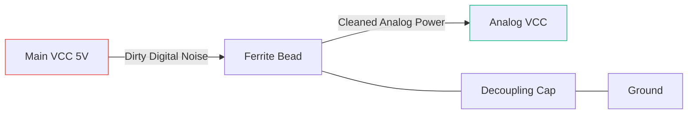

Hochgeschwindigkeits-Digitalelektronik erzeugt viel elektromagnetisches Rauschen. Ohne Abhilfe dringen diese hochfrequenten Störungen in empfindliche Analogleitungen ein oder strahlen nach außen ab, was dazu führt, dass Ihr Gerät die FCC-Emissionsprüfung spektakulär nicht besteht.

Die wichtigste Waffe gegen diese Störungen ist die **Ferritperle**. Das Verständnis des Schaltplansymbols und der Platzierung bestimmt, ob Ihre Schaltung sauber funktioniert oder in ihrem eigenen Rauschen untergeht.

## 1. Visualisierung des Ferritperlensymbols

Eine Ferritperle funktioniert von Natur aus wie eine stark verlustbehaftete Induktivität. Aus diesem Grund ist das schematische Symbol eng mit dem Standard-Induktorsymbol verwandt, aber so zugeschnitten, dass es dessen spezifische Rolle hervorhebt.

```mermaid
graph LR
    A[Inductor Basis] --> B(Standard Inductor Symbol)
    A --> C(Rectangle Over Wire)
    B -.-> D(Addition of a dashed line or solid bar)
    D --> E[IEEE Ferrite Symbol]
    C --> F[IEC Ferrite Symbol]
    
    style E fill:#0f172a,stroke:#3b82f6
    style F fill:#0f172a,stroke:#10b981
```

| Eigenschaft | IEEE/ANSI-Standard | IEC-Standard | Notizen |
| :--- | :--- | :--- | :--- |
| **Form** | Reihe von Halbkreisen mit Balken/Box | Ein massiver rechteckiger Block | Funktionell identisch im Ergebnis |
| **Bezeichnerpräfix** | `FB` | „FB“ oder „L“ | Die Verwendung von „FB“ wird dringend empfohlen, um Verwechslungen mit Leistungsinduktivitäten zu vermeiden
| **Maßeinheit** | Ohm (Ω) bei spezifischem MHz | Ohm (Ω) bei spezifischem MHz | Im Gegensatz zu Induktoren, gemessen in Henries (H) |

> **Entscheidende Unterscheidung:** Bewerten Sie eine Ferritperle niemals nach der Induktivität. Ferritperlen werden durch ihre **Impedanz (in Ohm) bei einer bestimmten Frequenz** (typischerweise 100 MHz) spezifiziert.

## 2. Kernbetriebsmechanismen

Warum eine Ferritperle anstelle eines Standardinduktors verwenden?

* Ein **Induktor** speichert Energie und gibt sie an den Stromkreis zurück. Es ist hochreaktiv und energieerhaltend.
* Eine **Ferritperle** ist aktiv darauf ausgelegt, *verlustbehaftet* zu sein. Bei hohen Frequenzen verhält es sich wie ein Widerstand und wandelt unerwünschte Hochfrequenzgeräusche direkt in Wärme um.

| Frequenzbereich | Verhalten von Ferritperlen | Ergebnis auf der Rennstrecke |
| :--- | :--- | :--- |
| **Niederfrequenz / DC** | Unter 1 MHz | Funktioniert wie ein einfacher Draht (~0 Ω). Gleichstrom fließt ungehindert durch. |
| **Resonanzfrequenz** | Hochreaktiv | Speichert Energie kurzzeitig. |
| **Hochfrequenz** | Über 50 MHz+ | Wirkt wie ein hochwertiger Widerstand. Blockiert und leitet HF-Rauschen als Wärme ab. |

## 3. Best Practices für die Schaltplanplatzierung

Die richtige Verwendung des FB-Symbols erfordert eine strategische Platzierung. Das wahllose Aufbringen von Ferritperlen auf einen Schaltplan kann das Klingeln und die Resonanz tatsächlich verschlimmern.

### Entkopplungsnetzteile (Pi-Filter)

Die absolut häufigste Verwendung für ein „FB“-Symbol ist die Trennung schmutziger digitaler Energie von sauberer analoger Energie.

In der obigen Konfiguration (Teil eines Pi-Filters) verhindert die Ferritperle, dass hochfrequente Transienten in die AVCC-Leitung gelangen, während der Kondensator alle verbleibenden Restwelligkeiten zur Erde leitet.

### Datenleitungs-EMI-Unterdrückung

Beim Verlegen langer USB-Datenkabel oder HDMI-Leitungen werden häufig „FB“-Symbole in Reihe in der Nähe des Anschlusses platziert. Dadurch wird sichergestellt, dass das lange, physisch freiliegende Kabel nicht als Antenne fungiert und CPU-Rauschen im ganzen Raum abstrahlt.

Um Ihrem nächsten Schaltplan eine Ferritperle hinzuzufügen, öffnen Sie den **[Schaltplan-Editor](/editor/)**, suchen Sie nach „Ferrit“ und geben Sie Ihren Impedanzwert an!