Der Bau eines Wechselrichters, der eine 12-V-Autobatterie in 220-V-Wechselstrom umwandelt, der zum Betrieb von Haushaltsgeräten geeignet ist, ist für Elektronikingenieure ein Übergangsritual.

Bevor Sie einen Lötkolben in die Hand nehmen, müssen Sie den zugrunde liegenden Schaltplan vollständig verstehen. Hochspannungsschaltkreise sind gnadenlos und ein schlecht gezeichneter Schaltplan garantiert verbrannte MOSFETs oder einen schweren Stromschlag. In diesem Leitfaden wird die Architektur eines grundlegenden Rechteckwechselrichters erläutert.

> **Sicherheitswarnung:** 220-V-Wechselstrom ist lebensgefährlich. Bei diesem Artikel handelt es sich um eine Untersuchung der schematischen Logik und des theoretischen Designs, nicht um einen Fertigungsplan. Bauen Sie niemals Hochspannungskreise ohne fortgeschrittene Elektroausbildung.

## Die Drei-Säulen-Architektur

Egal wie komplex ein moderner Wechselrichter ist, der Schaltplan lässt sich immer optisch und logisch in drei unterschiedliche Funktionsblöcke unterteilen.

```mermaid
flowchart LR
    DC_SRC[(12V DC Battery)] --> OSC[1. Oscillator Block]
    OSC -- Low Power Square Wave --> AMP[2. Power Switch Block]
    AMP -- High Current 12V Wave --> TX[3. Step-Up Transformer]
    TX -- Magnetic Induction --> AC_OUT((220V AC Output))
    
    style OSC fill:#0f172a,stroke:#3b82f6
    style AMP fill:#0f172a,stroke:#f59e0b
    style TX fill:#0f172a,stroke:#ef4444
```

### Stufe 1: Der Oszillator (Das Gehirn)

Gleichstrom (DC) aus einer Batterie fließt geradlinig. Transformatoren können eine gerade Linie nicht verstärken; Sie erfordern schwankende Magnetfelder. Daher müssen wir den Gleichstrom in eine künstliche Wechselstromwelle umwandeln (typischerweise 50 Hz oder 60 Hz, je nach geografischer Region).

| Verwendete Komponente | Schematische Rolle | Warum es gewählt wird |
| :--- | :--- | :--- |
| **CD4047 IC / 555 Timer** | Astabiler Multivibrator | Gibt durch Berechnung einer RC-Zeitkonstante eine bemerkenswert stabile Rechteckwelle aus. |
| **Widerstands- und Kondensatornetzwerk** | Zeitkalibratoren | Werte (z. B. „R=100 kΩ“, „C=0,1 μF“) bestimmen eindeutig die genaue 50-Hz-Frequenz. |

### Stufe 2: Die Leistungsschalter (Der Muskel)

Der Logikchip erzeugt eine makellose 50-Hz-Welle, jedoch mit außergewöhnlich niedrigen Stromgrenzen (oft unter 20 mA). Würde man das in einen Transformator einspeisen, würde dieser nicht genug magnetischen Fluss erzeugen, um eine Glühbirne zu betreiben.

Wir platzieren Hochleistungstransistoren zwischen dem Oszillator und den Transformatorspulen.

1. Das schwache Signal des Oszillators trifft auf das **Gate** eines massiven N-Kanal-MOSFET (wie den IRF3205).
2. Der MOSFET fungiert als elektronisches Hochleistungsrelais.
3. Es schaltet die enorme Stromstärke der 12-V-Batterie 50 Mal pro Sekunde rasant direkt durch die Transformatorspulen.

### Stufe 3: Der Aufwärtstransformator

An diesem Punkt im Schaltplan pulsieren riesige Mengen an 12-V-Strom hin und her. Im letzten Schritt muss dieser durch die Primärspulen eines Transformators geleitet werden.

| Funktion | Schematische Details | Auswirkungen auf die reale Welt |
| :--- | :--- | :--- |
| **Primärspule (links)** | Konfiguration mit Mittelabgriff („12V – 0 – 12V“) | Ermöglicht das Hin- und Her-Push-Pull-Schalten von zwei alternierenden MOSFETs. |
| **Kernlinien** | Zwei durchgezogene Linien, die vertikal gezeichnet sind | Stellt den Eisen-/Ferritkern dar, der für eine hocheffiziente magnetische Induktion erforderlich ist. |
| **Sekundärspule (rechts)** | Massiv erhöhtes Wickelverhältnis | Die Physik steigert den pulsierenden 12-V-Magnetfluss in eine tödliche, flüchtige 220-V-Welle. |

## Überlegungen zum Zeichnen

Wenn Sie den **[Schaltplan-Editor](/editor/)** zum Entwerfen dieses Entwurfs verwenden, beachten Sie die Best Practices für das Layout:

* Zeichnen Sie die dicken Linien, die den 12-V-Batteriestrom übertragen, dicker als die Linien des Oszillators mit geringer Leistung.
* Erden Sie die MOSFET-Source-Pins explizit und eindeutig; Führen Sie sie nicht in die Nähe der empfindlichen Oszillatormasse zurück, um eine Rauschkopplung zu verhindern.
* Begrenzen Sie die 220-V-Ausgänge grafisch! Platzieren Sie Warnschilder und Ausgangsanschlüsse (wie ein Steckdosensymbol), anstatt blanke Drähte im Hohlraum zu lassen.