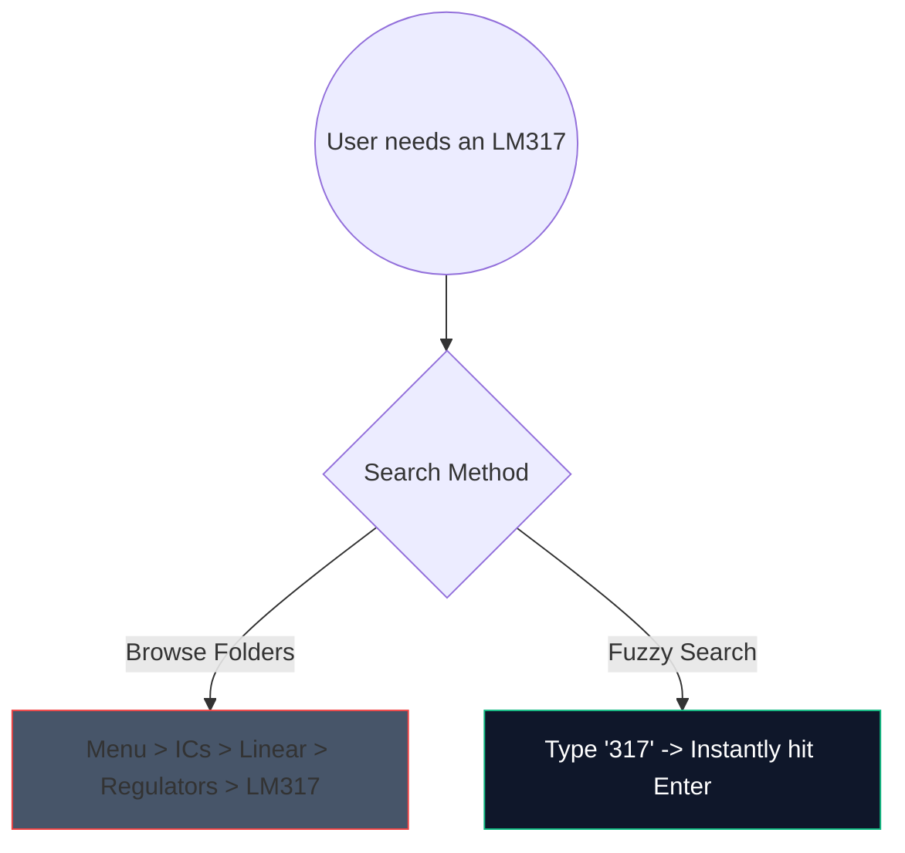

Die Zeiten, in denen man schwere, 2 Gigabyte große Desktop-Software herunterladen musste, nur um eine einfache Verstärkerschaltung zu skizzieren, sind vorbei. Browserbasiertes CAD (Computer-Aided Design) ist da und es ist phänomenal schnell.

Hier erfahren Sie genau, wie Sie mit modernen Web-Tools in weniger als 5 Minuten Schaltpläne in Produktionsqualität erstellen können.

## Warum browserbasiertes Schaltungsdesign?

Wenn Sie als Pädagoge, Student oder Bastler Dokumentationen schreiben, sind Geschwindigkeit und Zugänglichkeit wichtiger als die bloßen Funktionen.

```mermaid
flowchart LR
    subgraph Traditional Workflow
    DL[Download/Install] --> CONF[Configure Libraries] --> DRAW1[Draw]
    end
    
    subgraph Web Workflow
    URL[Go to URL] --> DRAW2[Draw immediately]
    end
    
    style URL fill:#0f172a,stroke:#3b82f6
    style DRAW2 fill:#1e293b,stroke:#10b981
```

| Metrisch | Desktop-Anwendung | Schaltplan-Ersteller |
| :--- | :--- | :--- |
| **Speicherplatz** | 1 GB - 5 GB+ | 0 MB (Cloud-basiert) |
| **Betriebssystemkompatibilität** | Häufig nur für Windows oder fehlerhafte Ports | Universell webkompatibel |
| **Startzeit** | 15–30 Sekunden | < 1 Sekunde |
| **Portabilität** | Auf eine Maschine beschränkt | Überall zugänglich |

## Kern-Workflow-Hacks für mehr Geschwindigkeit

Bei der Verwendung eines Web-Editors verwandelt die Verwendung von Tastaturkürzeln das Erlebnis vom „Herumklicken“ in einen ununterbrochenen Flusszustand.

Hier sind die Shortcuts mit dem höchsten ROI, die Sie sich in unserem Editor merken sollten:

| Aktion | Hotkey-Befehl | Workflow-Vorteil |
| :--- | :--- | :--- |
| **Kabelführung** | „W“ | Schaltet Ihren Cursor sofort in den Verbindungsmodus und ermöglicht so ein schnelles Netzrouting, ohne zu einer Symbolleiste wechseln zu müssen. |
| **Komponentenrotation** | „R“ (während ein Teil gehalten wird) | Durch die Ausrichtung von Widerständen oder Transistoren vor dem Platzieren wird später viel Zeit beim Reinigen eingespart. |
| **Doppelte Auswahl** | „Strg + D“ oder „Alt-Ziehen“ | Ziehen Sie nicht 8 LEDs aus dem Menü; Platzieren Sie eins, konfigurieren Sie es und duplizieren Sie es sofort siebenmal. |
| **Pan Canvas** | „Leertaste + Ziehen“ | Hält Ihre Zoomstufe beim Navigieren in großen, komplexen Layouts konstant. |

## Nutzung der Komponentensuche

Die visuelle Suche in riesigen Dropdown-Menüs ist mühsam. Wir haben einen robusten Fuzzy-Suchmechanismus integriert.

Klicken Sie einfach auf die Suchleiste und geben Sie „NPN“ ein, anstatt auf „Halbleiter -> Transistoren -> BJT“ zu klicken. Das Tool kuratiert sofort die Übereinstimmung mit der höchsten Wahrscheinlichkeit.

## Exportieren für den professionellen Gebrauch

Das Erstellen des Diagramms ist nur die halbe Miete; Die andere Hälfte besteht darin, es in Ihre Abschlussarbeit oder Ihren technischen Blog einzubauen.

Exportieren Sie Ihre Schaltungsmuster nach Möglichkeit immer als **SVG (Scalable Vector Graphics)** und nicht als PNG oder JPG. Ein SVG speichert mathematisch definierte Linien anstelle von Pixeln, was bedeutet, dass Sie Ihren Schaltplan auf Plakatgröße skalieren können und er immer gestochen scharf bleibt, ohne dass die Rasterung verschwimmt.

Sind Sie bereit, Ihre Geschwindigkeit zu testen? **[Starten Sie die App](/editor/)** und versuchen Sie, eine blinkende LED-Schaltung mit 555 Timern zu erstellen!