Das erste Öffnen eines komplexen Schaltplans fühlt sich an, als würde man auf eine fremde Sprache starren. Dutzende sich kreuzende Linien, kryptische Abkürzungen und gezackte Symbole verschmelzen zu einer Wand aus visuellem Rauschen.

Erfahrene Ingenieure lesen Schaltpläne jedoch nicht, indem sie auf die ganze Seite starren. Sie isolieren, verfolgen und erobern. Hier finden Sie die Schritt-für-Schritt-Methode zum Entschlüsseln eines Schaltplans.

## Schritt 1: Isolieren Sie die Kernstrominfrastruktur

Bevor Sie verstehen, was ein Schaltkreis *funktioniert*, müssen Sie verstehen, *wie er atmet*.

Jeder Schaltplan verfügt über Eintrittspunkte für elektrische Energie. Ihre erste Aufgabe besteht darin, alle wichtigen Spannungsschienen und Erdungsreferenzen zu lokalisieren.

```mermaid
flowchart TD
    A[Start: Scan Edges] --> B{Look for Power Symbols}
    B -- Found Battery/Jack --> C[Trace the initial VCC and GND lines]
    B -- Found Net Labels --> D[Locate generic +5V, +3.3V pads]
    C --> E[Are there Voltage Regulators?]
    D --> E
    E -- Yes --> F[Mentally divide circuit into Voltage Zones]
    E -- No --> G[Circuit runs on single voltage]
    
    style A fill:#0f172a,stroke:#3b82f6
    style F fill:#1e293b,stroke:#f59e0b
```



| Symbol/Text | Bedeutung | Handlungsanforderung |
| :--- | :--- | :--- |
| „VCC“ / „VDD“ | Positive Versorgungsspannung für ICs. | Verfolgen Sie dies, um sicherzustellen, dass jeder IC mit Strom versorgt wird. |
| „GND“ / „VSS“ | Der gemeinsame Bezug. | Angenommen, alle diese Symbole sind physisch miteinander verbunden. |
| „LDO“ / „Buck“ | Ein Chip, der die Spannung herunterregelt. | Beachten Sie, welche Komponenten nachgeschaltet sind und die neue niedrigere Spannung nutzen. |

## Schritt 2: Die „Gehirne“ (ICs) entmystifizieren

Wenn Sie wissen, wo Strom fließt, suchen Sie nach den größten Rechtecken auf der Seite. Integrierte Schaltkreise (ICs) bestimmen die Hauptfunktion des Schaltplans.

Wenn Sie auf einen IC mit der Bezeichnung „U1“ und einer kryptischen Teilenummer wie „NE555“ oder „ATmega328P“ stoßen, hören Sie sofort mit dem Lesen des Schaltplans auf. Öffnen Sie einen neuen Tab und rufen Sie das **Datenblatt** auf.

Sie müssen die interne Halbleiterphysik nicht verstehen; Schauen Sie sich einfach das „Pinbelegungsdiagramm“ im Datenblatt an. Wenn Pin 4 „RESET“ und Pin 8 „VCC“ ist, ordnen Sie diese Logik sofort wieder der Zeichnung zu.

## Schritt 3: Verfolgen Sie die Ein- und Ausgänge

Schaltkreise sind funktionale Maschinen. Sie nehmen Umweltinput auf, verarbeiten ihn und geben ein Ergebnis aus.

```mermaid
quadrantChart
    title Input/Output Hardware Identification
    x-axis Analog/Physical --> Digital/Data
    y-axis Input Devices --> Output Devices
    quadrant-1 Digital Receivers (e.g. WiFi)
    quadrant-2 Digital Displays (e.g. OLEDs)
    quadrant-3 Physical Actuators (e.g. Motors)
    quadrant-4 Physical Sensors (e.g. Thermistors)
    "Push Button": [0.1, 0.4]
    "Photoresistor": [0.2, 0.2]
    "UART RX": [0.8, 0.4]
    "UART TX": [0.8, 0.6]
    "Speaker": [0.3, 0.8]
    "LED": [0.4, 0.7]
```

Verfolgen Sie die Drähte von den zentralen ICs nach außen. Wenn ein IC-Pin mit einer LED verbunden ist, ist das eine visuelle Ausgabe. Wenn ein Pin mit einem SPST-Schalter verbunden ist, der auf Masse geht, handelt es sich um eine menschliche Eingabe.

## Schritt 4: Kreuzungen und Kreuzungen validieren

Der häufigste Lesefehler bei Anfängern besteht darin, dass sie sich kreuzende Drähte missverstehen.

* **Ein Punkt ergibt einen Knoten:** Wenn zwei sich schneidende Linien an ihrer Kreuzung einen durchgezogenen Punkt aufweisen, sind sie physisch miteinander verlötet/verbunden. Zwischen ihnen kann Strom fließen.
* **Kein Punkt ergibt eine Brücke:** Wenn zwei Linien ein einfaches Kreuz (+) bilden, berühren sie sich *nicht*. Sie ähneln zwei Autobahnen, die auf einer Überführung übereinander führen.

## Schritt 5: Unterschaltkreise erkennen (Die Geheimwaffe)

Ingenieure entwerfen Schaltungen selten völlig von Grund auf neu. Sie kleben standardmäßige modulare Teilschaltkreise zusammen. Sobald Sie lernen, diese visuellen „Wörter“ zu erkennen, hören Sie auf, einzelne „Buchstaben“ zu lesen.

| Visuelles Muster | Standard-Unterstromkreis | Funktion |
| :--- | :--- | :--- |
| Kondensatorübergang von „VCC“ zu „GND“ direkt neben einem IC. | **Entkopplungskondensator** | Absorbiert Lärm. Ignorieren Sie es, wenn Sie den logischen Fluss analysieren. |
| Widerstand von einem digitalen Pin, der bis zu „+5V“ gewickelt ist. | **Pull-up-Widerstand** | Verhindert schwebende Stifte; sorgt für einen stabilen HIGH-Standardzustand. |
| Zwei Widerstände in Reihe zwischen Spannung und Masse geschaltet, in der Mitte angezapft. | **Spannungsteiler** | Lässt eine Spannung proportional fallen, um sicher von einem Sensorstift gelesen zu werden. |

Setzen Sie diese Theorie in die Praxis um. Öffnen Sie den **[Schaltplan-Editor](/editor/)**, laden Sie eine Vorlage und planen Sie die Stromversorgung, das Gehirn, die Ein- und Ausgänge selbst!