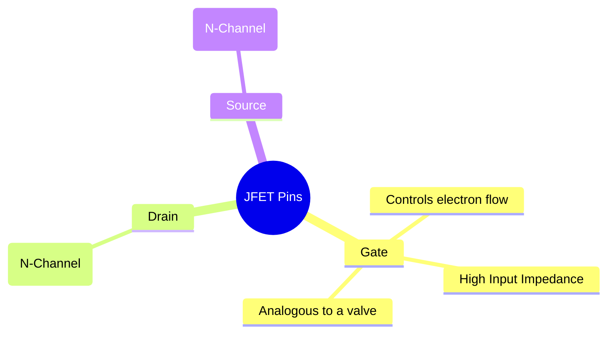

Vor der massiven Verbreitung von MOSFETs war der **JFET** (Junction Field-Effect Transistor) der König der Verstärkung mit hoher Eingangsimpedanz. Obwohl sie in der modernen digitalen Logik nicht so häufig verwendet werden, bleiben sie unverzichtbare Artefakte in High-Fidelity-Audio-Vorverstärkern, empfindlichen Instrumenten und HF-Schaltkreisen.

Das Verständnis des JFET-Schaltplansymbols ist für jeden, der sich mit dem Design diskreter analoger Schaltungen beschäftigt, von entscheidender Bedeutung.

## 1. Anatomie des JFET-Symbols

Im Gegensatz zu Bipolar Junction Transistoren (BJTs), bei denen es sich um stromgesteuerte Geräte handelt, ist ein JFET ein **spannungsgesteuertes** Gerät. Das schematische Symbol versucht, den physikalischen Aufbau seines internen Halbleiterkanals visuell darzustellen.

Das Symbol besteht aus einer geraden vertikalen Linie, die den Kanal darstellt, mit zwei horizontalen Linien, die darin einhaken (Abfluss und Quelle). Eine dritte senkrechte Linie bildet das Tor, komplett mit einem Pfeil, der die Halbleiterpolarität vorgibt.

### N-Kanal- vs. P-Kanal-JFETs

So wie BJTs NPN und PNP haben, gibt es JFETs in zwei verschiedenen Varianten.

| Charakteristisch | N-Kanal-JFET | P-Kanal JFET |
| :--- | :--- | :--- |
| **Symbolpfeil** | Zeigt **IN** auf die Kanallinie | Zeigt **OUT** vom Kanal weg |
| **Die meisten Fluggesellschaften** | Elektronen | Löcher |
| **Vgs für Pinch-Off** | Negative Spannung (z. B. -5 V) | Positive Spannung (z. B. +5 V) |
| **Typischer Vorgang**| Normalerweise EIN -> Zum Ausschalten eine negative Spannungsanordnung anlegen | Normalerweise EIN -> Zum Ausschalten eine positive Spannungsanordnung anlegen |

> **Speichertrick:** „Nach INNEN zeigen“ bedeutet **N**-Kanal. Schauen Sie sich den Pfeil am Tor an. Wenn er nach innen zur Leitung zeigt, handelt es sich um einen N-Kanal-JFET (wie den beliebten 2N5457).

## 2. Funktionsweise: Der Depletion-Modus

Eines der charakteristischsten Merkmale eines JFET ist, dass es sich um ein **Depletion Mode**-Gerät handelt. Dies hat erhebliche Auswirkungen darauf, wie Sie Schaltpläne um sie herum entwerfen.

* **MOSFETs (Verbesserungsmodus):** Sind normalerweise AUS. Sie müssen eine Spannung an das Gate anlegen, um es einzuschalten.
* **JFETs (Depletion Mode):** Sind normalerweise eingeschaltet. Bei 0 Volt am Gate fließt der maximale Strom von Drain nach Source. Sie müssen eine *umgekehrte Vorspannung* anlegen (negativ für den N-Kanal), um den Verarmungsbereich zu erweitern und den Elektronenfluss buchstäblich „abzuklemmen“, wodurch das Gerät ausgeschaltet wird.

```mermaid
flowchart LR
    VGS[V_GS = 0V] --> I1[Maximum Drain Current flows]
    VGS2[V_GS = -2V] --> I2[Current is restricted]
    VGS3[V_GS = -5V] --> I3[Pinch-Off reached. Circuit is OFF]
    
    style VGS fill:#1e293b,stroke:#f59e0b
    style VGS3 fill:#1e293b,stroke:#ef4444
```

## 3. Typische schematische Anwendungen

Da das Gate eines JFET während des Betriebs in Sperrrichtung vorgespannt ist, fließt im Wesentlichen kein Strom hinein. Dies führt zu einer astronomisch hohen Eingangsimpedanz (oft in Hunderten von Megaohm gemessen).

| Schaltungsanwendung | Warum JFETs ausgewählt werden | Schematische Hinweise |
| :--- | :--- | :--- |
| **Audio-Vorverstärker** | Extrem geringes Rauschen und massive Eingangsimpedanz verhindern die Belastung empfindlicher E-Gitarren-Tonabnehmer. | Wird oft als Source-Follower-Pufferstufe eingesetzt. |
| **Analogschalter** | Da sie rein spannungsgesteuert sind und keinen Gate-Strom haben, injizieren sie keine Schalttransienten in den Signalpfad. | In Reihe mit einem analogen Signal geschaltet, das durch den Drain-Source-Kanal fließt. |
| **Konstantstromquellen** | Ein JFET verhält sich nativ wie eine Konstantstromsenke, wenn das Gate direkt mit der Quelle verbunden ist. | Gate-Terminal direkt mit dem Source-Terminal verkabelt. |

Bei der Diagrammerstellung dieser speziellen analogen Schaltkreise kommt es auf Präzision an. Stellen Sie sicher, dass die Ausrichtung Ihres Torpfeils korrekt ist, um Herstellungsfehler zu vermeiden. Verwenden Sie die kuratierte diskrete Halbleiterbibliothek in **[Circuit Diagram Maker](/editor/)**, um Standard-N-Kanal- und P-Kanal-JFET-Symbole genau auf Ihrer nächsten Leinwand zu platzieren.