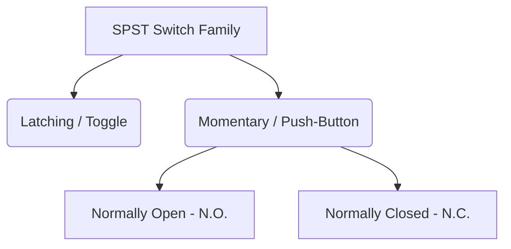

Das Herzstück jeder Schnittstelle, die Menschen zur Steuerung von Elektrizität nutzen, ist der mechanische Schalter. Die einfachste und allgegenwärtigste Inkarnation dieser Komponente ist der **SPST** oder Single Pole Single Throw-Schalter.

Ganz gleich, ob Sie einen Hochspannungs-Netzschalter entwerfen oder einfach nur einen Druckknopf auf einem Arduino-Steckbrett entwerfen, das SPST-Symbol ist Ihr logischer Ausgangspunkt.

## 1. Was SPST eigentlich bedeutet

Ingenieure klassifizieren Schalter anhand von zwei Variablen: **Pole** und **Würfe**.

* **Pol (P):** Die Anzahl der unabhängigen Stromkreise, die der Schalter gleichzeitig steuern kann. 
* **Wurf (T):** Die Anzahl der geschlossenen Zustände (EIN-Positionen), die jeder Pol hat.

Daher ist ein SPST ein *Single Pole* (steuert einen Stromkreis) und ein *Single Throw* (hat nur eine geschlossene, leitende Position).

```mermaid
flowchart LR
    A[Human Input] --> B((SPST Mechanism))
    B -- Open / Default --> C[Infinite Resistance / OFF]
    B -- Closed / Actuated --> D[Zero Resistance / ON]
    
    style B fill:#0f172a,stroke:#f59e0b
```

## 2. Lesen des SPST-Schaltplansymbols

Das Standard-IEEE-Symbol für einen SPST-Switch ist äußerst intuitiv – es sieht im wahrsten Sinne des Wortes so aus, wie es funktioniert.

| Visuelles Element | Bedeutung in der realen Welt |
| :--- | :--- |
| **Zwei offene Kreise** | Die stationären elektrischen Kontaktflächen, an denen Drähte enden. |
| **Diagonale gestrichelte Linie** | Der mechanisch leitfähige Arm ist physisch vom zweiten Pad getrennt, um den Standardzustand „Offen“ anzuzeigen. |
| **Bezeichner (`S` oder `SW`)** | Standard-Referenz-Tags. z. B. „SW1“. |

> **Normalzustandsannahme:** Sofern nicht anders angegeben, sind mechanische Schalter in ihrem **unbetätigten Ruhezustand** gezeichnet. Für einen Standard-SPST-Lichtschalter bedeutet dies, dass er im Schaltplan als AUS dargestellt ist.

## 3. Variationen des SPST: Drucktasten

Ein Kippschalter bleibt dort, wo Sie ihn platziert haben (rastend). Ein Druckknopf wird nur betätigt, solange sich Ihr Finger darauf befindet (kurzzeitig). Die SPST-Bezeichnung gilt für beide, die Symbole ändern sich jedoch geringfügig, um die menschlichen Interaktionsmodi zu unterscheiden.

| Schaltertyp | Schematische Änderung | Beispiel aus der Praxis |
| :--- | :--- | :--- |
| **Druckknopf (N.O.)** | Anstelle eines abgewinkelten Arms schwebt eine flache Brücke *über* den beiden Kontaktpads. Durch Herunterdrücken wird die Lücke geschlossen. | Tastaturtasten, Computer-Einschalttasten, Türklingeltasten. |
| **Druckknopf (N.C.)** | Die flache Brücke liegt *unter* den Pads oder berührt sie, sodass der Schaltkreis standardmäßig eingeschaltet bleibt. Durch Herunterdrücken werden Verbindungen unterbrochen. | Not-Aus-Tasten (E-Stop) an schweren Maschinen. |

## 4. Warnungen zur Hardware-Implementierung

Bei der Integration eines SPST-Schalters in eine digitale Logikschaltung (wie einen GPIO-Pin eines Raspberry Pi) führt ein naives Schaltplandesign zu einem katastrophal unvorhersehbaren Softwareverhalten.

### Das „Floating Pin“-Problem

Wenn Sie eine Seite eines SPST-Schalters an 5 V und die andere Seite direkt an einen Mikrocontroller-Pin anschließen, was passiert dann, wenn der Schalter geöffnet ist? Der Pin zeigt nicht 0 V an – er ist getrennt und „schwebt“ und verhält sich wie eine Antenne, die den umgebenden Elektromagnetismus auffängt.

**Die Lösung: Pull-Down-Widerstände**

Schließen Sie immer einen Widerstand (normalerweise 10 kΩ) zwischen den digitalen Pin und Masse ein.

1. **Ausschalten:** Der Pin liest über den Widerstand sicher 0 V.
2. **Einschalten:** Die 5-V-Versorgung überlastet den Widerstand und löst einen sicheren HIGH-Zustand aus.

Integrieren Sie SPST-Variationen sicher über den **[Schaltplan-Editor](/editor/)** in Ihre Designs. Erweitern Sie die linke Bibliothek „Schalter“, um N.O. zu finden. und N.C.-Implementierungen!