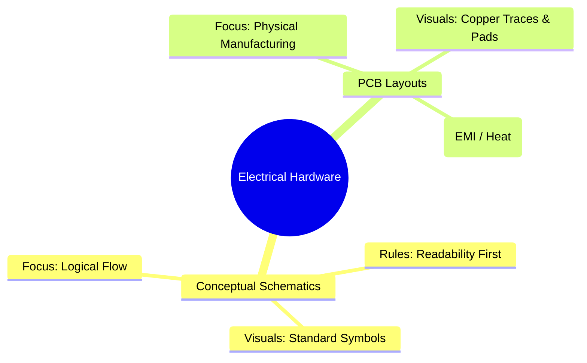
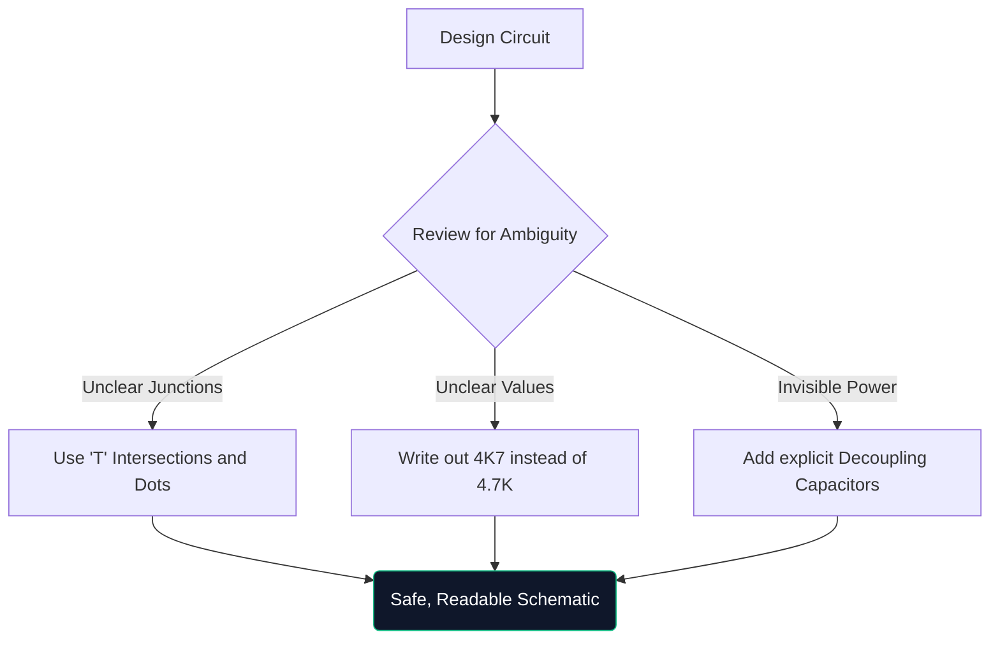

Willkommen zum ultimativen Meisterkurs zum Thema Schaltpläne. Egal, ob Sie an einem Wochenende Arduino-Prototypen zusammenhacken oder Elektrotechnik studieren, das Verständnis der schematischen Architektur ist nicht verhandelbar.

Dieser Leitfaden geht über die Grundlagen hinaus und bewertet, wie moderne Diagramme konstruiert, überprüft und hergestellt werden.

## Theoretische Schaltpläne vs. PCB-Layouts

Ein sehr häufiger Punkt für Verwirrung ist der Unterschied zwischen einem Schaltplan und einem Leiterplattenlayout (PCB). Es handelt sich um völlig unterschiedliche Darstellungen derselben elektrischen Wahrheit.

| Eigenschaft | Schematische Darstellung | PCB-Layout |
| :--- | :--- | :--- |
| **Zweck** | Um zu verstehen, *wie* die Schaltung logisch funktioniert | Um zu diktieren, *wohin* das Kupfer physisch geht |
| **Komponentendarstellung** | Abstrakte Symbole (Dreiecke, Zickzack) | Physische 1:1-Footprint-Pads (z. B. SOIC-8, 0805) |
| **Verbindungen** | Perfekte geometrische Linien | Kupferleiterbahnen im 45-Grad-Winkel |
| **Umwelt** | Sauberes, weißes Hintergrundpapier | Mehrschichtiger buchstäblicher 3D-Raum |

## Anatomie eines erweiterten Schaltplans

Wenn Schaltkreise mehr als 100 Komponenten umfassen, verändern sich die visuellen Paradigmen. Man kann nicht einfach alles mit gezogenen Drähten verbinden.

1. **Titelblöcke**: Professionelle Schaltpläne verfügen immer über einen Block in der unteren rechten Ecke, der den Firmennamen, den eingetragenen Ingenieur, die Revisionsnummer und das Datum angibt.
2. **Netzbezeichnungen und Ports**: Drähte verbinden keine Subsysteme; Namensetiketten tun dies. Wenn zwei Drähte mit „CLK_OUT“ gekennzeichnet sind, sind sie elektrisch verbunden, auch wenn sie sich auf unterschiedlichen Seiten befinden.
3. **Hierarchische Blöcke**: Massive Designs (wie ein Computer-Motherboard) verwenden Hierarchie. Ein einzelner rechteckiger Block mit der Bezeichnung „Memory Interface“ enthält eine völlig separate Schaltplanseite.

## Die Regel des „Defensive Drawing“

Ähnlich wie beim defensiven Fahren geht man beim defensiven Zeichnen davon aus, dass die Person, die Ihren Schaltplan liest, ihn missverstehen wird, sofern Sie sie nicht ausdrücklich anleiten.

> **Warum „4K7“ schreiben?** In gedruckten oder fotokopierten Schaltplänen verschwindet ein winziger Dezimalpunkt („.“) aufgrund von Artefakten leicht. Wenn Sie „4.7K“ schreiben, besteht die Gefahr, dass jemand es als „47K“ liest, was dazu führen könnte, dass eine Komponente kaputt geht. Wenn Sie „4K7“ schreiben, fungiert der Multiplikator als Dezimalpunkt, wodurch Fehllesungen praktisch vermieden werden.

## Übergang zu digitalen CAD-Tools

Das Zeichnen auf Millimeterpapier eignet sich hervorragend zum Brainstorming, ist für die Produktion jedoch praktisch nutzlos. Wenn Sie Ihre Entwürfe auf ein Tool wie [Circuit Diagram Maker](/editor/) migrieren, erhalten Sie mehrere Superkräfte:

* **Netzlisten**: Digitale Tools beweisen mathematisch Zusammenhänge.
* **Wiederverwendbarkeit**: Das Kopieren und Einfügen komplexer geregelter Netzteile aus früheren Projekten spart Stunden.
* **Vektorqualität**: Der Export als SVG garantiert perfekt gestochen scharfe Linien, unabhängig davon, wie stark Sie hineinzoomen.

Der Sprung von der Theorie zur Realität beginnt mit einer gut gezogenen Linie. Beginnen Sie noch heute Ihre Reise!