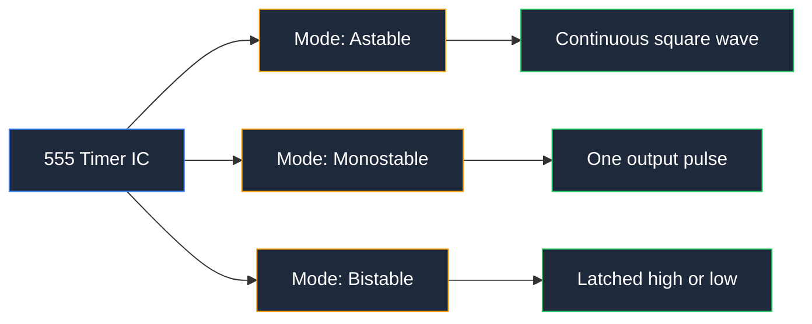
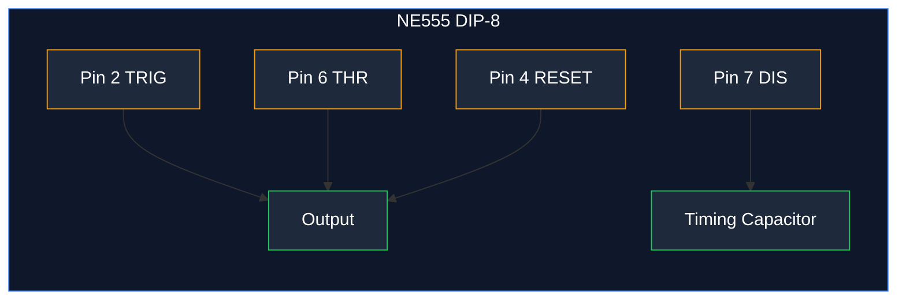
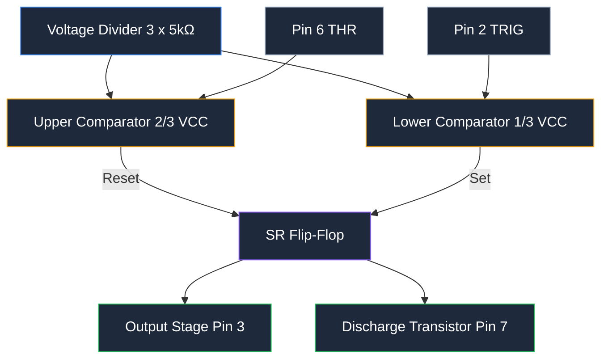
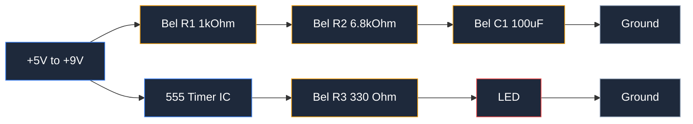
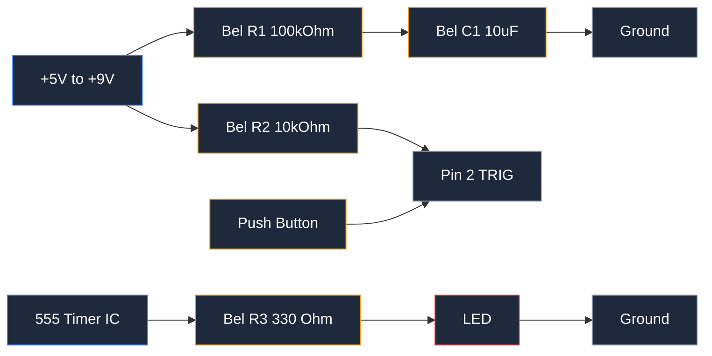
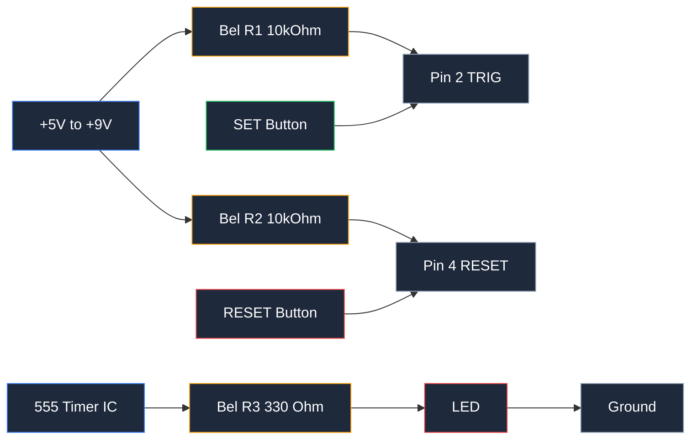
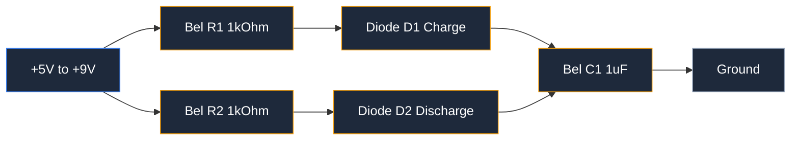
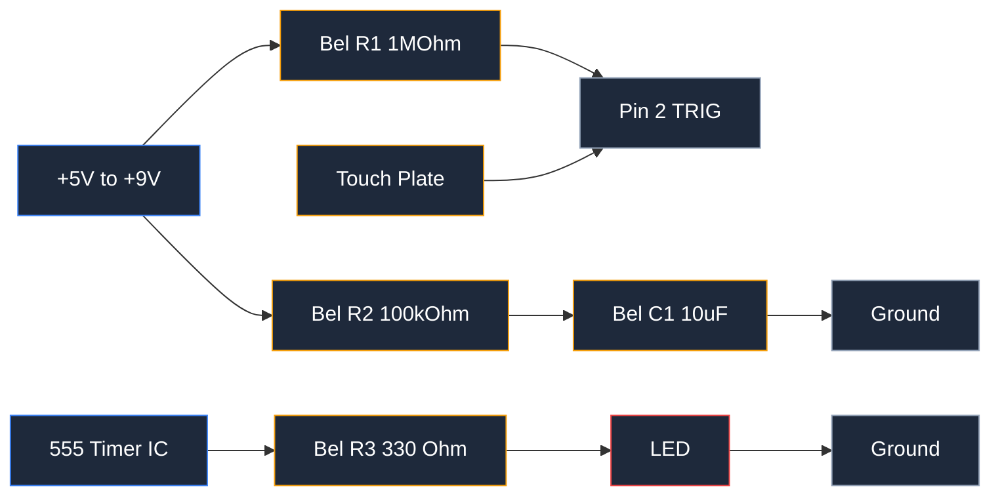

**A 555 timer circuit is a timing and oscillation circuit built around the 555 timer IC, an 8-pin integrated circuit (IC) that generates precise time delays and square-wave output signals.** Any 555 timer circuit works in one of three operating modes: astable mode, monostable mode, or bistable mode. Astable mode produces a continuous square wave with a set frequency and duty cycle. Monostable mode produces one output pulse with a set pulse width. Bistable mode latches the output high or low and keeps it there until told otherwise.

A 555 timer circuit offers 4 main benefits: it costs a few cents per IC, it runs on a wide 4.5V to 16V supply range, it drives loads up to 200mA directly, and it needs only a couple of timing components. Those timing components are a timing resistor, a timing capacitor, and a supply bypass capacitor.

555 timer circuits appear in dozens of electronics projects. Common uses include an LED flasher, a one-shot timer for debouncing buttons, a PWM generator for LED dimming and motor speed control, and a simple touch switch. In this guide you will build all five of those circuits on a breadboard.

The main parts of a 555 timer circuit are the 555 timer IC itself, two comparators, an SR flip-flop, and a voltage divider made of three 5kΩ resistors. External parts include the timing resistor and timing capacitor that set the timing, plus protective and logic resistors. You can draw the full schematic for every circuit here in seconds with the [online circuit diagram maker](https://www.circuitdiagrammaker.com/), then build it on a real breadboard.



## Introduction to the 555 Timer IC

The 555 timer IC appeared in 1971, designed by Hans Camenzind at Signetics. It became one of the best-selling ICs in history, with over 1 billion units sold per year for decades. The name 555 comes from the three internal 5kΩ resistors that form its voltage divider.

The 555 timer IC has 3 operating modes. Astable mode runs as a free-running oscillator that produces a square wave. Monostable mode waits for a trigger and then produces one timed pulse. Bistable mode works as a latch that sets and resets from two separate inputs. In this article, examples 1 and 4 use astable mode, examples 2 and 5 use monostable mode, and example 3 uses bistable mode.

### 555 Timer Pinout

The standard 555 timer IC comes in an 8-pin dual in-line package (DIP). Each of the 8 pins has one job.

| Pin | Name | Function |
|-----|------|----------|
| 1 | GND | Ground (0V) |
| 2 | TRIG | Trigger: a voltage below 1/3 VCC starts timing and sets the output high |
| 3 | OUT | Output: sources or sinks current to drive the load |
| 4 | RESET | Reset: a low level forces the output low regardless of other pins |
| 5 | CTRL | Control voltage: an optional override for the 2/3 VCC threshold |
| 6 | THR | Threshold: a voltage above 2/3 VCC ends timing and sets the output low |
| 7 | DIS | Discharge: pulls the timing capacitor to ground during the low interval |
| 8 | VCC | Positive supply from 4.5V to 16V |



### Internal Block Diagram

Inside the 555 timer IC sits a voltage divider, two comparators, an SR flip-flop, a discharge transistor, and an output stage.

The voltage divider is 3 equal 5kΩ resistors stacked between VCC and ground. It fixes the non-inverting input of the upper comparator at 2/3 VCC and the inverting input of the lower comparator at 1/3 VCC.

The upper comparator compares the threshold pin with 2/3 VCC. When the threshold pin rises above 2/3 VCC, the upper comparator resets the flip-flop and the output goes low. The lower comparator compares the trigger pin with 1/3 VCC. When the trigger pin falls below 1/3 VCC, the lower comparator sets the flip-flop and the output goes high.

The discharge transistor opens the discharge pin to ground when the output is low. That pin drains the timing capacitor to reset the cycle. The output stage then drives up to 200mA, enough to light LEDs, drive a small speaker, or switch a transistor directly.



## How to Calculate Timing Components

Two formulas control every 555 timer circuit: the astable frequency formula and the monostable pulse width formula. Both depend on the timing resistor and the timing capacitor values.

### Astable Mode Formula

In astable mode, the output alternates between high and low on its own. The time high is `t_high = 0.693 × (R1 + R2) × C`. The time low is `t_low = 0.693 × R2 × C`.

The total period is the sum of both:

```
t_high = 0.693 × (R1 + R2) × C
t_low  = 0.693 × R2 × C
T      = 0.693 × (R1 + 2 × R2) × C
```

Frequency is the inverse of the period:

```
f = 1 / T = 1.44 / ((R1 + 2 × R2) × C)
```

Duty cycle is the fraction of each period the output stays high:

```
Duty cycle (%) = (R1 + R2) / (R1 + 2 × R2) × 100
```

R1 is the first timing resistor, R2 is the second timing resistor, and C is the timing capacitor.

### Monostable Mode Formula

In monostable mode, the output produces a single pulse after a trigger. The pulse width depends only on one resistor and the timing capacitor:

```
pulse width t = 1.1 × R × C
```

R is the timing resistor in ohms, C is the timing capacitor in farads, and t is the pulse width in seconds. The trigger input must return high before the next pulse starts.

### Example Calculation: 1 Hz LED Flasher

Build a 1 Hz LED flasher with the astable formula. A 1 Hz output flashes the LED once per second, which is a period T of 1 second.

Pick a convenient timing capacitor first. Choose C = 100 µF (0.0001 F) and R1 = 1 kΩ. Solve the frequency formula for R2:

```
1 = 1.44 / ((1000 + 2 × R2) × 0.0001)
R2 = 6.8 kΩ (nearest standard value)
```

Check the result with the nearest standard value R2 = 6.8 kΩ:

```
f = 1.44 / ((1000 + 13600) × 0.0001) = 0.99 Hz
Duty cycle = (1000 + 6800) / (1000 + 13600) × 100 = 53%
```

The LED flashes at very close to 1 Hz with a 53% duty cycle.

### Tips for Selecting Standard Values

Resistors come in standard E24 values, and capacitors come in standard values too. Pick the nearest standard part and re-check the formula with the actual value. Use 1% tolerance metal-film resistors for timing accuracy. For a timing capacitor, use low-leakage polyester or ceramic types; electrolytic capacitors drift with temperature and have wide tolerance. Keep R1 above 1 kΩ to limit discharge current and keep the capacitor below 1000 µF to avoid long charge settling. When you need a long delay, raise the resistor first and keep the capacitor small.

## Example 1: Astable Multivibrator (LED Flasher)

The astable multivibrator is the most common 555 timer circuit. It lights an LED in a steady blink pattern with zero input from you.

### Schematic and Component Values

| Component | Value | Purpose |
|-----------|-------|---------|
| U1 | NE555 timer IC | Timing oscillator |
| R1 | 1 kΩ | First timing resistor |
| R2 | 6.8 kΩ | Second timing resistor |
| C1 | 100 µF electrolytic | Timing capacitor |
| C2 | 0.1 µF ceramic | Supply decoupling |
| LED1 | 5mm LED (any color) | Output load |
| R3 | 330 Ω | LED current limiting |
| SV1 | 5V to 9V supply | Power input |



### How the Circuit Works

When power turns on, the timing capacitor charges through R1 and R2 in series. The output stays high and the LED lights while the capacitor charges. When the capacitor reaches 2/3 VCC, the threshold comparator resets the flip-flop, the output goes low, and the discharge pin pulls the capacitor toward ground through R2 only. The LED switches off. When the capacitor falls to 1/3 VCC, the trigger comparator sets the flip-flop again and the cycle repeats.

The result is a square wave. The LED turns on for about 540ms and off for about 470ms, producing the visible blink.

### Breadboard Layout

Place the 555 timer IC across the center gutter of the breadboard with pin 1 on the left rail side. Run the ground rail to pin 1 and the supply rail to pin 8. Connect R1 between pin 7 and the supply rail. Connect R2 between pin 7 and pin 6. Connect pin 6 and pin 2 together with a jumper, then run the timing capacitor from that junction to the ground rail. Connect pin 4 to the supply rail so the reset input never floats. Add the 0.1 µF capacitor between pin 8 and GND, right beside the chip. Connect the LED and its 330 Ω resistor from pin 3 to ground, with the LED longer lead on the pin-3 side.

### Adjusting the Flash Rate

Two component values control the flash rate. Raise the timing capacitor C1 to flash more slowly. Lower C1 to flash faster. Raise R2 to slow the low-time discharge and, with it, the whole cycle. To change only the LED on-time, adjust R1. Doubling C1 from 100 µF to 200 µF drops the frequency to about 0.49 Hz. Halving it to 47 µF raises the frequency to about 2 Hz.

## Example 2: Monostable Mode (One-Shot Timer)

The monostable mode 555 timer circuit produces a single output pulse each time you trigger it. The output stays high for a set pulse width, then drops low and waits for the next trigger.

### Schematic and Component Values

| Component | Value | Purpose |
|-----------|-------|---------|
| U1 | NE555 timer IC | One-shot timer |
| R1 | 100 kΩ | Timing resistor |
| C1 | 10 µF electrolytic | Timing capacitor |
| R2 | 10 kΩ | Trigger pull-up |
| SW1 | Push button | Trigger input |
| LED1 | 5mm LED | Output load |
| R3 | 330 Ω | LED current limiting |



### Trigger and Output Behavior

The trigger pin sits high through the 10 kΩ pull-up resistor. Pressing the push button connects the trigger pin to ground. When the trigger voltage falls below 1/3 VCC, the lower comparator sets the flip-flop and the output jumps high. The timing capacitor starts charging through R1. When the capacitor reaches 2/3 VCC, the threshold comparator resets the flip-flop, the output drops low, and the discharge pin drains the capacitor. The output then stays low until the next press.

One press produces exactly one pulse. Holding the button down changes nothing because the trigger input returns high before the capacitor can reach 2/3 VCC; the timing already started at the first falling edge.

### Application: Debouncing a Button or Creating a Delay

A monostable 555 timer circuit debounces a mechanical button. A switch contact can bounce for several milliseconds, generating multiple false signals. A monostable with a 20ms pulse swallows the bounce and passes one clean pulse. The same circuit creates a delay: trigger it, then read the output state after the pulse width has passed. A 5V fan-on timer leaves a DC motor running for a set time after a sensor triggers it.

### How to Calculate Pulse Duration

Use the monostable formula: `t = 1.1 × R × C`. With R1 = 100 kΩ and C1 = 10 µF, the pulse width is:

```
t = 1.1 × 100,000 × 0.00001 = 1.1 seconds
```

For a 5 second delay, choose C1 = 10 µF and solve for R: R = 5 / (1.1 × 0.00001) = 455 kΩ. Use the nearest standard value of 470 kΩ, which gives 5.2 seconds.

## Example 3: Bistable Mode (Flip-Flop Switch)

The bistable mode 555 timer circuit works as a flip-flop or a latch. The output sets high or low from two push buttons and holds that state until the other button is pressed. No timing capacitor is involved.

### Schematic and Component Values

| Component | Value | Purpose |
|-----------|-------|---------|
| U1 | NE555 timer IC | Latching switch |
| R1 | 10 kΩ | Trigger pull-up |
| R2 | 10 kΩ | Reset pull-up |
| SW1 | Push button SET | Sets output high |
| SW2 | Push button RESET | Sets output low |
| LED1 | 5mm LED | Output indicator |
| R3 | 330 Ω | LED current limiting |



### Set/Reset Functionality

The two control inputs are the trigger pin (pin 2) and the reset pin (pin 4). Both have pull-up resistors to keep them high. Pressing the SET button pulls pin 2 low, the flip-flop sets, and the output goes high. Pressing the RESET button pulls pin 4 low, the flip-flop resets, and the output drops low. Between presses, the output latches its last state. The timing threshold and discharge pins are left unconnected in this mode.

### Application: Toggle Switch or Memory Element

The bistable 555 timer circuit substitutes for a mechanical on/off switch. Use it to gate a transistor or relay controlling a lamp, a pump, or a motor. It also acts as a 1-bit memory element: the state reads as logic high or low, and it survives as long as power stays connected. Two buttons give you a classic set/reset control panel that restores its last state on power-up if you wire the buttons as momentary contacts.

### How to Use It as an On/Off Controller

Build the circuit, then drive a transistor with the output. The output delivers up to 200mA on its own, which lights LEDs directly. For higher loads, add a transistor stage: pin 3 drives the transistor base through a 1 kΩ resistor, and the transistor switches a relay or motor on its collector. Press SET to turn the load on. Press RESET to turn it off.

## Example 4: PWM Generator (LED Dimmer)

The 555 timer circuit produces pulse-width modulation (PWM) by adding two diodes and a potentiometer to the astable oscillator. The frequency stays fixed while the duty cycle changes, which dims an LED or controls motor speed without changing the flash rate.

### Schematic and Component Values

| Component | Value | Purpose |
|-----------|-------|---------|
| U1 | NE555 timer IC | PWM oscillator |
| R1 | 1 kΩ | Minimum charge resistor |
| R2 | 1 kΩ | Minimum discharge resistor |
| VR1 | 10 kΩ potentiometer | Duty cycle control |
| D1, D2 | 1N4148 diodes | Steer charge and discharge paths |
| C1 | 1 µF ceramic | Timing capacitor |
| C2 | 0.1 µF ceramic | Supply decoupling |
| LED1 | 5mm LED | Dimmed load |
| R3 | 330 Ω | LED current limiting |



### How to Vary the Duty Cycle with a Potentiometer

The potentiometer splits the timing resistance into two arms. Diode D1 sends the charge current through one arm, and diode D2 returns the discharge current through the other. Because each diode conducts in only one direction, the charge path and the discharge path use different halves of the potentiometer. Turning the shaft moves resistance from one arm to the other, so the output high time grows while the low time shrinks. The total period stays the same, so frequency never changes.

### Application: LED Dimmer or Motor Speed Control

This circuit dims an LED from full off to full on with one pot rotation. The same output drives an NPN transistor base for motor speed control. A DC motor averages the PWM duty cycle, so a 40% duty cycle runs the motor at roughly 40% speed. PWM motor control runs cooler than a series resistor because the transistor switches fully on and fully off instead of dissipating power in between.

### How to Calculate Frequency and Duty Cycle Range

The two potentiometer arms act as timing resistors RA and RB, where RA + RB always equals the full pot value. The formulas become:

```
f = 1.44 / ((RA + RB) × C) = 1.44 / (10,000 × 0.000001) = 144 Hz
Duty cycle = RA / (RA + RB) × 100
```

Turning the pot varies the duty cycle from about 2% to 98%. The 144 Hz frequency sits above the visible flicker range for the eye, so the LED looks smooth at every setting. If the pot reaches the minimum-resistance end, the 1 kΩ series resistors keep the current in the diodes at a safe level.

## Example 5: 555 Timer as a Touch Switch

The monostable 555 timer circuit turns into a touch switch by replacing the push button with a bare metal touch plate. Touching the plate triggers a timed pulse that lights an LED or sounds a buzzer.

### Schematic and Component Values

| Component | Value | Purpose |
|-----------|-------|---------|
| U1 | NE555 timer IC | Touch-controlled one-shot |
| R1 | 1 MΩ | Trigger pull-up and sensitivity control |
| R2 | 100 kΩ | Timing resistor |
| C1 | 10 µF electrolytic | Timing capacitor |
| PLATE | Bare copper plate | Touch sensor |
| LED1 | 5mm LED | Output indicator |
| R3 | 330 Ω | LED current limiting |



### How the Touch Plate Triggers the Timer

The trigger pin stays high through the 1 MΩ pull-up resistor. Your body has resistance and capacitance; when you touch the plate and complete a path toward ground, the trigger pin pulls below 1/3 VCC. The comparator sets the flip-flop and the output goes high for the full pulse width. The output then returns low and the circuit waits for the next touch.

Touch sensing works reliably on a 5V supply. At higher supply voltages, the body-induced leakage may not pull the pin below the threshold, so keep the supply between 5V and 9V for this build.

### Application: Touch-Activated LED or Buzzer

Wire the output to an LED for a touch-activated light. Replace the LED with a small piezo buzzer for a touch alarm or a game button. The output pulse lasts `1.1 × R2 × C1 = 1.1 seconds` with the values above, long enough to see or hear clearly. For a power relay, drive it through a transistor stage like in example 3.

### Tips for Sensitivity Adjustment

Three changes adjust sensitivity. Lower R1 from 1 MΩ to 470 kΩ to make the trigger less sensitive to stray noise. Raise it to 2.2 MΩ to pick up lighter touches. Make the touch plate larger to increase sensitivity. Keep the trigger wire short and away from AC wiring, or the circuit triggers on mains hum. Add a 100 kΩ resistor from the plate to ground to drain static charge and stop false triggers.

## Breadboarding Tips and Common Mistakes

Five habits prevent most failed breadboard builds.

- Add a 0.1 µF decoupling capacitor between VCC (pin 8) and GND (pin 1), placed beside the IC. This capacitor absorbs supply noise that can cause false triggers and unstable timing.
- Check electrolytic capacitor polarity. The 100 µF timing capacitors have a marked negative lead. Reversing an electrolytic capacitor causes it to leak and eventually fail.
- Connect every ground to a common ground rail. A floating ground leaves the comparators with no reference voltage, and the timer does nothing.
- Verify with a multimeter. Measure the supply between pin 8 and pin 1 first. Then confirm each pin reads the expected voltage before troubleshooting the timing.
- Push every lead firmly into the breadboard. Wires sitting a millimeter short of the plate give intermittent contact that looks like a fault in the circuit.

The 5 most common mistakes in a 555 timer circuit are the wrong pin connections, a missing pull-up resistor on pin 4 or pin 2, a reversed electrolytic capacitor, no decoupling capacitor, and the timing capacitor connected to the wrong pin. Since the 555 timer has only 8 pins, checking each connection against the pinout table above catches every one of these errors.

## Troubleshooting Your 555 Timer Circuit

When a circuit misbehaves, work through these 5 checks in order.

- No output: measure pin 8 and confirm the supply is present, then confirm pin 1 connects to common ground. Check that pin 4 connects to VCC, because a floating reset pin holds the output low.
- Incorrect timing: verify the timing resistor and timing capacitor values against the formula. A 1 kΩ resistor used where a 100 kΩ belongs makes the circuit run 100 times too fast. Check resistor tolerance; 5% parts drift enough to shift frequency visibly.
- Output stuck high: the trigger pin sits too low, keeping the flip-flop set. Confirm the trigger pin stays above 1/3 VCC when nothing presses it.
- Output stuck low: the threshold pin sits above 2/3 VCC, keeping the flip-flop reset, or the reset pin floats low. Confirm pin 6 voltage and pin 4 wiring.
- Oscillation not working: the timing capacitor must connect between pin 6/pin 2 junction and ground. If the capacitor connects to pin 7 only, the discharge transistor drains it instantly and the circuit never charges.

Use an oscilloscope or a logic probe to debug. An oscilloscope shows the waveform at pin 3, the ramp at the capacitor, and a clean comparison of both. A logic probe shows whether each pin reads high, low, or toggling, which isolates a dead pin fast. If a single IC produces no toggle at pin 3, swap in a fresh NE555 before reworking the layout.

## 555 Timer Variants and Choosing the Right One

Not every 555 timer IC is identical. Four families dominate: NE555, LM555, TLC555, and CMOS versions like the TLC555 already mentioned plus the LMC555. They differ in supply voltage, speed, output drive, and power use.

| Variant | Type | Supply Range | Max Frequency | Output Drive | Supply Current |
|---------|------|--------------|---------------|--------------|----------------|
| NE555 | Bipolar | 4.5V – 16V | 500 kHz | ±200 mA | 3 mA – 10 mA |
| LM555 | Bipolar | 4.5V – 16V | 500 kHz | ±200 mA | 3 mA – 10 mA |
| TLC555 | CMOS | 2V – 15V | 2.1 MHz | ±10 mA | 250 µA |
| LMC555 | CMOS | 1.5V – 15V | 3 MHz | ±50 mA | 250 µA |

Choose a bipolar NE555 or LM555 for general projects with LED loads, moderate speed, and 5V supplies. Bipolar versions handle the 200mA output drive that CMOS parts cannot match. Choose a TLC555 or LMC555 when the project runs from a 3V coin cell, operates at high frequency, or must minimize battery drain; a CMOS part uses roughly 1/40 of the supply current. The low supply floor of the CMOS parts, down to 1.5V, suits modern 3.3V systems.

Package options affect how you build. The 8-pin DIP fits a breadboard and is easiest to hand-solder. The SOIC-8 surface-mount package suits assembled printed circuit boards. Tiny SOT-23 CMOS variants fit in space-constrained designs. For breadboard prototypes, buy the DIP package.

## Frequently Asked Questions

**What is the difference between astable, monostable, and bistable mode?**

Astable mode runs a free oscillator, producing a continuous square wave with a set frequency and duty cycle. Monostable mode produces one output pulse per trigger, with a set pulse width from the timing resistor and timing capacitor. Bistable mode latches the output high or low from two inputs and holds the state until the next input changes it.

**What is the maximum supply voltage for the 555 timer circuit?**

The bipolar NE555 and LM555 run from 4.5V to 16V. The CMOS TLC555 and LMC555 run from 2V (or 1.5V for the LMC555) to 15V. Stay inside the rated range for your variant, and add a 0.1 µF decoupling capacitor across the supply pins.

**How do I get a 50% duty cycle in astable mode?**

The standard astable formula always gives a duty cycle above 50% because it outputs high. To reach an exact 50% duty cycle, add one diode in the charge path and one in the discharge path so each path uses its own resistor; the charge time then equals the discharge time when the two resistors match. The same diode pair is the base of the PWM generator in example 4.

**Why does my 555 timer circuit not oscillate?**

Check 4 connections first: pin 4 (RESET) must connect to VCC so the chip stays enabled, pin 2 and pin 6 must tie together through the timing network, the timing capacitor must connect to ground with correct electrolytic polarity, and pin 8 and pin 1 must reach the supply and common ground.

**Can the 555 timer output drive a relay or motor directly?**

The output drives up to 200mA, which lights LEDs and small loads directly. A relay coil or motor draws more current in most cases, so add an NPN transistor stage driven from pin 3 through a series resistor, with a flyback diode across inductive loads.

<script type="application/ld+json">
{
  "@context": "https://schema.org",
  "@type": "FAQPage",
  "mainEntity": [
    {
      "@type": "Question",
      "name": "What is the difference between astable, monostable, and bistable mode?",
      "acceptedAnswer": {
        "@type": "Answer",
        "text": "Astable mode runs a free oscillator, producing a continuous square wave with a set frequency and duty cycle. Monostable mode produces one output pulse per trigger, with a set pulse width from the timing resistor and timing capacitor. Bistable mode latches the output high or low from two inputs and holds the state until the next input changes it."
      }
    },
    {
      "@type": "Question",
      "name": "What is the maximum supply voltage for the 555 timer circuit?",
      "acceptedAnswer": {
        "@type": "Answer",
        "text": "The bipolar NE555 and LM555 run from 4.5V to 16V. The CMOS TLC555 and LMC555 run from 2V or 1.5V for the LMC555 to 15V. Stay inside the rated range for your variant, and add a 0.1 µF decoupling capacitor across the supply pins."
      }
    },
    {
      "@type": "Question",
      "name": "How do I get a 50% duty cycle in astable mode?",
      "acceptedAnswer": {
        "@type": "Answer",
        "text": "The standard astable formula always gives a duty cycle above 50% because it outputs high. To reach an exact 50% duty cycle, add one diode in the charge path and one in the discharge path so each path uses its own resistor; the charge time then equals the discharge time when the two resistors match."
      }
    },
    {
      "@type": "Question",
      "name": "Why does my 555 timer circuit not oscillate?",
      "acceptedAnswer": {
        "@type": "Answer",
        "text": "Check four connections first: the RESET pin must connect to VCC so the chip stays enabled, the TRIG and THR pins must tie together through the timing network, the timing capacitor must connect to ground with correct electrolytic polarity, and the supply and ground pins must reach the power rails."
      }
    },
    {
      "@type": "Question",
      "name": "Can the 555 timer output drive a relay or motor directly?",
      "acceptedAnswer": {
        "@type": "Answer",
        "text": "The output drives up to 200mA, which lights LEDs and small loads directly. A relay coil or motor draws more current in most cases, so add an NPN transistor stage driven from pin 3 through a series resistor, with a flyback diode across inductive loads."
      }
    }
  ]
}
</script>

## Conclusion and Next Steps

This guide covered 5 working 555 timer circuits: an astable LED flasher, a monostable one-shot timer, a bistable flip-flop switch, a PWM LED dimmer, and a touch switch. Each one reuses the same 8-pin IC and the same two timing formulas. Learn to read a resistor color band and verify the capacitor value, and every formula in this article delivers a working circuit on the first try.

Modify the five circuits with new component values. Raise the timing capacitor in the flasher for a slower blink. Swap the LED in the monostable for a relay. Replace the range of the PWM pot to suit a motor. Each change exercises the same core skill: pick a resistor and capacitor, run the formula, and confirm the result.

To understand any schematic you plan to rebuild, start with our guide on [how to read a circuit diagram](/blog/how-to-read-a-circuit-diagram-step-by-step-guide/). When you are ready to draw your own layouts, draft the schematic with the [circuit diagram maker](https://www.circuitdiagrammaker.com/), then build it on a breadboard and verify the timing with the formulas above.