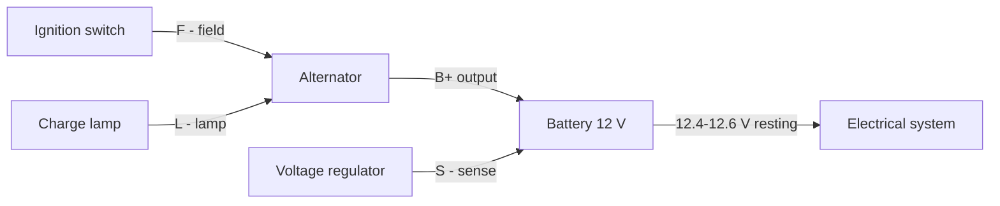
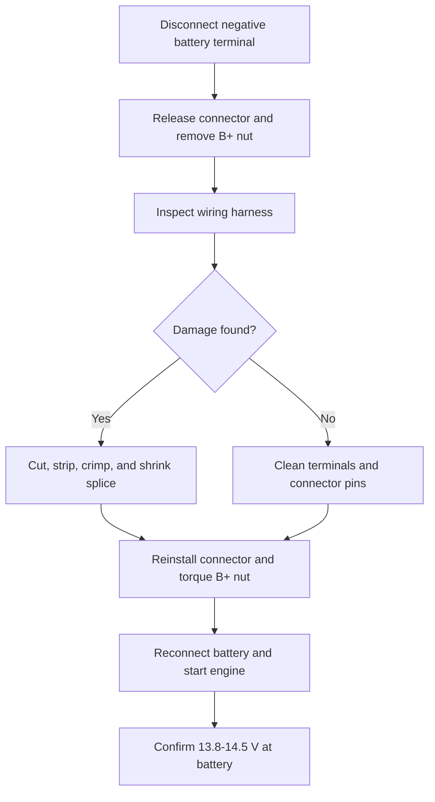
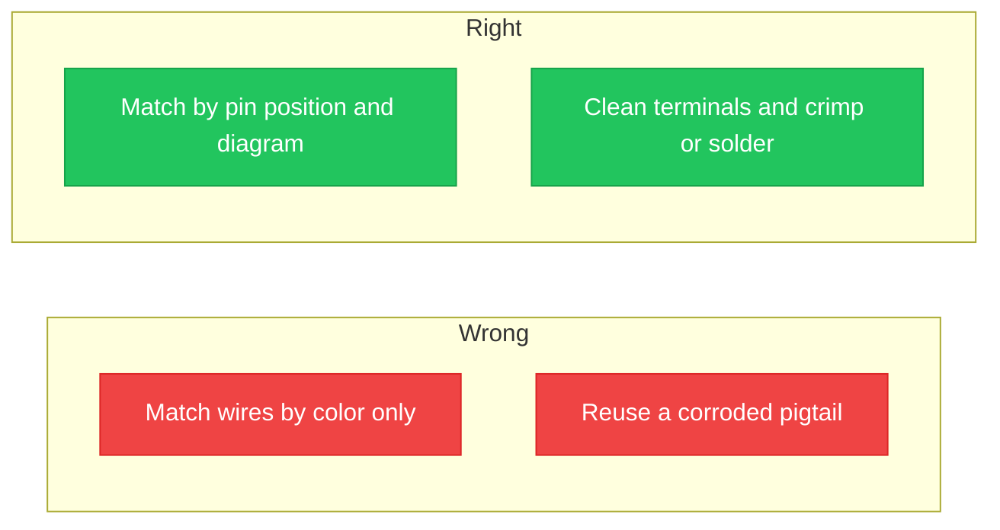

## Introduction to Alternator Wiring Diagrams

**<b>An alternator wiring diagram is the schematic that shows how the alternator, battery, voltage regulator, and wiring harness connect inside a vehicle's charging circuit.</b> The drawing maps every terminal, wire, connector, and ground point from the alternator output to the battery and the rest of the electrical system.

The alternator converts the engine's mechanical power, delivered by the serpentine belt, into electrical power. A healthy alternator keeps the battery charged and supplies current for the ignition system, lights, and accessories whenever the engine runs. Most passenger alternators deliver 13.8–14.5 volts (V) at 60–180 amps (A), depending on the vehicle.

There are 3 main benefits of reading an alternator wiring diagram:

1. Diagnose a charging fault before replacing parts
2. Reconnect an alternator or pigtail correctly after a repair
3. Avoid damaging the voltage regulator with a reversed connection

Alternator wiring diagrams have 4 main uses: alternator replacement, charging-system troubleshooting, harness and connector repair, and voltage checks against the rated output. The charging circuit has 5 main parts: the alternator, the battery, the voltage regulator, the charge lamp circuit, and the wiring harness that joins them.

Common issues with alternator wiring include loose battery connections, corroded terminals, a damaged wiring harness, a failed voltage regulator, and a blown fusible link.

## Understanding Wiring Diagrams

To read a diagram, learn the symbols first. The alternator appears as a circle with an output stud; the battery appears as stacked plates; a connector appears as a small block with numbered pins; the ground appears as three descending bars. Lines on the diagram represent wires, and each line carries a color label that matches the vehicle's harness.

Color codes vary by manufacturer. SAE-standard base colors appear across most diagrams, and a two-character code places the base color first and the stripe second. A code such as W/R reads as a white wire with a red stripe. The vehicle's factory manual lists the exact codes for each model.

A diagram also records component functions such as the regulator sense input and the lamp excite output. Factory manuals pair each layout with step-by-step instructions and maintenance tips for the wiring connections.

Wiring layouts differ by vehicle family. Three common layouts:

| Vehicle family | Terminals on the connector | Notes |
| :--- | :--- | :--- |
| **GM Delco SI** | BAT, #1, #2 | BAT is the output; #1 excites the field through the lamp; #2 senses battery voltage |
| **Ford** | I, S, A | I feeds the ignition; S senses battery voltage; A reads armature output; smart-charge systems add a LIN data line |
| **Toyota and Honda** | B, IG, S, L | B is the output; IG feeds ignition; S senses voltage; L drives the warning lamp |

Accurate wiring matters for 3 reasons: a reversed sense line keeps the alternator below target voltage, an open lamp line stops the field from exciting at start-up, and a loose output connection adds resistance that heats the B+ wire. Each fault drags the battery below a healthy 12.4 V resting charge.

## Common Alternator Wiring Issues

There are 6 common symptoms of alternator wiring trouble:

1. Charge warning lamp stays on while driving
2. Headlights dim at idle and brighten with engine speed
3. Battery discharges overnight
4. Electrical accessories flicker
5. Burning smell at the alternator plug
6. Engine stalls or fails to restart

| Symptom | Likely cause | First check |
| :--- | :--- | :--- |
| Lamp stays on | Open lamp circuit or failed regulator | Verify the L wire at the connector |
| Dim headlights at idle | Low output, loose belt, or high-resistance B+ | Measure 13.8–14.5 V at the battery |
| Overnight discharge | Battery drain or failed diode | Test current draw with the engine off |
| Flickering accessories | Loose wiring connections | Tighten and clean battery connections |
| Burning smell at plug | Corroded or melted connector pins | Inspect the wiring harness pigtail |
| Engine stalls | Charging circuit dropped below minimum | Check the wiring harness and ground strap |

Follow this step-by-step troubleshooting process:

1. Measure the battery with the engine off; a reading below 12.4 V means the battery is discharged or failing
2. Start the engine and measure again; a healthy charging system reads 13.8–14.5 V
3. If the voltage stays near the resting value, check belt tension and confirm the alternator pulley spins
4. Turn the engine off, disconnect the negative battery terminal, and inspect the wiring harness for melted plastic, corrosion, or charred pins
5. Check the fusible link between the B+ stud and the battery
6. Test the engine-to-chassis ground strap for high resistance
7. Reconnect everything, start the engine, and confirm the charge lamp turns off

> If a replacement alternator still does not charge, the fault sits in the wiring harness or the ground, not in the new alternator. Test the connector circuits before replacing parts a second time.

## Step-by-Step Wiring Repair Guide

Gather 8 tools and safety items before starting: a multimeter, insulated screwdrivers, a wire stripper, crimp connectors, heat-shrink tubing, safety glasses, work gloves, and the factory wiring diagram for the vehicle.

Follow this step-by-step repair process:

1. Disconnect the negative battery terminal and secure the cable away from the battery
2. Release the alternator connector latch and pull the plug straight off
3. Remove the B+ nut and lift the output ring terminal clear of the stud
4. Inspect the wiring harness for corrosion, melting, or damaged insulation
5. Cut out the damaged wire section and strip 6–8 mm (1/4–3/8 inch) of insulation
6. Crimp the splice, shrink the tubing over it, and re-pin or replace the connector as needed
7. Reinstall the connector, torque the B+ nut to specification, and reconnect the battery
8. Start the engine and confirm 13.8–14.5 V at the battery with the multimeter

Take 3 safety precautions during the repair: keep the disconnected negative cable away from the battery, never short the B+ stud to the case with a wrench, and verify the fuse before re-energizing the circuit. The B+ stud stays live whenever the battery is connected.

## Visual Aids and Diagrams

The wiring layout at the top of this guide shows the B+ path through the fusible link and the connector circuits of a typical alternator. The image below maps each terminal to its function and its common wire color:

The diagram shows 5 terminals: B+, L, S, F, and GND. Each card lists the terminal letter, the circuit name, and the physical job the wire performs. Use the image during a repair to confirm the function of every wire before reconnecting.

Common wiring mistakes appear as a wrong habit or a right habit. Compare the two columns:

There are 4 common wiring mistakes to avoid:

1. Match the connector circuits by color instead of by pin position
2. Reuse a melted or corroded pigtail
3. Leave the B+ nut loose or overtightened
4. Skip the negative battery disconnect and arc the B+ stud to the case

Visual aids serve 3 purposes in a repair: they label the exact terminal function, they compare correct and incorrect wiring side by side, and they speed up diagnosis for DIY mechanics working without a factory manual.

## Safety Precautions When Working with Wiring

Disconnect the negative battery terminal before touching any alternator wiring. The B+ stud carries full battery voltage at all times, and a wrench that touches the stud and the alternator case arcs violently.

Essential safety gear and tools: safety glasses, insulated screwdrivers and sockets, work gloves, a multimeter, and a fire extinguisher rated for electrical fires.

Common hazards in vehicle wiring work:

- Electric shock from the live B+ stud
- Battery explosion from hydrogen gas and sparks
- Burns from the hot alternator case
- Arc flash when a tool bridges the battery connections

Follow these 8 safe working practices:

1. Disconnect the negative battery terminal first and reconnect it last
2. Use insulated tools around the B+ stud
3. Remove metal jewelry before working
4. Wear safety glasses and work gloves
5. Work on a cool engine; the alternator case gets hot
6. Keep sparks away from the battery; hydrogen gas is flammable
7. Torque the B+ nut to specification
8. Double-check polarity before reconnecting the battery

> The negative battery cable grounds the entire body. Removing it isolates the charging circuit and is the single most important step before any electrical repair.

## Conclusion and Additional Resources

Understanding the alternator wiring diagram keeps the charging system reliable and makes DIY repairs safe. The schematic maps the 5 main parts, shows the B+ output to the battery, and traces the small connector circuits to the charge lamp, sense, and field. Reading the color coding before touching any wire prevents the reversed connections that damage the voltage regulator.

For a model-specific layout, see the [2005 Kia Sedona alternator wiring diagram](/blog/sedona-alternator-wiring-diagram/). To practice reading schematics, start with the [step-by-step guide to reading circuit diagrams](/blog/how-to-read-a-circuit-diagram-step-by-step-guide/).

Draw and save your own charging-system schematic in the free browser editor: [open the circuit editor](/editor/). You can also [make a circuit diagram online](/blog/how-to-make-circuit-diagram-online/) without installing software.

Share your questions or your own alternator wiring experiences in the comments. The team answers new charging-system topics in the next guide.
