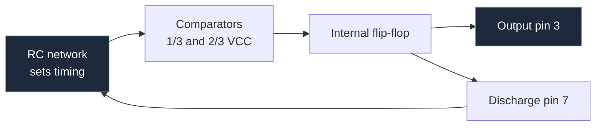

**An analog schematic is judged on one thing: can the reader see the feedback path?** Gain, bandwidth, stability and oscillation frequency are all set by feedback, and feedback is a *loop* — the one structure that a left-to-right drawing convention cannot represent naturally. Learning to draw loops so they are obvious rather than confusing is most of what separates a clean analog schematic from a mess.

This guide covers the drawing conventions for op-amps, comparators, 555 timers, and the RC networks that set their behaviour, then applies them to real audio amplifier and oscillator circuits. It sits under our [complete guide to circuit diagrams](/blog/complete-guide-to-circuit-diagrams/), which covers the universal layout rules.

## The Op-Amp Triangle

The op-amp symbol is a triangle pointing right. Its anatomy:

| Element | Position | Rule |
| :--- | :--- | :--- |
| **Inverting input** | Left edge, marked `−` | Conventionally the upper input |
| **Non-inverting input** | Left edge, marked `+` | Conventionally the lower input |
| **Output** | Apex, right | Single pin, always the point of the triangle |
| **Positive supply** | Top edge | Often hidden on multi-op-amp sheets |
| **Negative supply** | Bottom edge | Same |

Two rules govern the triangle, and the second one is where designs get destroyed.

**You may flip the inputs.** Putting `+` on top and `−` on the bottom is completely acceptable when it makes the feedback network cleaner, and experienced designers do it constantly.

**You must move the labels when you flip.** The `+` and `−` markings define the pins — the geometry does not. A triangle drawn flipped but labelled unflipped is the single most expensive symbol error in analog design, because the circuit simulates correctly from the netlist you *intended* and oscillates or latches in hardware. Check every op-amp symbol against its pin numbers before release.

**Supply pins.** On a sheet with one or two op-amps, draw the supply pins explicitly with their decoupling capacitors. On a sheet with eight, use hidden power pins tied to named nets, and put a note on the sheet stating which rails they connect to plus a separate decoupling block. What you must never do is silently omit the supplies and provide no note — the reader cannot tell whether the part is single-supply or dual-supply, and that changes the entire biasing scheme.

## Drawing Feedback So the Loop Is Obvious

The convention is simple and near-universal: **the feedback component goes directly above the amplifier body**, with the loop running output → up → left → down into the input node.

That produces a closed rectangle sitting on top of the triangle. A reader sees the rectangle and immediately knows two things: the amplifier has negative feedback, and the component inside the rectangle sets the gain. No tracing required.

Rules that keep the loop readable:

- **Feedback above, input from the left.** The summing node — where `Rin` and `Rf` meet at the inverting input — should be a clean T junction with a visible dot.
- **Never route feedback below the amplifier.** Below is where the ground return and the bias network live. Mixing them makes the loop unreadable.
- **One loop per amplifier, visually closed.** If your feedback path wanders across the sheet through six corners, move the amplifier instead.
- **Annotate the gain.** Write `Av = −Rf/Rin = −10` next to the block. It costs one text label and eliminates the reader's arithmetic.

| Configuration | Topology | Gain | Drawing signature |
| :--- | :--- | :--- | :--- |
| **Inverting** | Input via `Rin` to `−`, `Rf` output to `−`, `+` to ground | `−Rf/Rin` | Feedback rectangle above, `+` tied down |
| **Non-inverting** | Input direct to `+`, divider from output to `−` | `1 + Rf/Rg` | Divider hanging below the feedback path |
| **Voltage follower** | Output wired straight to `−`, input to `+` | `1` | A bare wire loop, no components |
| **Comparator** | Reference to one input, signal to the other | Open loop | *No* feedback rectangle at all |
| **Difference amp** | Two matched dividers | `Rf/Rin` | Symmetric — draw it symmetric |

The comparator case deserves emphasis: the *absence* of a feedback rectangle is itself information. When a reader sees an op-amp triangle with nothing above it, they should immediately conclude "open loop, this is a comparator." So do not leave a feedback resistor off an amplifier by accident — you are not just omitting a part, you are actively communicating something false.

Add hysteresis to a comparator and a small feedback rectangle appears, but it returns to the **non-inverting** input rather than the inverting one. That distinction — feedback to `+` means positive feedback means hysteresis or oscillation — is visible in the drawing if you have been disciplined about which input sits where.

## The 555 Timer: Block Diagram or Pinout?

The 555 can be drawn two completely different ways, and choosing correctly depends on your audience.

**As a pinout rectangle.** A plain box with the eight pins labelled by function. This is what you use in any real design. It is compact, it drops into a schematic like any other IC, and it tells a builder everything they need.

**As an internal block diagram.** Two comparators, a three-resistor divider, an SR flip-flop, a discharge transistor and an output buffer. This is a *teaching* drawing. It belongs in documentation and tutorials, never in a design schematic, because it implies you can access nodes that are not brought out to pins.

The internal view does explain the part, though. The divider is three equal resistors across the supply, setting thresholds at one third and two thirds of VCC. The lower comparator watches the trigger pin against ⅓ VCC; the upper watches the threshold pin against ⅔ VCC. Their outputs set and reset the internal flip-flop, whose state drives both the output pin and the discharge transistor. Every 555 circuit is just an RC network arranged to cross those two thresholds.

| Pin | Name | Function |
| :--- | :--- | :--- |
| 1 | GND | Ground return |
| 2 | TRIG | Starts the timing cycle when pulled below ⅓ VCC |
| 3 | OUT | Push-pull output, sources and sinks ~200 mA |
| 4 | RESET | Active low — forces output low. **Tie to VCC if unused** |
| 5 | CTRL | Control voltage, taps the ⅔ VCC node. Bypass with 10 nF if unused |
| 6 | THR | Ends the timing cycle when driven above ⅔ VCC |
| 7 | DIS | Discharge — the open collector that drains the timing capacitor |
| 8 | VCC | Supply, 4.5 V to 15 V for the bipolar version |

Two of those pins cause most 555 failures in the field, and both failures are *drawing* failures:

- **Pin 4 left floating.** Reset is active low; a floating pin picks up noise and randomly resets the timer. Draw it tied to VCC explicitly.
- **Pin 5 left bare.** The control node is high impedance and sits inside the threshold divider. Draw the 10 nF bypass capacitor to ground.

Both are cases where "the schematic did not say to do it" becomes "the board does not work."

## Drawing RC Timing Networks

In a 555 or oscillator circuit, the RC network is the part the reader most wants to find, because it sets the frequency. Make it findable:

**Group the timing components.** `R1`, `R2` and `C1` should form a visually distinct vertical column beside the IC, not be scattered among the decoupling and pull-ups.

**Draw the charge path top to bottom.** Resistors descend from VCC, the capacitor sits at the bottom going to ground, and the timing node — where threshold and trigger connect — is the junction between them. That vertical arrangement matches the voltage convention and makes the charging direction obvious.

**Annotate the formula on the sheet.** For the astable configuration:

```
f = 1.44 / ((R1 + 2·R2) · C1)
duty = (R1 + R2) / (R1 + 2·R2)
```

And for the monostable:

```
t = 1.1 · R · C
```

Writing the relevant one next to the network turns your schematic into a document somebody can modify correctly. Without it, the next person changes `R2` to adjust frequency and is surprised when the duty cycle moves too.

**Mark tolerance where it matters.** A timing capacitor should be annotated with its dielectric and tolerance. A ±20% Y5V ceramic in a timing slot makes the frequency a suggestion. Our [555 timer circuit guide](/blog/555-timer-circuit/) works through the full formula set with practical component choices.



That loop back from the discharge pin to the RC network is the whole oscillator. Draw it as a visible closed path and the astable configuration explains itself.

## Audio Amplifier Circuit Diagrams

### LM386: The Simple Audio Amplifier

The LM386 is the standard small-signal audio amplifier, and its schematic has a specific set of components that must all appear:

| Pin | Function | What to draw |
| :--- | :--- | :--- |
| 1 | Gain set | Leave open for gain of 20 |
| 2 | Inverting input | Usually to ground through the input network |
| 3 | Non-inverting input | Signal in, via a coupling capacitor and volume pot |
| 4 | GND | Ground |
| 5 | Output | Coupling capacitor to the speaker, plus the Zobel network |
| 6 | VS | Supply, with decoupling |
| 7 | Bypass | 10 µF to ground |
| 8 | Gain set | 10 µF from pin 1 to pin 8 raises gain to 200 |

The gain-setting arrangement between pins 1 and 8 is the LM386's signature and the thing beginners most often draw wrong. Open means gain 20. A 10 µF capacitor between them means gain 200. A resistor in series with that capacitor sets intermediate values. Annotate which one you intend — `GAIN = 200` next to the capacitor — because the component itself does not communicate the design decision.

Two more that get left off and must not be:

- **The output coupling capacitor.** A few hundred µF between pin 5 and the speaker. Without it, DC flows through the voice coil.
- **The Zobel network.** Roughly 10 Ω in series with 50 nF from the output to ground. It stabilizes the amplifier against the speaker's inductive load. It looks like two pointless components until the amplifier oscillates without them, so draw them adjacent to the output pin and label the pair `ZOBEL`.

### TDA2030: Subwoofer and Power Amplifier

For real power you move to a chip like the TDA2030 — around 14 W into 4 Ω. Its five pins in the Pentawatt package:

| Pin | Function |
| :--- | :--- |
| 1 | Non-inverting input |
| 2 | Inverting input |
| 3 | −VS (negative supply, or ground in single-supply designs) |
| 4 | Output |
| 5 | +VS (positive supply) |

Drawing notes specific to a power amplifier of this class:

- **Dual supply means the vertical convention does real work.** `+VS` at the top of the sheet, ground in the middle, `−VS` at the bottom. The input bias network references ground; drawn correctly, the symmetry is visible.
- **The feedback network still goes above the body**, exactly as with a small-signal op-amp. Gain is set by the ratio in that divider, and for a subwoofer channel you will usually be running a gain of 20 to 30.
- **Draw the supply decoupling as two pairs**: a bulk electrolytic and a ceramic on each rail, adjacent to the supply pins. Power amplifiers draw current in bursts at signal frequency, and this is where you say so.
- **Show the protection diodes** from each output to each rail if the design uses them. On an inductive load they are not optional.
- **Annotate the heatsink requirement** as a text note. A 14 W amplifier dissipating in a TO-220-style package is a thermal design, and the schematic is where that gets flagged.

For a subwoofer specifically, the low-pass filter ahead of the amplifier belongs on the drawing as its own labelled block — typically a Sallen-Key active filter around an op-amp with its corner frequency annotated. Keep it visually separate from the power stage: filter on the left, amplifier on the right, one clean signal path between them.

## Oscillator Circuits

### Sine Wave Generator Circuits

A **Wien bridge oscillator** is the standard low-distortion sine source. An op-amp with a series RC and a parallel RC in the feedback path oscillates at:

```
f = 1 / (2 · π · R · C)
```

The critical design constraint is that the amplifier gain must be *exactly* 3 — enough to sustain oscillation, not enough to clip. That means the non-inverting gain divider needs a ratio of 2, plus some amplitude-stabilizing element: back-to-back diodes, a thermistor, or a small incandescent lamp in the classic version.

Drawing rules that matter here:

- **The frequency-determining network goes on the input side**, drawn as a recognizable pair: series RC above, parallel RC below.
- **The gain-setting divider goes in the feedback rectangle** on the other input. Two networks, two locations, no ambiguity about which sets frequency and which sets gain.
- **Annotate the amplitude-stabilization element** with a note explaining its purpose, because a lamp or a pair of diodes in a feedback path looks like a mistake to anyone who has not seen the topology.

A **phase-shift oscillator** takes the alternative route: three cascaded RC sections each contributing 60° of phase shift, wrapped around an inverting amplifier. Draw the three RC sections as three visually identical stages in a row — the repetition *is* the explanation, and any asymmetry in your drawing will read as a design detail rather than a drawing accident.

### Monostable Multivibrator Using an Op-Amp

A monostable produces one output pulse of fixed length per trigger. Built from an op-amp, it is a comparator with positive feedback setting the threshold and an RC network setting the duration.

Because the feedback here is *positive*, the drawing must make that unmistakable: the feedback rectangle returns to the **non-inverting** input, and the RC timing network connects to the **inverting** input. Two networks, two inputs, and the input labels are what distinguish a monostable from a linear amplifier. Add a note — `POSITIVE FEEDBACK — SCHMITT ACTION` — beside the feedback resistor. It is one of the few cases where a text annotation prevents a genuine misreading of a correct drawing.

### 555 Counter and Reaction-Timer Circuits

Combine a 555 astable with a counter and you get a family of practical projects.

A **555 seven-segment counter** is three blocks on one sheet: the 555 astable generating clock pulses on the left, a decade counter with a built-in seven-segment decoder such as the 4026 or 4033 in the middle, and the display on the right. Draw the seven segment outputs as a bus rather than seven parallel wires, and label the display pins by segment letter, not by pin number.

A **555 reaction timer** adds a gate: the clock runs into the counter only while a start signal is active, and the player's button stops it. The gating logic is a single AND gate or the counter's own clock-inhibit pin, and the drawing should place the human-facing controls — start button, stop button, reset — grouped together on one edge of the sheet with clear labels. Counter chains and the 4017 sequencer that often replaces the decoder are covered in the [logic gate circuit diagrams guide](/blog/logic-gate-circuit-diagrams/).

## Analog Schematic Checklist

1. Every op-amp's `+` and `−` labels verified against pin numbers, especially where the symbol is flipped.
2. Feedback network drawn above the amplifier body, forming a closed visible rectangle.
3. Gain annotated as a formula and a number.
4. Comparators clearly open-loop, or hysteresis feedback clearly going to the non-inverting input.
5. Supply pins either drawn with decoupling or covered by an explicit sheet note.
6. 555 pin 4 tied to VCC, pin 5 bypassed — drawn, not assumed.
7. Timing components grouped in one column with the frequency formula written beside them.
8. Timing capacitor dielectric and tolerance specified.
9. Coupling capacitors on every AC-coupled input and output, with values.
10. Zobel or snubber networks drawn adjacent to the output pin they stabilize, and labelled.
11. Bias network referenced to the correct rail, with the mid-supply reference explicitly named in single-supply designs.
12. Heatsink and dissipation notes on any device above about 1 W.

**[Start drawing your own schematic now.](/editor/)** Op-amp triangles, comparators, 555 blocks, polarized capacitors and the passives you need for RC networks are all in the library, and the grid snap keeps feedback rectangles square. When your oscillator needs verifying on the bench, the [measurement and test circuit guide](/blog/measurement-test-circuit-diagrams/) covers how to draw the test points and probe loading you will need.
