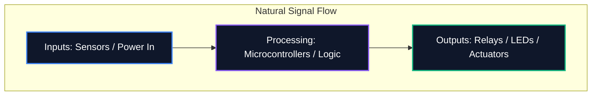

Whether you are sharing a diagram on a forum or submitting it for professional PCB fabrication, the readability of your layout is as important as its logical correctness. In fact, using a proper **circuit diagram maker** is essential to avoid routing errors, misunderstood components, and entirely wasted time.

This guide outlines the core best practices used by professional electronics engineers to create clean, maintainable, and highly readable circuit diagrams.

## 1. Flow of the Schematic: Left to Right, Top to Bottom

A schematic is a technical document, and like any document, it should be read naturally. In electronics design, standard convention dictates that inputs flow from the left, and outputs exit to the right. 

Similarly, higher voltages should be explicitly placed at the top of the schematic, and lower voltages or ground at the bottom.



## 2. Power and Ground Symbols

Never draw long, winding wires connecting every single ground pin together. It creates a spiderweb that is impossible to read. Instead, use local power and ground symbols at the component.

| Bad Practice | Best Practice | Why it Matters |
| :--- | :--- | :--- |
| Tying all grounds with a single continuous wire | Utilizing local `GND` symbols at each component | Reduces visual clutter; explicitly defines return paths without complex tracing |
| Placing VCC lines crossing over signal traces | Using local `VCC` / `+5V` symbols pointing upward | Prevents signal lines from being visually confused with power delivery |
| Labeling different grounds with the same symbol | Differentiating Analog Ground (AGND) and Digital Ground (DGND) | Critical for avoiding ground loops and noise propagation in mixed-signal designs |

## 3. Junction Dots vs. Crossings

One of the most dangerous mistakes in schematic design is ambiguity where wires cross. 

```mermaid
graph TD
    A[Is it a connection?]
    A --> B{Is there a junction dot?}
    B -- Yes --> C[Wires are electrically connected (Node)]
    B -- No --> D[Wires are crossing without connecting]
    
    style A fill:#1e293b,stroke:#f59e0b
    style C fill:#1e293b,stroke:#10b981
    style D fill:#1e293b,stroke:#ef4444
```

> **Pro Tip:** Never use "4-way" junctions (a cross shaped like a '+'). If four wires need to meet, offset them into two 3-way 'T' junctions. This completely eliminates ambiguity; if the junction dot disappears when printing or scaling, the 'T' shape still unambiguously implies a connection, whereas a bare cross does not.

## 4. Logical Component Grouping

When dealing with large schematics containing microcontrollers with 64+ pins, trying to draw every wire physically to the component is an exercise in futility. Instead, professional tools utilize **Net Labels**.

Group functional blocks of your circuit into visual zones. For instance, put the power supply in one corner, the MCU in the center, and motor drivers in another. Connect them purely using descriptive Net Labels (e.g., `SPI_MOSI`, `UART_TX`, `MOTOR_PWM`).

## 5. Reference Designators and Values

A bare resistor symbol tells the viewer nothing. Every component must have a unique reference designator and an explicit value.

| Component Category | Standard Prefix | Example |
| :--- | :--- | :--- |
| **Resistors** | `R` | `R1 (10kΩ)` |
| **Capacitors** | `C` | `C4 (100nF)` |
| **Integrated Circuits** | `U` or `IC` | `U2 (LM358)` |
| **Diodes / LEDs** | `D` | `D1 (1N4148)` |
| **Transistors / MOSFETs** | `Q` | `Q1 (2N2222)` |
| **Inductors** | `L` | `L1 (4.7μH)` |
| **Connectors/Headers** | `J` or `P` | `J1 (Power Jack)` |

Adhering to these conventions guarantees that your schematic will be instantly understood by any engineer, anywhere in the world. Start applying these rules today in the [Circuit Diagram Editor](/editor/).

## 6. Sources

*   [IPC-2612 Sectional Requirements for Electronic Diagramming](https://www.ipc.org)
*   IEEE Std 315-1975 (Reaffirmed 1993) - Graphic Symbols for Electrical and Electronics Diagrams
*   Best practices extracted from professional hardware engineering teams at major semiconductor manufacturers.

## 7. Frequently Asked Questions

**Are crossing wires without dots connected?**  
No, by standard convention, wires that cross without a junction dot are not electrically connected.

**Why is natural signal flow important?**  
Structuring from left to right makes it significantly easier to trace logical paths and troubleshoot issues without relying purely on net labels.

**Is there a tool that implements these best practices automatically?**  
Many modern EDA tools and platforms like Circuit Diagram Maker encourage or enforce clean standard rules, especially via built-in grid snapping.

<script type="application/ld+json">
{
  "@context": "https://schema.org",
  "@type": "FAQPage",
  "mainEntity": [
    {
      "@type": "Question",
      "name": "Are crossing wires without dots connected?",
      "acceptedAnswer": {
        "@type": "Answer",
        "text": "No, by standard convention, wires that cross without a junction dot are not electrically connected."
      }
    },
    {
      "@type": "Question",
      "name": "Why is natural signal flow important?",
      "acceptedAnswer": {
        "@type": "Answer",
        "text": "Structuring from left to right makes it significantly easier to trace logical paths and troubleshoot issues without relying purely on net labels."
      }
    },
    {
      "@type": "Question",
      "name": "Is there a tool that implements these best practices automatically?",
      "acceptedAnswer": {
        "@type": "Answer",
        "text": "Many modern EDA tools and platforms like Circuit Diagram Maker encourage or enforce clean standard rules, especially via built-in grid snapping."
      }
    }
  ]
}
</script>
