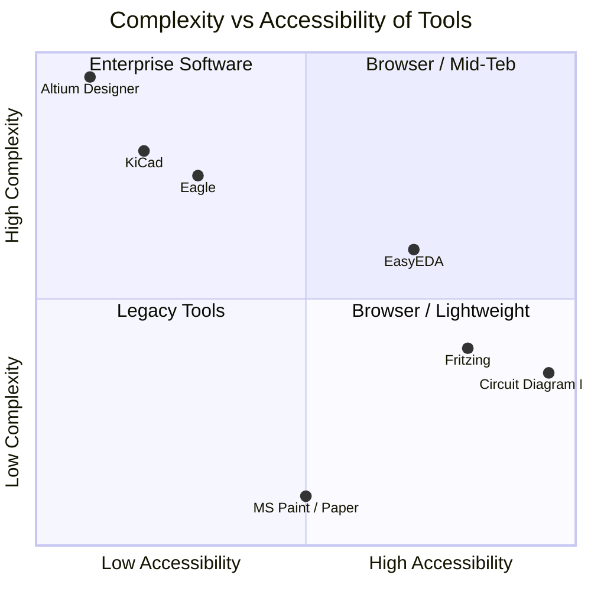
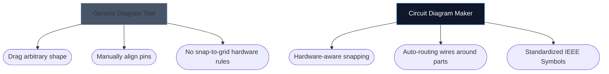

Choosing the right tool to draw your electronics schematics can often dictate how fast you can iterate on a new hardware project. While advanced PCB designers require heavyweight desktop environments, hobbyists, students, and makers often need something entirely different: accessibility and speed.

Below, we analyze how our tool stacks up against the main industry alternatives.

## Tool Categorization Matrix

Before diving into individual tools, it is crucial to understand what tier of software your project actually demands. Using enterprise PCB software to sketch a 4-component LED layout is overkill.

## 1. Circuit Diagram Maker vs. Fritzing

Fritzing is famous for bridging the gap between breadboard prototyping and schematics. However, Fritzing requires installation and has struggled with maintenance updates over the years.

| Feature | Circuit Diagram Maker | Fritzing |
| :--- | :--- | :--- |
| **Primary Focus** | Standard Schematic Layouts | Breadboard Visualizations |
| **Installation** | None (100% Browser-based) | Desktop Installation Required |
| **Cost** | 100% Free | Paid (Donationware) |
| **Learning Curve** | Extremely Low | Moderate |

> **The Verdict:** If you specifically need to visualize physics wires plunging into a breadboard, Fritzing is superior. If you need standard, universal electronic schematics *instantly*, use Circuit Diagram Maker.

## 2. Circuit Diagram Maker vs. KiCad & Altium

KiCad is a legendary open-source PCB suite, and Altium Designer is the enterprise industry standard. They are immensely powerful.

| Capability Layer | Circuit Diagram Maker | KiCad / Altium |
| :--- | :--- | :--- |
| **Output Type** | SVG/PNG Imagery | Gerber Files, BOM, Pick&Place |
| **Simulation** | Visual / Simplistic | Deep SPICE Integration |
| **Speed to First Schema** | < 10 seconds | 10–30 Minutes (Setup/Config) |

> **The Verdict:** Use KiCad or Altium when you are sending layers of copper to a factory in Shenzhen. Use Circuit Diagram Maker when you are attaching a schematic to a physics assignment, blog post, or forum question.

## 3. Circuit Diagram Maker vs. draw.io / Lucidchart

Generic diagramming tools like draw.io are incredibly popular for flowcharts. However, they lack semantic understanding of electronics.

When you use a dedicated electronics tool, the editor understands that a wire cannot simply "terminate" randomly without a junction, and it inherently maps standard properties (like Ohms to resistors).

## Which Tool is Right for You?

The best tool is the one that gets out of your way. For rapid ideation, educational assignments, and web publications, [Circuit Diagram Maker](/editor/) offers an unbeatable combination of speed and modern aesthetic. 
