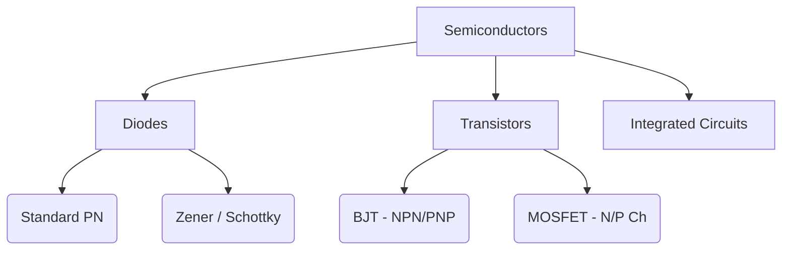

Electronic symbols are the universal language of hardware engineering. Just as music notes dictate pitch and rhythm, circuit symbols convey electrical function, property, and connectivity over a piece of paper.

In this comprehensive guide, we dissect the visual morphology of the most important elements you will encounter in any schematic.

## Global Standard Differences: IEEE vs. IEC

Before diving into specific symbols, it is crucial to recognize that symbols can look different depending on where the schematic was drawn. The two dominant standards are the **IEEE/ANSI** (mostly Americas) and **IEC** (Europe and international).

```mermaid
flowchart LR
    subgraph Regional Standards
    A((Schematic Origin))
    A -- US / Americas --> B[IEEE / ANSI]
    A -- Europe / Int'l --> C[IEC]
    end
    
    B -.-> D(Zigzag Resistors)
    C -.-> E(Rectangle Resistors)
    
    style B fill:#1e293b,stroke:#f59e0b
    style C fill:#1e293b,stroke:#3b82f6
```

In Circuit Diagram Maker, we primarily utilize the IEEE/ANSI standard, as it remains highly popular in digital and hobbyist ecosystems, though both are technically correct.

## Passive Components

Passive components do not require an external power source to operate and cannot amplify a signal.

| Component | Standard Symbol Appearance | Functional Description |
| :--- | :--- | :--- |
| **Resistor** | Defined by a sharp, jagged zigzag line. Variable variants feature an arrow piercing the line. | Dissipates power as heat to restrict the flow of electrical current. |
| **Capacitor** | Two parallel lines separated by a gap. Polarized variants curve one of the lines to indicate the negative terminal. | Stores electrical energy temporarily in an electric field. |
| **Inductor** | A series of rounded loops or semi-circles representing coils of wire. | Opposes changes in current flow by storing energy in a magnetic field. |

## Active Components (Semiconductors)

Active components require a power source and can control the flow of electricity, often amplifying signals.

| Component | Visual Indicators | Core Usage |
| :--- | :--- | :--- |
| **Diode** | A triangle pointing towards a flat line. The line indicates the cathode (negative). | A one-way valve for electricity. |
| **LED** | A standard diode symbol with two small arrows pointing outward, signifying light emission. | Visual indicators and optoelectronics. |
| **BJT Transistor** | A vertical line flanked by three connections: base, collector, and an emitter with an arrow dictating NPN or PNP. | Current-controlled switches and amplifiers. |
| **MOSFET** | Features separated boundary lines highlighting the isolated gate and internal substrate diodes. | Voltage-controlled switching for high power. |

## Mechanical and Output Devices

These parts interact with the physical world, either taking human input or generating physical output.

| Component | Schematic Shorthand | Application |
| :--- | :--- | :--- |
| **Switch (SPST)** | A broken line that can pivot down to complete the circuit. | Basic ON/OFF power control. |
| **Relay** | Usually depicted as an inductor (the internal coil) coupled with isolated switch contacts. | Switching high-voltage loads via low-voltage microcontrollers. |
| **Motor** | A circle containing an 'M', often with designated positive and negative terminals. | Converting electrical current into rotational kinetics. |

> **Design Tip:** Whenever using mechanical switches or relays, always include a *flyback diode* across inductive loads to protect your semiconductor components from voltage spikes!

Understanding these symbols is the first step toward circuit fluency. Check out our [online editor](/editor/) to drag, drop, and experiment with these shapes instantly.
