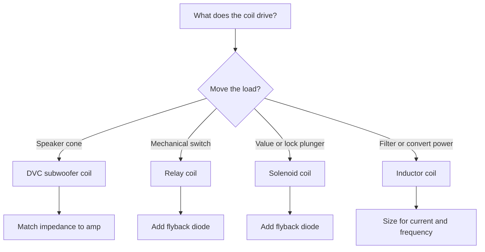
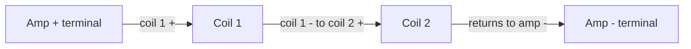
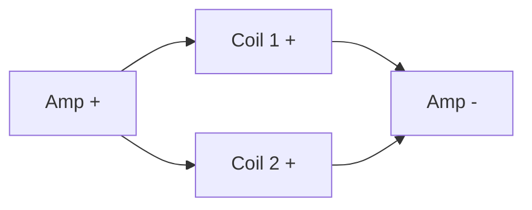
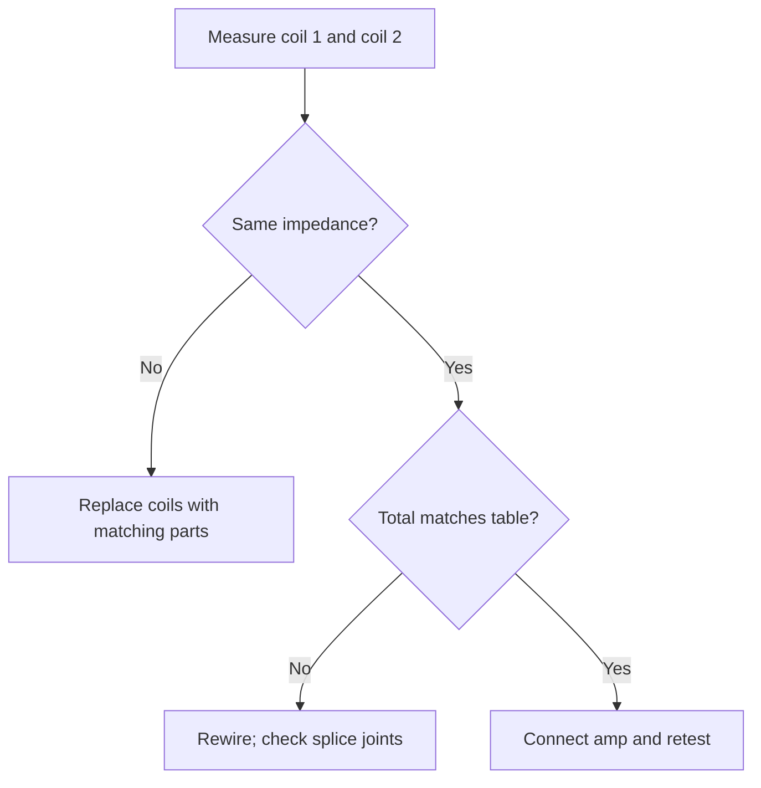

## Introduction to Coil Wiring

**<b>A coil wiring diagram is the schematic that shows how coils connect to power, ground, and the parts they drive, covering relay coils, solenoid coils, inductors, and dual voice coil speakers.</b> A coil is a length of wire wound into loops that stores energy in a magnetic field. The diagram maps each coil terminal to the driver circuit and the protection components around it.

Coil wiring matters in Arduino projects because relays, solenoid valves, and power inductors all rely on coils. In Arduino projects, the diagram shows how a digital output drives a coil through a transistor and a flyback diode instead of connecting the coil straight to the board.

There are 3 main benefits of reading a coil wiring diagram:

1. Predict the impedance and power handling of audio coils before wiring
2. Drive relay and solenoid coils from a microcontroller without damaging the board
3. Find no-power, hum, and blown-coil faults from the wiring layout

The diagram has 4 main uses: dual voice coil (DVC) subwoofer wiring, Arduino relay modules, solenoid actuation, and inductor-based power circuits. The wiring layout has 5 main parts: the coil, the power source, the switching device, the flyback protection, and the electrical load.

## Types of Coils and Their Applications

**<b>A dual voice coil (DVC) subwoofer has 2 separate voice coils wound on the same speaker former.</b> Each coil has its own pair of terminals and its own impedance rating, usually 2 or 4 ohms (Ω).**

A DVC subwoofer offers 3 advantages:

1. Match the amplifier load with series and parallel wiring
2. Wire a single subwoofer to a mono amp or a bridged amp
3. Reach a low final impedance when the amp cannot drive high-ohm loads well at low power

<table>
  <thead>
    <tr><th>Coil type</th><th>What the coil does</th><th>Typical rating</th><th>Common use</th></tr>
  </thead>
  <tbody>
    <tr>
      <td><strong>DVC speaker coil</strong></td>
      <td>Moves the subwoofer cone; impedance adds in series and halves in parallel</td>
      <td>2 Ω or 4 Ω per coil</td>
      <td>Subwoofer wiring in audio systems</td>
    </tr>
    <tr>
      <td><strong>Relay coil</strong></td>
      <td>Energizes an electromagnet that closes switch contacts</td>
      <td>5 V or 12 V DC</td>
      <td>Arduino projects and home automation</td>
    </tr>
    <tr>
      <td><strong>Solenoid coil</strong></td>
      <td>Pulls a plunger to move a valve or a lock</td>
      <td>6–24 V DC</td>
      <td>Irrigation valves and door locks</td>
    </tr>
    <tr>
      <td><strong>Inductor coil</strong></td>
      <td>Stores magnetic energy and smooths current flow</td>
      <td>Microhenries (µH) to henries (H)</td>
      <td>Filters and boost converters</td>
    </tr>
  </tbody>
</table>

Select the coil type from the wire-up requirement before designing the circuit:

In audio systems, a DVC subwoofer wires to a mono subwoofer amplifier. A single DVC sub delivers around twice the cone control of an equivalent single voice coil (SVC) sub when the amplifier matches the lower final impedance. The image below shows the 4 coil types:

## Step-by-Step Wiring Diagrams

Two wiring methods apply to a DVC subwoofer: series wiring and parallel wiring.

**<b>Series wiring connects coil 2 to coil 1 and adds the impedances. Parallel wiring connects both coils across the same amplifier terminals and halves the impedance.</b>**

The table shows both outcomes for common coil impedances:

| Each coil impedance | Series total | Parallel total |
| :--- | :--- | :--- |
| 2 Ω | 4 Ω | 1 Ω |
| 4 Ω | 8 Ω | 2 Ω |

Select the wiring method to match the amplifier's stable impedance range. A mono amp rated to 4 ohms (Ω) at 500 watts (W) receives 2 DVC coils in series, each 2 Ω, for a 4 Ω total. An amp rated to 1 Ω receives the same coils in parallel at 1 Ω total, and power handling splits across the 2 coils.

Use these 5 wiring tips:

1. Match the total impedance to the amplifier's rated range for a stable load
2. Connect coil 1 and coil 2 from the same subwoofer to the same amp channel
3. Check that both coils share the same impedance and power rating
4. Measure the terminals with a multimeter before connecting the amplifier
5. Mark the + and − terminals on both coils to avoid reversal

## Troubleshooting Common Wiring Issues

There are 6 common wiring mistakes in coil circuits:

1. Reverse the polarity on one voice coil, and the cone fights itself
2. Mix 2 Ω and 4 Ω coils in one subwoofer and the load is uneven
3. Wire a net impedance below the amp rating, and the amp enters protect mode
4. Leave a loose or cold-soldered splice on a high-current coil circuit
5. Skip the flyback diode on an Arduino relay coil
6. Use undersized wire on a high-power coil circuit

Solve a DVC wiring problem with a multimeter:

1. Set the multimeter to resistance (Ω)
2. Measure coil 1 across its terminals; expect 2 Ω or 4 Ω
3. Measure coil 2; expect the same value
4. Wire series or parallel, then measure the two coil terminals again against the table

> "I wired two 4 Ω coils in series to reach 8 Ω for my amp. The meter showed 8.1 Ω and the amp ran cool instead of cutting out." — Classic car audio forum post

> "An Arduino relay module I built kept resetting. The missing flyback diode was the whole fault. One 1N4007 fixed it." — Hobby electronics forum user

Preventative measures: fuse the power line at the coil's current rating, solder every joint, and heat-shrink the exposed splices.

## Safety Precautions When Working with Coils

A coil stores magnetic energy, and an interrupted coil current produces a high-voltage spike. That spike reaches hundreds of volts on a relay coil driven at 12 V. Coil wiring carries 3 main risks: electric shock, coil kickback damage, and short circuits from loose wire.

Follow these 8 safety precautions:

1. Unplug the power source before wiring or re-wiring any coil
2. Discharge power capacitors before touching the circuit
3. Install a flyback diode across every relay and solenoid coil
4. Use insulated tools and wire strippers with a clean die
5. Check polarity on both coils before connecting an amplifier
6. Fuse the power line at or below the coil's rated current
7. Wear safety glasses when a solenoid plunger can spring back
8. Verify the coil reads its rated resistance before applying power

> A flyback diode (1N4007 for most DC coils) works in every coil circuit that a microcontroller or switch interrupts. The diode faces backwards across the coil and absorbs the kickback spike when the coil turns off.

Check insulation twice. Cracks in the wire jacket near a coil's metal case cause shorts to ground. Use shrink tubing at every splice so bare conductors never touch the frame.

## Real-World Examples and Case Studies

**Case study 1: Arduino relay switch.** A home automation rig switches a 12 V garden pump with a relay coil. The relay draws 85 milliamps (mA) at 12 V, far above the Arduino's 20 mA per pin. The build uses a 2N2222 transistor, a 1 kΩ base resistor, and a 1N4007 flyback diode across the coil. The Arduino pin turns the transistor on, the coil energizes, and the pump runs. A lesson learned: without the flyback diode, the coil spike reset the Arduino on every switch-off.

**Case study 2: Car subwoofer build.** A single 2 Ω DVC sub drives a 1 Ω-stable mono amplifier. The builder wired the coils in parallel for 1 Ω total, ran 16 AWG speaker wire to both coils, and fused the power at the amp rating; kit dyno showed clean output across the frequency range. A second attempt with series wiring gave 4 Ω at half the current draw but less power.

**Case study 3: Boost converter with an inductor coil.** A DIY 5 V to 12 V boost converter uses a 100 µH inductor, a Schottky diode, and a switch driven by the Arduino's PWM (pulse-width modulation) output. The inductor stores energy each switching cycle and delivers a smoothed 12 V at the output. The lesson learned: the inductor must be rated for the full switching current, or the core saturates and output voltage collapses.

3 innovative uses of coil wiring in DIY electronics:

1. Magnetic door locks driven by an Arduino and a relay module
2. DVC subwoofer wiring in a 2.1 home theater speaker build
3. Hand-wound induction coils used in wireless charging experiments

## Conclusion and Further Resources

A coil wiring diagram connects the coil, power source, driver, flyback protection, and load into one readable layout. Series wiring adds impedance; parallel wiring halves it. A DVC subwoofer depends on that impedance match, and Arduino circuits depend on flyback diodes. Apply the safety precautions before every joint, measure with an ohmmeter, and troubleshoot from the wiring layout before replacing parts.

Continue learning with these guides:

- [How to read a circuit diagram step by step](/blog/how-to-read-a-circuit-diagram-step-by-step-guide/)
- [Circuit diagram symbols explained](/blog/circuit-diagram-symbols-explained/)
- [Circuit diagram maker best practices](/blog/circuit-diagram-maker-best-practices/)

Draw and save your own coil wiring layout before you solder. Open the free browser editor and experiment: [start in the circuit editor](/editor/).