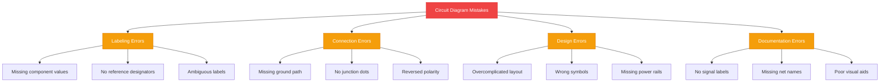
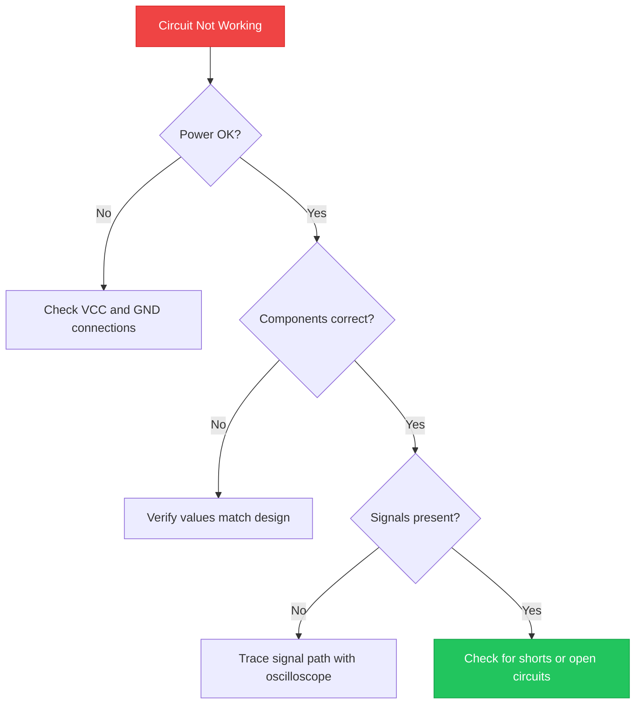

<b>The 10 most common circuit diagram mistakes are poor labeling, missing ground connections, ignoring component polarity, crossing wires without junction dots, overcomplicating designs, omitting component values, using wrong symbols, missing power rails, no reference designators, and unclear signal flow.</b> These errors cause circuit functionality failures, manufacturing defects, and hours of troubleshooting.



## Introduction

A circuit diagram is a visual representation of an electrical circuit. It uses standardized symbols to show how components like resistors, capacitors, and <a href="https://en.wikipedia.org/wiki/LED" rel="nofollow noopener" target="_blank">LEDs (Light Emitting Diodes)</a> connect together.

Circuit diagrams serve three purposes:

1. **Design planning** — Map out circuits before building
2. **Documentation** — Record how a circuit works for others
3. **Troubleshooting** — Identify problems in existing circuits

Avoiding common mistakes saves time, prevents component damage, and produces reliable circuits. The 10 mistakes below appear in beginner and intermediate schematics. Fixing them improves circuit functionality and makes diagrams easier to read.

## Understanding Common Circuit Diagram Mistakes

There are 10 common circuit diagram mistakes that cause the most problems:

| Rank | Mistake | Impact Level |
|------|---------|--------------|
| 1 | Poor labeling of components | High |
| 2 | Missing ground connections | High |
| 3 | Ignoring component polarity | High |
| 4 | Crossing wires without junction dots | Medium |
| 5 | Overcomplicating diagrams | Medium |
| 6 | Omitting component values | High |
| 7 | Using wrong symbols | Medium |
| 8 | Missing power rail connections | High |
| 9 | No reference designators | Medium |
| 10 | Unclear signal flow direction | Low |

Each mistake creates specific problems during <a href="/blog/simple-led-driver-circuit/" rel="noopener">circuit building and troubleshooting</a>. The following sections explain each mistake and how to fix it.

## Mistake 1: Poor Labeling of Components

Labeling components correctly is the foundation of a readable circuit diagram. Without proper labels, anyone reading the diagram cannot identify components, their values, or their function.

### Why Labeling Is Crucial

Poor labeling causes three problems:

1. **Manufacturing errors** — Assembly technicians cannot identify correct parts
2. **Debugging delays** — Engineers waste time tracing unlabeled connections
3. **Knowledge transfer** — New team members cannot understand the design

### Good vs. Bad Labeling

**Bad labeling example:**

```
R
C
D
```

**Good labeling example:**

```
R1 = 10kΩ (1/4W, 5%)
C1 = 100nF (50V, ceramic)
D1 = 1N4148 (silicon diode)
```

Good labels include:

- **Reference designator** (R1, C1, D1)
- **Component value** (10kΩ, 100nF)
- **Package or rating** (1/4W, 50V)

> **Rule:** Every component needs a unique reference designator and its critical value.

## Mistake 2: Ignoring Circuit Functionality

A circuit diagram must reflect how the circuit actually works. Ignoring circuit functionality creates diagrams that look correct on paper but fail in practice.

### How Mistakes Affect Functionality

These errors directly impact circuit operation:

- **Missing pull-up resistors** — Microcontroller inputs float and produce random readings
- **No decoupling capacitors** — ICs receive noisy power and malfunction
- **Wrong voltage dividers** — Signal levels exceed input ratings
- **Missing current limiting** — LEDs and transistors burn out

### Troubleshooting Tips

Follow this process when a circuit does not work:

1. **Verify power connections** — Check VCC and GND reach every IC
2. **Check component values** — Confirm resistors and capacitors match the design
3. **Test signal paths** — Use an oscilloscope to trace signals through each stage
4. **Look for shorts** — Test for unintended connections between traces



## Mistake 3: Overcomplicating Diagrams

Simple diagrams are easier to read, build, and debug. Overcomplicating diagrams with unnecessary components, messy wiring, or excessive detail makes schematics hard to follow.

### The Importance of Simlicity

An overcomplicated diagram causes:

- **Reading errors** — Important connections get lost in clutter
- **Build mistakes** — Assemblers misinterpret the layout
- **Maintenance delays** — Troubleshooting takes longer

### Simplified Diagram Examples

**Overcomplicated approach:**

Drawing every trace length, physical component shape, and mounting detail in the schematic.

**Simplified approach:**

Using standard symbols, clean routing, and logical groupings. Physical layout belongs in the PCB design tool, not the schematic.

> **Rule:** Schematics show electrical connections, not physical placement. Keep it clean.

## Using Software Tools to Avoid Mistakes

Modern circuit design software catches errors before they reach the workshop. These tools provide automated checks that prevent the most common mistakes.

### Popular Circuit Design Software

| Software | Type | Key Feature |
|----------|------|-------------|
| <a href="https://circuitdiagram.org/editor/" rel="noopener">Circuit Diagram Maker</a> | Browser-based | Free, no installation required |
| <a href="https://www.kicad.org/" rel="nofollow noopener" target="_blank">KiCad</a> | Desktop | Open source, full PCB workflow |
| <a href="https://easyeda.com/" rel="nofollow noopener" target="_blank">EasyEDA</a> | Browser-based | Integrated with LCSC components |
| <a href="https://www.autodesk.com/products/electronics/overview" rel="nofollow noopener" target="_blank">Fusion 360 Electronics</a> | Desktop | Professional-grade design |
| <a href="https://www.diptrace.com/" rel="nofollow noopener" target="_blank">DipTrace</a> | Desktop | Beginner-friendly interface |

### How Software Tools Prevent Errors

Design software prevents mistakes through:

1. **Electrical Rules Check (ERC)** — Flags unconnected pins, missing power, and short circuits
2. **Component libraries** — Provides correct symbols and footprints
3. **Net labeling** — Tracks connections across sheets automatically
4. **BOM generation** — Lists all components with values and part numbers
5. **Version control** — Tracks changes and allows rollback

> **Rule:** Run ERC before finalizing any design. Fix all errors, even the ones that seem minor.

## Visual Aids and Their Importance

Visual aids clarify complex concepts that text alone cannot explain. A well-placed diagram, table, or annotation saves hundreds of words.

### How Diagrams Clarify Concepts

Visual aids improve circuit diagram quality through:

- **Block diagrams** — Show high-level system architecture before detailed schematics
- **Signal flow arrows** — Indicate direction of data or power movement
- **Color coding** — Distinguish power (red), ground (black), and signal (blue) nets
- **Callout boxes** — Highlight critical design notes or warnings

### Examples of Effective Visual Aids

**Block diagram for a power supply:**


**Signal flow annotation:**

```
MCU → Level Shifter → Driver IC → Motor
     3.3V          5V          12V
```

**Color-coded net labels:**

```
VCC_RED = +5V power
GND_BLACK = Ground reference
SIG_BLUE = UART transmit
```

These visual aids make diagrams self-documenting. Anyone reading the diagram understands the design without needing额外说明.

## Common Mistakes Quick Reference

Use this table to check your diagrams against the 10 most common errors:

| Mistake | How to Fix It |
|---------|---------------|
| Poor labeling | Add reference designators and values to every component |
| Missing ground | Ensure every circuit has a complete return path to GND |
| Ignoring polarity | Mark anode (+) and cathode (−) on diodes and LEDs |
| No junction dots | Add dots where wires actually connect |
| Overcomplicated | Remove unnecessary detail; keep schematics clean |
| Missing values | List all resistor, capacitor, and inductor values |
| Wrong symbols | Use IEEE or IEC standard symbols |
| Missing power rails | Show VCC and GND connections on every IC |
| No designators | Label each component R1, C1, D1, U1 sequentially |
| Unclear signal flow | Add arrows showing data or power direction |

## Conclusion

Avoiding common circuit diagram mistakes saves time, prevents component damage, and produces reliable designs. The 10 mistakes covered — from poor labeling to unclear signal flow — account for most schematic errors.

Apply these design principles to every circuit diagram:

- **Label every component** with reference designator and value
- **Verify circuit functionality** before finalizing the design
- **Keep diagrams simple** and free of unnecessary detail
- **Use software tools** with Electrical Rules Check (ERC)
- **Add visual aids** to clarify complex sections

For more circuit design tips, read our <a href="/blog/circuit-diagram-for-beginners/" rel="noopener">circuit diagrams for beginners</a> guide or explore <a href="/blog/circuit-diagram-maker-best-practices/" rel="noopener">circuit diagram best practices</a>.