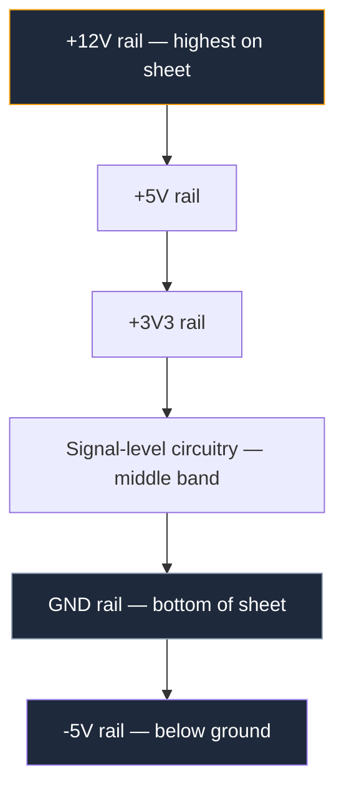
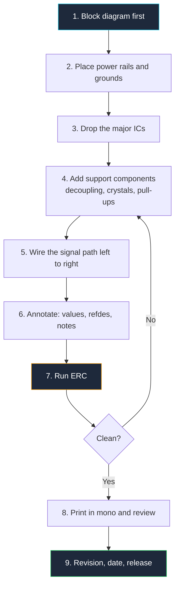

**A circuit diagram is a drawing that describes the electrical connections of a circuit using standardized symbols instead of pictures of parts.** It is not a map of where components physically sit, and it is not a picture of the finished device. It is a language — and like any language, it has grammar, dialects, and conventions that experienced readers expect you to follow.

That last point is what most tutorials miss. You can memorize every symbol in the standard and still produce a schematic nobody wants to read, because circuit diagram design is 30% symbols and 70% layout discipline. This guide covers both. By the end you will know why signal flows left to right, why ground belongs at the bottom of the sheet, which shape means "resistor" in which part of the world, and how to lay out a drawing that a reviewer can understand in 60 seconds without asking you a single question.

## What a Circuit Diagram Actually Is

Four different documents describe the same piece of hardware, and confusing them is the single most common beginner mistake. Each one answers a different question.

| Document | Answers the question | Shows | Typical use |
| :--- | :--- | :--- | :--- |
| **Block diagram** | What are the major functions? | Labeled rectangles and arrows | Architecture reviews, datasheets |
| **Schematic (circuit diagram)** | How is it connected electrically? | Standard symbols, nets, values | Design, debugging, review |
| **Wiring diagram** | Which wire goes where physically? | Wire colors, connector positions, harnesses | Field installation, automotive repair |
| **PCB layout** | Where does the copper go? | Footprints, pads, traces, layers | Manufacturing |

A schematic optimizes for *logical clarity*. A wiring diagram optimizes for *physical accuracy*. A PCB layout optimizes for *manufacturability and physics*. When you draw a schematic, you are explicitly allowed to place a component wherever the drawing reads best, even if the real part sits on the opposite side of the board. That freedom is the whole point.

Notice where the schematic sits: everything downstream is generated from it. A netlist — the text file that tells the PCB tool which pins connect to which — is extracted directly from your drawing. If the schematic is wrong, the board is wrong, and no amount of careful routing will save it. The schematic is the source of truth, which is why the conventions below exist at all.

## The Philosophy of Schematic Drawing

Standards bodies define the symbols. They do not define good taste. The layout conventions below are unwritten rules enforced by peer review, and every experienced engineer applies them automatically. Break them and your drawing will be technically correct but functionally illegible.

### Law 1: Signal Flows Left to Right

Inputs enter on the left edge. Processing happens in the middle. Outputs leave on the right edge. This mirrors the reading direction of Latin scripts and it means a reviewer can trace a design in one pass without backtracking.

The one legitimate exception is a feedback path. Feedback by definition travels right to left, from output back to input, and every reader understands that a wire running backwards above an amplifier is a feedback network. Because that convention is so strong, you should avoid running any *non-feedback* signal right to left — it will be misread.

### Law 2: Power at the Top, Ground at the Bottom

The vertical axis of your sheet represents voltage. The most positive rail sits at the top, ground sits at the bottom, and negative supplies sit below ground. Current, drawn conventionally, flows down the page.

This gives you a free diagnostic: if a wire on your drawing runs *upward* into a ground symbol, or a supply symbol points down, something is drawn wrong. The convention also makes voltage levels visually obvious. A reader glancing at your sheet can see the supply hierarchy without reading a single label.

> Combine Law 1 and Law 2 and you get a coordinate system: horizontal position tells the reader *where in the signal chain* a component sits, and vertical position tells them *what potential* it operates at. Every symbol you place should respect both axes.

### Law 3: One Sheet, One Function

A schematic sheet should hold one functional block: the power supply, the MCU and its support components, the analog front end. When a block outgrows a sheet, split it and connect the sheets with named ports rather than shrinking symbols and cramming.

The practical test is font size. If you are reducing text to fit more parts on the page, you have already needed a second sheet for a while. A 40-component sheet that reads cleanly beats a 200-component sheet that requires zooming.

### Law 4: A Schematic Is a Document, Not a Picture

Professional schematics carry a **title block**, conventionally in the bottom-right corner, containing:

- Project and board name
- Sheet title and sheet number ("3 of 7")
- Revision number and date
- Designer name
- Company name

This matters more than it sounds. Schematics get printed, emailed, photographed on a bench, and pasted into slide decks. Without a revision number, you cannot tell whether the drawing taped to the prototype describes the prototype. Undated, unversioned schematics are the root cause of an enormous share of hardware debugging misery.

### Law 5: Optimize for the Reader, Not the Drawer

Every shortcut that saves you time while drawing costs someone else time while reading — usually you, six months later. Rotating a symbol to avoid a wire bend, leaving a value off because "it's obvious," reusing a net name loosely: each is a small deposit into a debt account that always gets collected.

Assume your reader is tired, working from a black-and-white printout, and unfamiliar with the design. Draw for that person.

## Schematic Drawing Basics: Setting Up the Canvas

Before placing a single symbol, get the canvas right. These settings are boring and they determine whether your drawing looks professional.

**Work on a grid, and snap to it.** The traditional schematic grid is 0.1 inch (100 mil / 2.54 mm), which matches the pin pitch of through-hole ICs and headers. Every symbol pin and every wire endpoint should land on a grid intersection. Off-grid pins are the leading cause of "wires that look connected but aren't" — a gap of two thousandths of an inch is invisible on screen and electrically fatal.

**Pick a sheet size and stay with it.** ANSI A (letter) or ISO A4 for small blocks, ANSI B/A3 for denser sheets. A consistent size means consistent print scaling across the whole document set.

**Keep symbols at one scale.** Mixing a large op-amp triangle with tiny resistors makes the drawing look accidental. Most tools handle this for you, but it breaks the moment you start scaling symbols by hand to make things fit.

**Leave whitespace.** Aim for roughly 40% of the sheet empty. Whitespace is what lets the eye follow a wire. Dense schematics are not impressive; they are unreviewable.

**Use orthogonal wires only.** Horizontal and vertical segments with 90-degree corners. Diagonal wires are acceptable in a hand sketch and nowhere else — they make junctions ambiguous and destroy the visual grid that helps readers scan.

## Electronic Circuit Symbols: The IEEE/ANSI Core Set

Two standards dominate. **IEEE 315** (published jointly as ANSI Y32.2) is the American standard and is what you will see in US datasheets, textbooks, and the majority of hobbyist material. **IEC 60617** is the international standard, common in Europe and in academic publishing. Both are correct; mixing them within one drawing is not.

| Component | IEEE 315 / ANSI (American) | IEC 60617 (International) |
| :--- | :--- | :--- |
| **Resistor** | Zigzag with 3–4 peaks | Plain open rectangle |
| **Variable resistor** | Zigzag with diagonal arrow | Rectangle with diagonal arrow |
| **Inductor** | Series of semicircular loops | Series of loops, or filled rectangle |
| **Logic gates** | Distinctive shapes (D, curved, triangle) | Rectangles with `&`, `≥1`, `=1` qualifiers |
| **Capacitor** | Two parallel plates | Two parallel plates (identical) |
| **Diode** | Triangle plus bar | Triangle plus bar (identical) |

The takeaway: passives and logic gates differ between standards, while semiconductors are largely universal. Pick the standard your audience reads and note it in the title block if there is any doubt. For a symbol-by-symbol visual reference beyond the core set covered here, see our dedicated [electrical symbols reference chart](/blog/electrical-symbols/).

### Resistor Symbols

The ANSI resistor is a zigzag; the IEC resistor is a rectangle roughly 3:1 in aspect ratio. Both are two-terminal and non-polarized, so orientation carries no electrical meaning — but it carries readability meaning. Draw series resistors horizontally along the signal path and pull-ups/pull-downs vertically, so the reader sees the topology from the geometry alone.

| Variant | Symbol modification | Meaning |
| :--- | :--- | :--- |
| **Fixed resistor** | Base zigzag or rectangle | Fixed current limiting or biasing |
| **Potentiometer** | Arrow tapping the middle | Three-terminal adjustable divider |
| **Rheostat** | Diagonal arrow through the body | Two-terminal adjustable resistance |
| **Thermistor** | Body with a `θ` or `t°` marking | Temperature-dependent resistance |
| **Photoresistor (LDR)** | Two arrows pointing inward | Light-dependent resistance |
| **Fuse** | Line through or looping the body | Sacrificial overcurrent protection |

### Capacitor Symbols

A capacitor is two parallel plates separated by a gap representing the dielectric. The critical distinction is polarity:

- **Non-polarized:** two straight, equal-length parallel lines. Ceramic, film, most decoupling. Either terminal can face either potential.
- **Polarized (electrolytic/tantalum):** one straight line and one curved line, with the straight line marking the positive terminal, plus an explicit `+` sign. Reversing one of these produces a bang, smoke, or both.

Always draw the positive plate toward the higher potential — up, when the capacitor sits between a rail and ground. When a reviewer scans your bulk capacitors, they are checking exactly that, and having them all oriented consistently makes the check instant.

**Decoupling capacitors** deserve a specific layout habit: draw each one immediately adjacent to the IC power pin it serves, not clustered in a corner of the sheet. The schematic is where you communicate design *intent*, and "this 100 nF belongs to pin 8 of U3" is intent that the PCB layout engineer needs.

### Ground and VCC Symbols

Power symbols are the most abused symbols on a schematic, mostly because there are several ground symbols and they are not interchangeable.

| Symbol | Name | Appearance | Use for |
| :--- | :--- | :--- | :--- |
| **Signal / common ground** | Common return | Three horizontal bars decreasing in width | The 0 V reference of your circuit |
| **Earth ground** | Protective earth | Line into three descending bars, or a hatched trio | Mains safety earth, PE conductor |
| **Chassis ground** | Frame connection | Line into a hatched/raked bar | Enclosure or vehicle body return |
| **VCC / VDD** | Positive supply | Upward bar, arrow, or a labeled flag | Positive rail feeding the block |
| **VEE / VSS** | Negative or return supply | Downward bar or labeled flag | Negative rail or FET source rail |

`VCC` and `VDD` are historical, not arbitrary: **VCC** is the *collector* supply of bipolar devices, **VDD** is the *drain* supply of field-effect devices, and **VEE**/**VSS** are the corresponding emitter and source rails. Modern drawings often ignore the distinction, but using them correctly signals competence to any reader who notices.

The practical rules for power symbols:

1. **Never draw a long wire to a power symbol.** Attach it directly, pointing up for supplies and down for grounds.
2. **Label multi-rail designs explicitly.** `+3V3`, `+5V`, `+12V`, `VBAT` — not a generic `VCC` on every symbol when four different rails exist.
3. **Keep separate grounds separate.** If the design has isolated analog and digital grounds, use distinct symbols or distinct net names (`AGND`, `DGND`) and draw the single deliberate tie point where they meet. Merging them silently on the schematic guarantees a noise problem you will chase for a week.
4. **Use power symbols instead of drawing rails everywhere.** In a dense sheet, dozens of local `GND` symbols read better than one long ground wire snaking through the whole drawing.

### Semiconductor Symbols

| Component | Symbol | Reading rule |
| :--- | :--- | :--- |
| **Diode** | Triangle pointing into a bar | Conventional current flows in the direction of the triangle; the bar is the cathode |
| **LED** | Diode with two outward arrows | Arrows always point away from the body |
| **Zener diode** | Bar with bent ends | Operated reverse-biased, so it points "backwards" on purpose |
| **Schottky diode** | Bar with an `S`-shaped end | Low forward drop, fast recovery |
| **NPN transistor** | Circle, base bar, emitter arrow pointing out | Arrow out = **N**ot **P**ointing i**N** |
| **PNP transistor** | Emitter arrow pointing in toward the base | Arrow in = **P**ointing i**N** |
| **N-channel MOSFET** | Gate bar, channel bar, body arrow pointing in | Arrow direction identifies channel type |
| **P-channel MOSFET** | Body arrow pointing out from the channel | Usually drawn above the load, source to the positive rail |

Orient transistors so that current flows top to bottom: collector or drain up, emitter or source down. This makes the amplifier or switch topology instantly recognizable and keeps you consistent with Law 2.

### IC and Op-Amp Symbols

Integrated circuits use one of two representations, and choosing correctly is a real design decision.

**The rectangular block.** Used for microcontrollers, memory, logic, regulators — anything whose internal behavior is described by its pins rather than its topology. Rules for a good IC block:

- **Arrange pins by function, not by physical order.** Inputs on the left, outputs on the right, power on top, ground on the bottom. The footprint handles physical pin geometry; the symbol exists to be readable. A DIP-8 symbol that lists pins 1–4 down the left side purely because they are pins 1–4 is a wasted opportunity.
- **Label every pin with its function**, and add the pin number in a smaller font next to the boundary.
- **Group related pins** with a small gap between groups: all the SPI pins together, all the ADC inputs together.
- **Mark active-low pins** with an overbar, a leading `n` (`nRESET`), a leading slash (`/RESET`), or a trailing hash (`RESET#`). Pick one convention per project.
- **Split large ICs** into multiple symbol parts — a 100-pin MCU is far more readable as three separate blocks (core/power, GPIO bank A, GPIO bank B) than as one monolith.

**The triangle.** Used for op-amps and comparators, where the shape itself communicates "amplifier." The inverting input is marked `−` and the non-inverting input `+`, the apex is the output, and the supply pins enter from the top and bottom. You may swap the `+` and `−` inputs vertically to make a feedback network cleaner — that is standard practice — but you must move the labels with them. A mislabeled op-amp is the single most expensive symbol error in analog design.

Feedback networks belong to the amplifier's own visual space: draw the feedback resistor directly above the triangle so the loop is obvious. Detailed op-amp and 555 timer layouts, including the internal-block-versus-pinout question, are covered in the [amplifier and oscillator circuit guide](/blog/amplifier-and-oscillator-circuits/).

## Reference Designators and Component Values

A symbol without a designator and a value is decoration. Reference designators follow ASME Y14.44 (successor to IEEE 200), and they are worth memorizing:

| Prefix | Component | Prefix | Component |
| :--- | :--- | :--- | :--- |
| **R** | Resistor | **U** | Integrated circuit |
| **C** | Capacitor | **Q** | Transistor |
| **L** | Inductor | **D** | Diode, LED |
| **J** | Jack / connector | **P** | Plug |
| **SW** | Switch | **K** | Relay |
| **Y** | Crystal, oscillator | **T** | Transformer |
| **F** | Fuse | **FB** | Ferrite bead |
| **TP** | Test point | **JP** | Jumper |

Number them in reading order — left to right, top to bottom, per sheet. Sheet-based numbering blocks (100-series on sheet 1, 200-series on sheet 2) make it possible to find any part instantly on a multi-sheet drawing.

For values, use **letter-in-place-of-decimal notation**, an old drafting practice that survives because it is robust:

| Write | Means | Instead of |
| :--- | :--- | :--- |
| `4k7` | 4.7 kΩ | `4.7k` |
| `R47` | 0.47 Ω | `0.47R` |
| `100n` | 100 nF | `0.1uF` |
| `1u5` | 1.5 µF | `1.5uF` |
| `2M2` | 2.2 MΩ | `2.2M` |

The reason is simple: a decimal point is one dot wide. It disappears in a fax, a photocopy, a compressed screenshot, or a low-resolution print — and `4.7k` misread as `47k` is a broken circuit. A letter cannot vanish.

Add the parameters that actually constrain the part: voltage rating on electrolytics, power rating on any resistor above 1/4 W, tolerance on anything in a timing or precision path, dielectric on ceramics in analog circuits (`X7R` versus `C0G` changes behavior significantly). Everything else belongs in the bill of materials, not on the drawing.

## Wires, Junctions, and Nets

How you handle connections determines whether your drawing is trustworthy.

**Junction dots are mandatory.** A filled dot at a wire intersection means "electrically connected." No dot means "crossing, not connected." Every serious tool places these automatically, but you must verify them, because a missing dot is an invisible open circuit.

**Never draw a four-way junction.** Four wires meeting at one point with a dot is legal and terrible practice. If that dot is lost — bad print, JPEG artifact, a smudge — the drawing silently changes meaning from "all four connected" to "two pairs crossing." Instead, offset the connection into two three-way T-junctions a grid step apart. Now the topology survives any reproduction, and a missing dot is visually obvious.

| Situation | Correct rendering |
| :--- | :--- |
| Two wires connected | T-junction with a filled dot |
| Two wires crossing, not connected | Plain crossover, no dot, no hop |
| Four wires at one node | Two staggered T-junctions, never one dot |
| Pin intentionally unused | Explicit `X` no-connect marker |
| Long-distance connection | Named net label at both ends |

**Use net labels for distance.** Two wires carrying the label `SPI_CLK` are electrically connected even on different sheets. Net labels beat long wires for anything crossing more than about a third of the sheet, and they make the drawing self-documenting. Name nets after their function (`MOTOR_PWM`, `VBAT_SENSE`), never after their location.

**Use buses for parallel groups.** Eight data lines drawn as `D[0..7]` on a single thick bus line is dramatically cleaner than eight parallel wires, and it is the standard approach for wide microcontroller and memory interfaces.

**Mark no-connects explicitly.** An `X` on an unused pin tells the reviewer "I considered this pin and chose to leave it floating." A bare unconnected pin tells them "I may have forgotten this pin." Same electrical result, completely different review outcome — and every electrical rule check (ERC) will flag the second one.

## Best Practices for Clean, Readable Diagrams

A consolidated checklist. Run it before you call any schematic finished.

1. **Snap everything to grid.** Every pin, every wire end, no exceptions.
2. **Signal left to right, power top to bottom.** Reserve right-to-left routing for genuine feedback.
3. **Orthogonal wires only.** 90-degree corners, no diagonals.
4. **Minimize crossings.** A crossing is a small tax on the reader. Move symbols, rotate blocks, or convert to net labels until crossings are rare.
5. **No four-way junctions.** Stagger into T-junctions.
6. **Group by function** and give each group visible whitespace or a labeled boundary box.
7. **Designator and value on every part.** Non-negotiable.
8. **Decoupling capacitors next to their pins**, not in a corner cluster.
9. **Consistent text size and orientation.** All labels horizontal, or at most rotated one consistent direction. Upside-down text is unacceptable.
10. **Comment the non-obvious.** A text note explaining *why* a resistor is 4k7 saves the next engineer — often you — an hour of reverse-engineering. Schematics support free text; use it.
11. **Explicit no-connects** on every intentionally unused pin.
12. **Complete the title block** with revision and date, every single time.
13. **Run the ERC** and resolve every warning, or annotate why a warning is acceptable.
14. **Print it in black and white** and read it. If it survives that, it is done. If a connection only makes sense in color, it is not.

> The 60-second test: hand your schematic to someone who has never seen the design. If they cannot identify the power input, the main processing block, and the outputs within a minute, the layout has failed regardless of electrical correctness.

Most schematic defects fall into a short list of repeat offenders — missing junction dots, ambiguous values, floating pins, mixed symbol standards. We catalogued them with fixes in [10 common circuit diagram mistakes](/blog/common-circuit-diagram-mistakes/), and the condensed rule set lives in our [schematic design best practices](/blog/circuit-diagram-maker-best-practices/) guide.

## A Repeatable Workflow, Blank Canvas to Reviewed Schematic

The order matters. Engineers who place components first and think about power later end up with power rails threaded awkwardly through a finished layout — the visual signature of a rushed schematic. Establish the rails, then hang the circuit off them.

Step 5 deserves emphasis: wire the *signal path* first, in order, before wiring anything else. If you can trace input to output in one clean left-to-right sweep, the drawing is already 80% readable. Everything else — bias networks, decoupling, protection — attaches to that spine.

**[Start drawing your own schematic now.](/editor/)** The editor snaps to a 100-mil grid, ships the IEEE/ANSI symbol library described above, and places junction dots automatically, so you can practice these conventions without fighting the tool. Browse the full [component symbol library](/components/) to see what is available before you start.

## Six Domains, Six Sets of Drawing Conventions

The rules above are universal. On top of them, each circuit family has its own layout idioms — the specific way experienced engineers draw that kind of circuit. These six guides go deep on each.

### 1. Logic Gates and Digital Basics

Digital schematics are about symbol shape and signal propagation, not component values. The [guide to logic gate circuit diagrams](/blog/logic-gate-circuit-diagrams/) covers the distinctive ANSI shapes (the flat-backed D for AND, the curved shield for OR, the triangle-plus-bubble for NOT) against the IEC/DIN rectangles with `&` and `≥1` qualifiers, then chains them into real circuits: a NOT gate built from a single transistor, XOR and NAND gates from discrete transistors, cross-coupled flip-flops, and multi-stage binary counters including the 4017 decade counter. Digital layout has one extra rule worth knowing up front — gate inputs go on the left and never cross each other, because a crossed gate input is the hardest error to spot in a digital drawing.

### 2. Power Supplies and Conversion

Power schematics are the only place where the drawing must communicate *physical* information: isolation, creepage, and current capacity. The [power supply circuit design guide](/blog/power-supply-circuit-diagrams/) covers drawing the isolation barrier as a visible vertical line separating high-voltage primary from low-voltage secondary, transformer symbols with correct dot conventions, bridge rectifiers drawn as diamonds rather than four scattered diodes, filter capacitor placement, and 78xx-series regulator blocks. It also covers the thick-versus-thin line convention for high-current paths in SMPS, buck converter, transformerless supply, and dual-rail designs.

### 3. Amplifiers, Oscillators, and Timers

Analog schematics live or die on feedback clarity. The [amplifier and oscillator circuit guide](/blog/amplifier-and-oscillator-circuits/) covers when to draw a 555 timer as an internal block diagram versus a simple pinout box, how to lay out feedback resistors so the loop is visually unmistakable, and how to draw frequency-determining RC networks so the timing components are identifiable at a glance. Worked layouts include LM386 and TDA2030 audio amplifiers, sine wave generators, op-amp monostable multivibrators, and 555-driven counter and reaction-timer circuits.

### 4. Sensors, Switching, and Protection

This is the boundary between the real world and your microcontroller, and it is where schematic conventions do the most work. The [sensor and protection circuit guide](/blog/sensor-and-protection-circuit-diagrams/) covers drawing pull-up and pull-down resistors so their function is obvious from position alone, voltage dividers for LDRs and thermistors, MOSFET switching stages, and debounce circuits built from RC filters or Schmitt triggers. It also covers protection topologies — reverse polarity, overvoltage clamps — where drawing the current path clearly is what lets a reviewer verify the circuit actually protects anything.

### 5. Measurement and Test

Test infrastructure is the most under-drawn part of most schematics. The [measurement and test circuit guide](/blog/measurement-test-circuit-diagrams/) covers placing and labeling `TP` test points, drawing shunt resistors with their sense connections explicit (Kelvin connections are a drawing problem before they are an electrical one), and representing an oscilloscope or multimeter as a load in your diagram. Includes continuity testers, op-amp voltage followers, sample-and-hold stages, and LM3914 bar-graph voltmeters.

### 6. Microcontrollers and Embedded Systems

The most demanding diagrams. The [microcontroller schematic layout guide](/blog/microcontroller-circuit-diagrams/) covers splitting large MCU pinouts across multiple symbol parts, using bus notation to collapse parallel groups, crystal oscillator layout with load capacitors, per-pin decoupling, and wiring external peripherals — H-bridge motor drivers, sensor arrays, relays, and displays. Worked examples include line-follower robots, Raspberry Pi projects, and battery management systems.

## Frequently Asked Questions

**Is a circuit diagram the same as a schematic diagram?**
Yes. "Circuit diagram," "schematic diagram," and "schematic" are used interchangeably for a drawing that shows electrical connections using standard symbols. "Wiring diagram" is *not* a synonym — it shows physical wire routing, colors, and connector positions instead of logical connections.

**Should I use IEEE/ANSI or IEC symbols?**
Match your audience. Use IEEE 315/ANSI (zigzag resistors) for North American readers, US datasheets, and most hobbyist and educational material. Use IEC 60617 (rectangular resistors) for European and international technical documents. Never mix them in one drawing.

**Why must ground be at the bottom of the diagram?**
Because the vertical axis represents potential. With the most positive rail at the top and ground at the bottom, conventional current flows down the page and voltage relationships become visible from geometry alone. It also gives you a free error check: any wire running upward into a ground symbol is drawn wrong.

**How do I know if two crossing wires are connected?**
Look for a filled junction dot. Dot means connected; no dot means crossing without connection. This is exactly why four-way junctions are bad practice — the meaning of the entire node depends on one small dot surviving reproduction.

**What is the difference between VCC and VDD?**
`VCC` is the collector supply voltage, inherited from bipolar transistor circuits. `VDD` is the drain supply voltage, from FET and CMOS circuits. `VEE` and `VSS` are the corresponding emitter and source rails. Many modern schematics use them loosely, but in mixed designs the distinction still carries useful information.

**Do I need to draw decoupling capacitors on the schematic?**
Yes, always, and next to the pin they serve. Decoupling is a design decision — value, quantity, and placement per power pin — and the schematic is where that intent is recorded for the layout engineer. Omitting them because "everyone knows to add them" reliably produces boards without them.

**How many components belong on one sheet?**
There is no fixed number, but if you are shrinking symbols or text to make things fit, you passed the limit. Around 40–60 components per sheet with generous whitespace is comfortable for most readers. Split by function and connect sheets with named ports.

**What is an ERC and why does it matter?**
An electrical rule check scans your schematic for structural errors: unconnected pins, outputs driving outputs, power pins with no source, duplicate designators. It catches a large fraction of real defects in seconds. Run it before every review and resolve or annotate every warning.

## Putting It Together

Circuit diagram design comes down to a small number of decisions applied consistently. Choose one symbol standard and stay with it. Put inputs on the left and outputs on the right. Put supplies at the top and ground at the bottom. Snap to grid, keep wires orthogonal, dot your junctions, avoid four-way nodes, label every part, and fill in the title block. None of it is difficult. All of it is a habit.

The fastest way to build that habit is to draw. Take a circuit you already understand — an LED and a current-limiting resistor is enough — and draw it three times: once carelessly, once applying every rule in this guide, and once from memory a day later. The difference between the first and second drawing is what a reviewer sees, and the third tells you which conventions have actually stuck.

For hands-on practice, our [step-by-step guide to reading circuit diagrams](/blog/how-to-read-a-circuit-diagram-step-by-step-guide/) works the same conventions in reverse, which is the fastest way to internalize them.

**[Start drawing your own schematic now.](/editor/)** No install, no account — a grid-snapped canvas, the full IEEE/ANSI symbol library, automatic junction dots, and image or netlist export when your drawing is ready to become a board.
