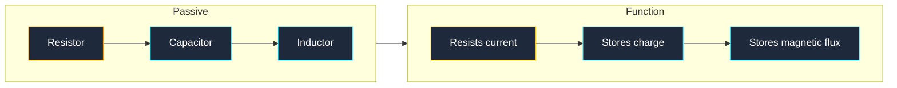
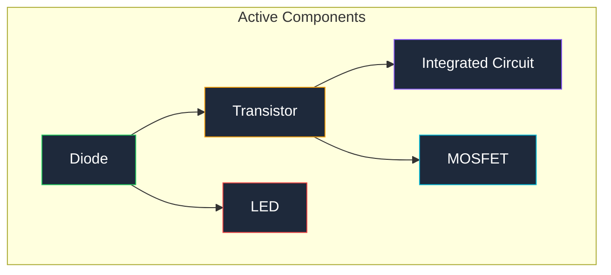
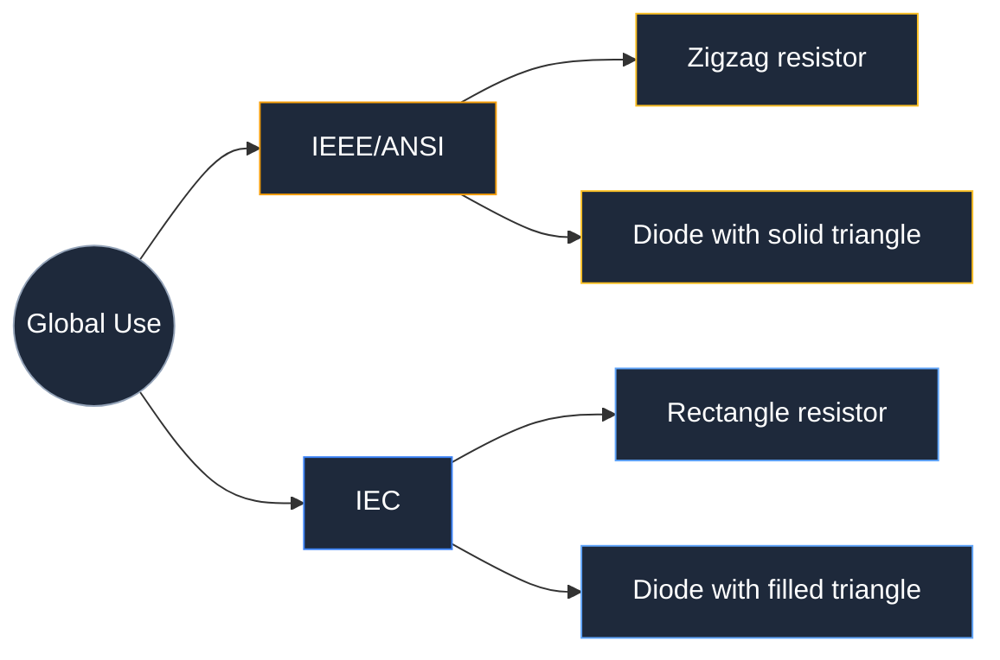

**Electrical symbols are standardized graphic marks used to represent individual components in a circuit diagram.** Each electrical symbol maps to one component type, so engineers, technicians, and hobbyists worldwide can read and build the same circuit from the same drawing. Without these symbols, every circuit schematic would require a photograph or a labeled drawing of each part, which would make schematics unreadable at scale.

There are roughly 30 core electrical symbols that cover 90% of everyday circuit design. The remaining symbols appear in specialized domains such as power distribution, industrial controls, or RF engineering. This guide groups every symbol by category, shows you the exact visual shape for each one, and explains where to use it.

## Passive Component Symbols (Resistors, Capacitors, Inductors)

Passive components do not amplify a signal. They either resist current flow, store energy in an electric field, or store energy in a magnetic field. Every circuit diagram starts with these three symbol groups.

### Resistor Symbol

The IEEE (American National Standards Institute) resistor symbol is a zigzag line with 3 or 4 peaks. The IEC (International Electrotechnical Commission) resistor symbol is a plain rectangle. Both are correct; the region determines which one you will see.

| Resistor Variant | Symbol Shape | Description |
|---|---|---|
| **Fixed resistor** | Zigzag line (IEEE) or rectangle (IEC) | A 2-terminal component that limits current |
| **Variable resistor** | Zigzag line with an arrow passing through it | A resistor whose value changes with a knob or screw |
| **Potentiometer** | Zigzag with an arrow on the center tap | A 3-terminal variable resistor used as a voltage divider |
| **Thermistor** | Zigzag with a flat bar and a hockey-stick tail | A resistor whose resistance changes with temperature |
| **Photoresistor** | Zigzag with two arrows pointing inward | A resistor whose resistance changes with light level |
| **Fuse** | Zigzag line with a wire passing straight through | A safety device that melts and opens the circuit at overcurrent |

### Capacitor Symbol

A capacitor symbol shows two parallel plates separated by a gap. The gap represents the dielectric material between the plates.

| Capacitor Variant | Symbol Shape | Description |
|---|---|---|
| **Non-polarized** | Two straight parallel lines with a gap | Used for AC coupling, filtering, and timing |
| **Polarized (electrolytic)** | One straight line and one curved line, with a + sign | A polarized type; must be installed with correct polarity |
| **Variable capacitor** | Two parallel lines with an arrow through them | Tunable capacitance, common in radio tuning circuits |

### Inductor Symbol

An inductor symbol is a series of semi-circular loops that represent a coil of wire. An inductor with a line above the loops indicates an iron-core inductor.

| Inductor Variant | Symbol Shape | Description |
|---|---|---|
| **Air-core inductor** | 3 to 5 loops | An inductor with no magnetic core material |
| **Iron-core inductor** | Loops with a horizontal line above | An inductor with an iron core that increases inductance |
| **Ferrite-core inductor** | Loops with two parallel lines above | An inductor with a ferrite core for high-frequency use |

## Active Component Symbols (Semiconductors)

Active components require a power source and can control or amplify the flow of current. Semiconductors make up the largest group of active component symbols.

### Diode Symbols

A diode allows current to flow in one direction only. The symbol is a triangle pointing toward a flat bar. The triangle points from anode (positive) to cathode (negative).

| Diode Variant | Symbol Shape | Description |
|---|---|---|
| **Standard diode** | Triangle with a bar at the tip | A one-way valve for electrical current |
| **Zener diode** | Triangle with a bar that has angled tips (bent at both ends) | A diode designed to conduct in reverse at a specific breakdown voltage |
| **Schottky diode** | Triangle with an S-shaped bar | A fast-switching diode with low forward voltage drop |
| **LED** | Diode triangle with two arrows pointing outward | A diode that emits light when forward-biased |
| **Photodiode** | Diode triangle with two arrows pointing inward | A diode that generates current when exposed to light |
| **TVS diode** | Diode with a bent bar on both ends | A transient voltage suppressor that clamps voltage spikes |

### Transistor Symbols

A transistor switches or amplifies a signal. There are two main families: bipolar junction transistors (BJTs) and metal-oxide-semiconductor field-effect transistors (MOSFETs).

| Transistor Variant | Symbol Shape | Description |
|---|---|---|
| **NPN BJT** | Circle with a vertical bar, two diagonal lines, and an arrow on the emitter pointing outward | A current-controlled switch; base current controls collector-to-emitter flow |
| **PNP BJT** | Circle with a vertical bar, two diagonal lines, and an arrow on the emitter pointing inward | Same as NPN but with reversed current direction |
| **N-channel MOSFET** | Vertical bar with three terminals (gate, drain, source) and an inward arrow on the substrate | A voltage-controlled switch with very high input impedance |
| **P-channel MOSFET** | Vertical bar with three terminals and an outward arrow on the substrate | Same as N-channel but with reversed polarity |
| **JFET (N-channel)** | Vertical bar with three terminals and an inward arrow on the gate | A voltage-controlled resistor used in analog circuits |

### Integrated Circuit Symbols

An integrated circuit (IC) symbol is a rectangle with pin labels on each side. The IC symbol does not show the internal circuitry; it shows only the pin functions.

| IC Variant | Symbol Shape | Description |
|---|---|---|
| **Op-amp** | Triangle with 5 pins (+in, -in, V+, V-, out) | An analog amplifier used in signal conditioning |
| **Digital IC** | Rectangle with numbered pins | A logic gate, microcontroller, or memory chip |
| **Voltage regulator** | Rectangle with 3 pins (in, out, ground) | A chip that maintains a constant output voltage |

## Power Source and Ground Symbols

Every circuit needs a source of electrical energy and a common ground reference. These symbols appear at the edges of every schematic.

| Source Symbol | Symbol Shape | Description |
|---|---|---|
| **DC voltage source (battery)** | Parallel lines of alternating lengths (long = +, short = -) | A direct current (DC) source made of one or more cells |
| **AC voltage source** | Circle with a sine wave inside | An alternating current (AC) source such as mains power |
| **Ground (earth)** | Three horizontal lines of decreasing width | A physical connection to earth ground |
| **Chassis ground** | Three downward-pointing lines forming an inverted triangle | The chassis or metal frame of the device |
| **Signal ground** | Filled or open triangle pointing down | A common reference point for signal measurements |
| **VCC / VDD** | A short horizontal line with a label above | The positive power supply rail for ICs |
| **VSS / GND** | A short horizontal line with a label below | The negative or ground supply rail |

## Connection and Junction Symbols

These symbols show how wires, cables, and terminals connect in a schematic. Getting these right prevents short circuits and miswired boards.

| Connection Symbol | Symbol Shape | Description |
|---|---|---|
| **Wire junction (dot)** | Solid dot at the intersection of two lines | Two wires are soldered and connected at this point |
| **Wire crossing (no dot)** | Two lines crossing without a dot | Two wires pass over each other without connecting |
| **Terminal / test point** | Small open circle at a wire end | A connection point for probes or external wiring |
| **Connector** | Pair of parallel lines or a trapezoid | A plug and socket pair used to join cables |
| **Splice** | Dot on a wire with 3 or more branches | A point where multiple wires share a single electrical node |

## Mechanical and Output Device Symbols

These symbols represent components that create physical motion, produce sound, or provide visual indicators.

| Device | Symbol Shape | Description |
|---|---|---|
| **Switch (SPST)** | A broken line with a pivot point | A single-pole single-throw ON/OFF switch |
| **Push button** | A horizontal line above two contacts with a vertical plunger | A momentary-contact switch that closes when pressed |
| **Relay coil** | Rectangle with a diagonal line through it (IEC) or loops (IEEE) | An electromechanical switch activated by a coil |
| **Motor** | Circle with the letter M inside | A device that converts electrical energy into rotational motion |
| **Speaker** | Funnel or cone shape | A transducer that converts electrical signals into sound |
| **Lamp** | Circle with a cross inside | A light bulb or incandescent lamp |
| **Transformer** | Two inductor coils with parallel lines between them | Transfers AC energy between circuits at a different voltage level |
| **Fuse** | Rectangle with a wire through it (IEC) or zigzag (IEEE) | A safety device that opens the circuit when current exceeds a rating |

## IEEE vs. IEC Symbol Standards: What Is the Difference?

The two dominant symbol standards are IEEE/ANSI (American National Standards Institute) and IEC (International Electrotechnical Commission). IEEE symbols are more common in the United States, while IEC symbols are used across Europe and most of the rest of the world.

The three largest visual differences between IEEE and IEC are the resistor, the ground, and the diode.

| Component | IEEE/ANSI Symbol | IEC Symbol | Key Difference |
|---|---|---|---|
| **Resistor** | Zigzag line | Rectangle | Zigzag vs. box |
| **Ground (earth)** | Three horizontal lines | Single horizontal line with vertical hatching | More detailed vs. simplified |
| **Diode** | Open triangle pointing to a bar | Filled triangle pointing to a bar | Open vs. solid triangle |
| **Relay coil** | Loops (inductor-like) | Rectangle with diagonal line | Coil vs. box representation |
| **Fuse** | Zigzag line with wire through | Rectangle with wire through | Zigzag vs. box |

Neither standard is "better." Pick the standard that matches your audience and stick with it throughout the schematic. Mixing symbols from both standards on one sheet confuses readers.

## Component Reference Designators (R1, C1, U1, D1)

Every electrical symbol on a schematic has a reference designator that ties the symbol to a parts list. The designator uses a letter prefix followed by a sequential number.

| Prefix | Component Type | Example |
|---|---|---|
| **R** | Resistor | R1, R2, R14 |
| **C** | Capacitor | C1, C2, C10 |
| **L** | Inductor | L1, L2 |
| **D** | Diode or LED | D1, D2 |
| **Q** | Transistor | Q1, Q2 |
| **U** | Integrated circuit | U1, U2 |
| **J** | Connector or jack | J1, J2 |
| **SW** | Switch | SW1, SW2 |
| **K** | Relay | K1 |
| **F** | Fuse | F1 |
| **T** | Transformer | T1 |
| **X** | Crystal oscillator | X1 |
| **Y** | Crystal oscillator (alternate) | Y1 |

When reading a schematic, the reference designator links each electrical symbol to its corresponding entry in the bill of materials (BOM). R1 on the schematic maps to R1 in the BOM, which lists the exact part number, value, and tolerance.

## How to Draw Electrical Symbols in a Circuit Diagram

Drawing accurate electrical symbols matters. A sloppy zigzag that does not close properly can be mistaken for a fuse. A missing dot at a junction can turn a connected node into an open circuit.

Five rules produce clean, readable schematics.

1. Use consistent line weight for all symbols on the same sheet
2. Draw every resistor as a 4-peak zigzag (IEEE) or a clean rectangle (IEC) with no gaps
3. Place dots at every junction where 3 or more wires meet
4. Label every reference designator next to its symbol, not inside it
5. Keep a uniform spacing between parallel wires of at least 3 mm on screen

You can draw every electrical symbol listed here in seconds with the [circuit diagram maker](https://www.circuitdiagrammaker.com/). The editor uses the IEEE/ANSI standard by default and lets you place each symbol with a single click.

## Common Electrical Symbol Mistakes to Avoid

Five mistakes appear repeatedly in student and hobbyist schematics. Each one causes a real build failure.

1. Confusing the NPN and PNP transistor arrows: NPN arrow points outward (not pointing in), PNP arrow points inward
2. Omitting the diode orientation mark: without the bar, the symbol looks like a wire
3. Swapping the electrolytic capacitor polarity: the curved plate is always the negative terminal
4. Drawing a ground symbol on every pin that connects to ground instead of using net labels: this clutters the schematic with redundant wires
5. Forgetting the dot at a junction: two crossing wires without a dot are not connected, which causes open circuits during assembly

## Frequently Asked Questions

**What is the most common electrical symbol in a circuit diagram?**

The ground (GND) symbol is the most common electrical symbol. It appears at least once in every schematic and often multiple times. Ground provides the 0V reference that all other voltages are measured against. Without a ground symbol, the schematic has no reference point and the circuit cannot function as intended.

**How many electrical symbols do I need to know to read most schematics?**

Roughly 30 core symbols cover 90% of everyday circuit schematics. The 10 most critical are resistor, capacitor, inductor, diode, LED, NPN transistor, MOSFET, op-amp, switch, and ground. Once you recognize those 10 symbols, you can trace the signal path through most beginner and intermediate circuits.

**What does R1 mean on a circuit diagram?**

R1 is a reference designator. The letter R identifies the component as a resistor, and the number 1 distinguishes it from other resistors (R2, R3, and so on). The same pattern applies to every component type: C1 is the first capacitor, U1 is the first integrated circuit, D1 is the first diode, and so forth.

**Why do resistor symbols look different in US and European schematics?**

The US uses the IEEE/ANSI standard, which represents a resistor as a zigzag line. Europe uses the IEC standard, which represents a resistor as a plain rectangle. Both symbols mean the same component. The region and the drafting standard determine which shape you will encounter.

**How do I know which way to orient a diode in a circuit?**

The triangle in the diode symbol points in the direction of conventional current flow. The flat bar at the triangle tip marks the cathode (negative terminal). Current flows from the anode (triangle base) through the diode and out the cathode (bar side). In a schematic, the anode connects toward the positive supply and the cathode connects toward ground or the load.

## Conclusion and Next Steps

This guide covered every major electrical symbol group: passive components (resistors, capacitors, inductors), active components (diodes, transistors, ICs), power sources and ground, connection and junction marks, and mechanical and output devices. You also learned the key differences between IEEE and IEC standards and how reference designators tie symbols to real parts.

To put these symbols into practice, open the [online circuit diagram maker](https://www.circuitdiagrammaker.com/) and place the 10 most common symbols on a blank schematic. Build a simple LED circuit with a resistor, a switch, and a battery symbol. Trace the current path from the positive rail through each symbol to ground. That one exercise reinforces every symbol group in this guide.

For a deeper dive into reading full schematics, see our guide on [how to read a circuit diagram](/blog/how-to-read-a-circuit-diagram-step-by-step-guide/). When you are ready to build your first real project, draw the schematic in the [circuit diagram editor](/editor/) and export it as an image or netlist for your breadboard.
