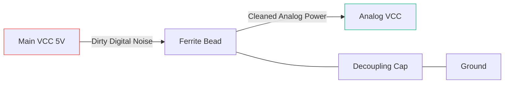

High-speed digital electronics create a lot of electromagnetic noise. Without mitigation, this high-frequency interference bleeds into sensitive analog lines or radiates outward, causing your device to spectacularly fail FCC emissions testing. 

The primary weapon against this interference is the **ferrite bead**. Understanding its schematic symbol and placement dictates whether your circuit operates cleanly or drowns in its own noise.

## 1. Visualizing the Ferrite Bead Symbol

A ferrite bead operates inherently like a heavily lossy inductor. Because of this, its schematic symbol is closely related to the standard inductor symbol, but tailored to emphasize its specific role.

```mermaid
graph LR
    A[Inductor Basis] --> B(Standard Inductor Symbol)
    A --> C(Rectangle Over Wire)
    B -.-> D(Addition of a dashed line or solid bar)
    D --> E[IEEE Ferrite Symbol]
    C --> F[IEC Ferrite Symbol]
    
    style E fill:#0f172a,stroke:#3b82f6
    style F fill:#0f172a,stroke:#10b981
```

| Trait | IEEE/ANSI Standard | IEC Standard | Notes |
| :--- | :--- | :--- | :--- |
| **Shape** | Series of semi-circles with a bar/box | A solid rectangular block | Functionally identical in outcome |
| **Designator Prefix** | `FB` | `FB` or `L` | Using `FB` is highly recommended to prevent confusion with power inductors |
| **Measurement Unit** | Ohms (Ω) at specific MHz | Ohms (Ω) at specific MHz | Unlike inductors measured in Henries (H) |

> **Crucial Distinction:** Never rate a ferrite bead by inductance. Ferrite beads are specified by their **impedance (in Ohms) at a specific frequency** (typically 100 MHz).

## 2. Core Operational Mechanics

Why use a ferrite bead instead of a standard inductor? 

* An **inductor** stores energy and returns it to the circuit. It is highly reactive and preserves energy.
* A **ferrite bead** is actively designed to be *lossy*. At high frequencies, it behaves like a resistor, converting unwanted high-frequency noise directly into heat.

| Frequency Range | Ferrite Bead Behavior | Result on Circuit |
| :--- | :--- | :--- |
| **Low Frequency / DC** | Under 1 MHz | Acts like a simple wire (~0 Ω). DC power passes through freely. |
| **Resonant Frequency** | Highly Reactive | Stores energy briefly. |
| **High Frequency** | Over 50 MHz+ | Acts like a high-value resistor. Blocks and dissipates RF noise as heat. |

## 3. Best Practices for Schematic Placement

Properly utilizing the FB symbol requires strategic placement. Slapping ferrite beads randomly on a schematic can actually worsen ringing and resonance.

### Decoupling Power Supplies (Pi-Filters)

The absolute most common use for an `FB` symbol is isolating dirty digital power from clean analog power.

In the configuration above (part of a Pi-Filter), the ferrite bead blocks high-frequency transients from entering the AVCC line, while the capacitor shunts any remaining ripple down to ground.

### Data Line EMI Suppression

When routing long USB data cables or HDMI traces, `FB` symbols are often placed in series near the connector. This ensures that the long, physically exposed wire does not act as an antenna and radiate CPU noise across the room.

To add a ferrite bead to your next schematic, open the **[Circuit Diagram Editor](/editor/)**, search for "Ferrite," and specify your impedance rating!
