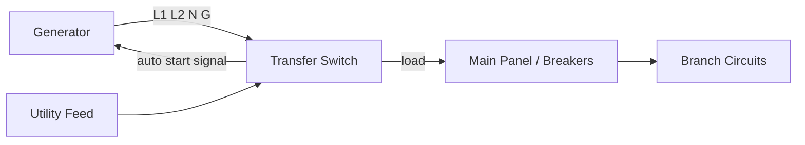
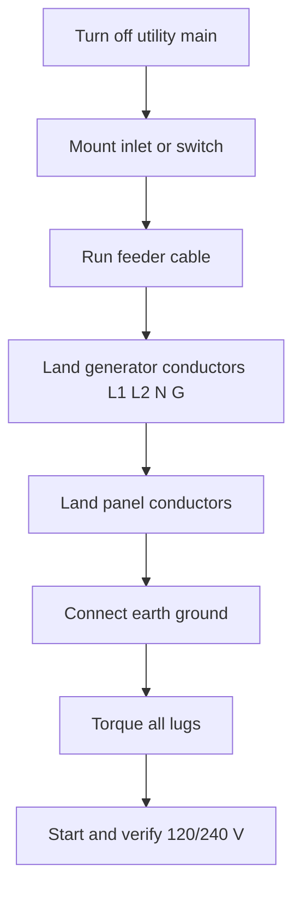
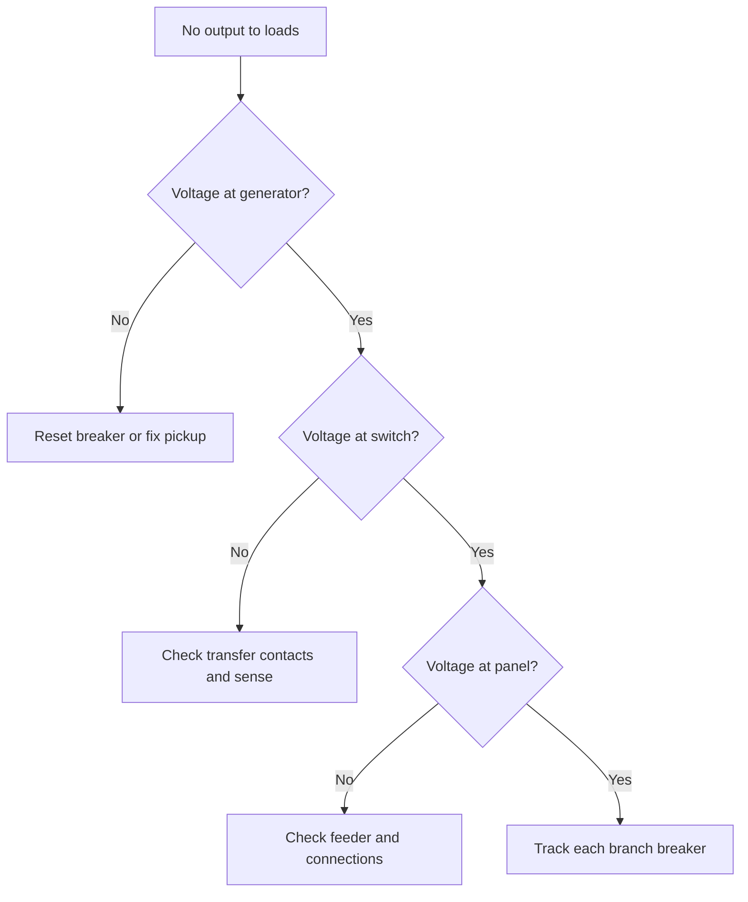

## Introduction to Generator Wiring Diagrams

**<b>A generator wiring diagram is the electrical schematic that shows how a generator connects to a transfer switch, a breaker panel, and the loads that the generator serves.</b> The drawing maps every conductor, terminal, switch, and breaker in the power path from the generator output to the circuits it feeds.

Generator wiring diagrams guide 3 jobs: generator installation, scheduled maintenance, and fault diagnosis. An accurate diagram shows the correct landing point for each wire so the person wiring the unit never guesses.

There are 3 main benefits of using accurate diagrams:

1. Confirm the correct connection for every conductor before energizing
2. Prevent backfeeding, the fault that energizes utility lines during an outage
3. Reduce troubleshooting time when a circuit has no power

The diagrams have 4 main uses: standby generator installation, portable generator hookup, transfer switch wiring, and power distribution to branch circuits. The core components are the automatic transfer switch (ATS), circuit breakers, an interlock kit, the generator inlet box, and the ground and neutral connection.

## Core Components of Generator Wiring

**<b>Five core components carry the power path in a home generator system: the transfer switch, main circuit breaker, interlock kit, inlet box, and the ground and neutral bond.</b>**

<table>
  <thead>
    <tr><th>Component</th><th>Function in the wiring process</th></tr>
  </thead>
  <tbody>
    <tr>
      <td><strong>Automatic transfer switch (ATS)</strong></td>
      <td>Senses utility power loss, starts the generator, and transfers the load to the generator feed.</td>
    </tr>
    <tr>
      <td><strong>Main circuit breaker</strong></td>
      <td>Shuts the panel down for service and protects branch circuits from overload.</td>
    </tr>
    <tr>
      <td><strong>Interlock kit</strong></td>
      <td>A mechanical cover that stops the utility main and the generator breaker from closing at the same time.</td>
    </tr>
    <tr>
      <td><strong>Generator inlet box</strong></td>
      <td>A weatherproof receptacle on the outside wall where the generator cable lands.</td>
    </tr>
    <tr>
      <td><strong>Ground and neutral bond</strong></td>
      <td>Earth rod and bond that keep the system stable and carry fault current safely to ground.</td>
    </tr>
  </tbody>
</table>

Components change with the generator type. A portable generator backs a small panel through a 30-amp (A) inlet and interlock. A permanently installed standby generator pairs with a 200 A ATS and its own transfer-rated breakers. The wiring diagram marks each unit's rating so the installer selects the matching breaker size and conductor gauge.

## Step-by-Step Wiring Instructions

To wire a generator, gather 8 tools and safety items: a multimeter, insulated screwdrivers, a wire stripper, a cable stripper, a torque wrench, a ladder, safety glasses, and work gloves. Read the full diagram before touching the panel.

Follow this step-by-step wiring guide for a transfer-switch hookup:

1. Turn off the utility main breaker and verify the panel is dead with a multimeter
2. Mount the inlet box or transfer switch on the wall in its listed location
3. Run the feeder cable between the generator inlet and the panel
4. Land the generator conductors on the inlet: L1, L2, neutral (N), and ground (G)
5. Land the load conductors on the transfer switch or interlocked breaker
6. Connect the earth ground rod to the ground bar
7. Torque every lug to the manufacturer's specification
8. Start the generator and confirm 120/240 V between the correct phases with a live check

Avoid these 5 common installation pitfalls:

1. Skip the interlock, and generator power flows into the utility grid
2. Reverse L1 and L2, and 240 V equipment sees the wrong phases
3. Leave the neutral floating, and ground-fault devices misbehave
4. Use undersized cable, and the circuit heats at full load
5. Use a double-ended male cord, and live prongs sit exposed at one end

Select the right wiring method from the generator type. A portable generator pairs with an interlocked inlet; a standby generator requires an ATS. Match the interlock or ATS rating to the generator feeder breaker.

## Troubleshooting Common Wiring Issues

There are 6 common generator wiring issues with identifiable symptoms:

| Issue | Symptom | First check |
| :--- | :--- | :--- |
| Tripped generator breaker | Generator runs, no output | Reset the breaker, reduce the load |
| Open neutral connection | Lights dim and hum | Measure 120 V from L1 to N and L2 to N |
| Reversed phases | New equipment fails on 240 V | Confirm L1 and L2 order at the panel |
| Loose ground | Shocks when touching equipment | Check continuity from chassis to earth rod |
| Undersized feeder | Cable warm and voltage dip at load | Compare gauge to the breaker rating |
| ATS will not start | No transfer during outage | Verify the sense circuit and battery/charging source |

Use a metering process for each fault:

1. Measure voltage at the generator output first; expect 120/240 V at no load
2. Measure at the transfer switch load side next
3. Check continuity on every ground and neutral conductor
4. Isolate each branch by opening breakers until the fault disappears, if branch overload is suspected

Call a licensed electrician when the panel is hot, when the fault persists after these checks, or when the service entrance must be opened. Line-side work on the utility meter and supply conductors belongs to a professional.

## Safety Precautions When Wiring Generators

Generator wiring carries 4 hazards: carbon monoxide (CO) poisoning, electric shock, backfeed to the utility grid, and fire from overloaded circuits.

Follow these 10 safety precautions:

1. Run the generator outdoors at least 6 meters (20 feet) from windows, doors, and vents
2. Install a carbon monoxide alarm inside the building before any generator use
3. Turn off the utility main and verify zero voltage before touching the panel
4. Use the interlock or transfer switch so generator power never feeds the grid
5. Wear dry gloves, safety glasses, and non-conductive footwear
6. Stand dry and keep the generator and panel dry in wet weather
7. Use extension cords rated for the full generator current
8. Ground the generator per the manufacturer's instructions
9. Stop the generator before refueling and let the engine cool
10. Keep a rated fire extinguisher near the generator installation

**<b>Never run a generator in an enclosed area and never plug a generator into a wall outlet.</b> Both practices cause CO buildup and backfeeding, and each can be fatal.

Emergency procedures: shut down the generator and disconnect it if you smell burning wire, see smoke, or feel a tingle from any metal part. Open the main breaker if a conductor faults, and call a licensed electrician. For CO exposure, leave the building, move to fresh air, and call the emergency services.

## Visual Aids and Diagrams

The wiring layout at the top of this guide shows the 4-phase path from generator output to the branch loads. The component sheet above the step list identifies each part in the power distribution chain.

Read a generator diagram by following 4 cues:

1. Trace the generator output conductors (L1, L2, N, G) to the switch first
2. Find the neutral return and the separate ground path
3. Note every breaker rating printed on the diagram
4. Check the transfer switch throws for the utility and generator positions

| Line | Conventional color | Function |
| :--- | :--- | :--- |
| L1 | Black | Phase A, 120 V to neutral |
| L2 | Red | Phase B, 120 V to neutral |
| N | White | Neutral return |
| G | Green or bare | Equipment ground |

Use these reference sheets standing next to the panel during the job. Draft a personal copy of the wiring layout in the browser editor before cutting cable: [open the circuit editor](/editor/).

## FAQs About Generator Wiring

**Can I plug a generator into a wall outlet?**

No. Plugging a generator into a wall outlet backfeeds power into the utility line, energizes the panel from the wrong side, and risks electric shock for utility crews.

**Do I need an automatic transfer switch (ATS)?**

Only a standby generator needs an ATS for unattended starts. A portable generator with an interlocked breaker provides safe manual transfer at a lower cost.

**What size generator do I need?**

Add the running watts of the circuits you want to power and keep roughly 20% headroom above the total. A 3,000-watt (W) unit covers lights, a refrigerator, and a phone charger; a 7,500 W unit covers those plus well pumps and a furnace blower.

**Can I run the generator on extension cords?**

Yes, for small portable loads. Use cords rated for the full generator current and keep the generator dry outdoors. Extension cords do not protect hardwired circuits during a power outage.

**Do I ground a portable generator?**

Ground the generator per the generator's manual. The neutral-ground bonding arrangement on the unit affects how it connects to the transfer switch and the panel.

**Do I need a permit or inspection?**

Many areas require a permit and inspection for a permanent generator connection. Check the local electrical code, confirm the neutral-ground bond against the manual, and submit wiring questions to your electrician.

Add questions in the comments, and the team answers new generator wiring topics in the next guide.