Building a power inverter—converting a 12V car battery into 220V alternating current capable of running household appliances—is a rite of passage for electronics engineers. 

Before lifting a soldering iron, you must achieve a flawless understanding of the underlying schematic. High-voltage circuitry is unforgiving, and a badly drawn diagram guarantees burnt MOSFETs or severe electric shock. This guide breaks down the architecture of a fundamental square-wave inverter.

> **Safety Warning:** 220V AC power is lethal. This article is an exploration of schematic logic and theoretical design, not a manufacturing blue-print. Never build high-voltage circuits without advanced electrical training.

## The Three Pillar Architecture

No matter how complex a modern inverter is, the schematic can always be visually and logically divided into three distinct functional blocks.

```mermaid
flowchart LR
    DC_SRC[(12V DC Battery)] --> OSC[1. Oscillator Block]
    OSC -- Low Power Square Wave --> AMP[2. Power Switch Block]
    AMP -- High Current 12V Wave --> TX[3. Step-Up Transformer]
    TX -- Magnetic Induction --> AC_OUT((220V AC Output))
    
    style OSC fill:#0f172a,stroke:#3b82f6
    style AMP fill:#0f172a,stroke:#f59e0b
    style TX fill:#0f172a,stroke:#ef4444
```

### Stage 1: The Oscillator (The Brains)

Direct Current (DC) from a battery flows in a straight line. Transformers cannot step-up a straight line; they require fluctuating magnetic fields. Therefore, we must convert the DC into an artificial AC wave (typically 50Hz or 60Hz depending on geographic region).

| Component Used | Schematic Role | Why it is Chosen |
| :--- | :--- | :--- |
| **CD4047 IC / 555 Timer** | Astable Multivibrator | Outputs a remarkably stable square wave via calculating an RC time constant. |
| **Resistor & Capacitor Network** | Timing calibrators | Values (e.g., `R=100kΩ`, `C=0.1μF`) uniquely dictate the precise 50Hz frequency. |

### Stage 2: The Power Switches (The Muscle)

The logic chip produces a pristine 50Hz wave, but at exceptionally low current limits (often under 20mA). If you fed that into a transformer, it would not generate enough magnetic flux to run a lightbulb.

We place high-power transistors between the oscillator and the transformer coils. 

1. The oscillator's weak signal hits the **Gate** of a massive N-Channel MOSFET (like the IRF3205).
2. The MOSFET acts as an electronic heavy-duty relay.
3. It furiously switches the massive amperage from the 12V battery directly through the transformer coils 50 times a second.

### Stage 3: The Step-Up Transformer

At this point in the schematic, we have massive amounts of 12V current pulsing back and forth. The final stage requires routing this through the primary coils of a transformer.

| Feature | Schematic Details | Real-world Implication |
| :--- | :--- | :--- |
| **Primary Coil (Left)** | Center-tapped configuration (`12V - 0 - 12V`) | Allows back-and-forth push-pull switching from two alternating MOSFETs. |
| **Core Lines** | Two solid lines drawn vertically | Represents the iron/ferrite core necessary for high-efficiency magnetic induction. |
| **Secondary Coil (Right)** | Massively increased winding ratio | Physics steps the pulsing 12V magnetic flux up into a lethal, volatile 220V wave. |

## Drawing Considerations

When utilizing the **[Circuit Diagram Editor](/editor/)** to draft this design, remember layout best practices:

* Draw the heavy lines carrying the 12V Battery current thicker than the low-power oscillator lines.
* Ground the MOSFET Source pins explicitly and uniquely; do not route them back near the sensitive oscillator ground to prevent noise coupling.
* Delineate the 220V outputs graphically! Place warning labels and output ports (like a socket symbol) rather than leaving bare wires terminating in the void.
