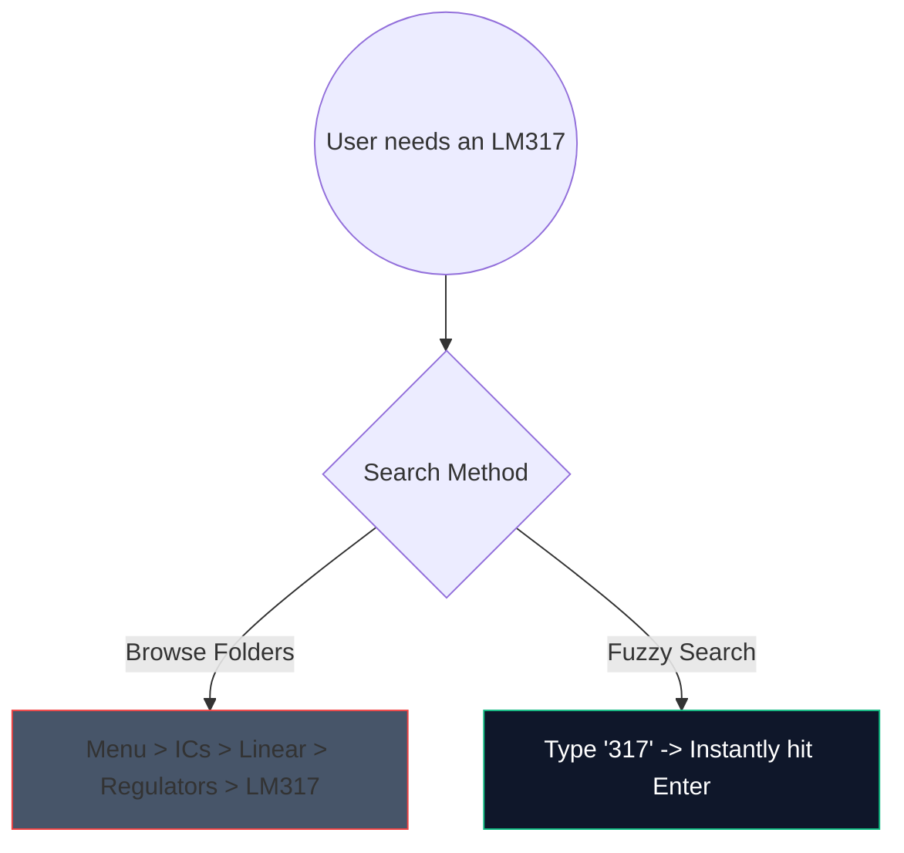

The days of downloading heavy, 2-gigabyte desktop software just to sketch a simple amplifier circuit are over. Browser-based CAD (Computer-Aided Design) is here, and it is phenomenally fast.

Here is exactly how you can utilize modern web tools to generate production-quality schematics in under 5 minutes.

## Why Browser-Based Circuit Design?

If you are an educator, student, or hobbyist writing documentation, speed and accessibility trump raw features. 

```mermaid
flowchart LR
    subgraph Traditional Workflow
    DL[Download/Install] --> CONF[Configure Libraries] --> DRAW1[Draw]
    end
    
    subgraph Web Workflow
    URL[Go to URL] --> DRAW2[Draw immediately]
    end
    
    style URL fill:#0f172a,stroke:#3b82f6
    style DRAW2 fill:#1e293b,stroke:#10b981
```

| Metric | Desktop Application | Circuit Diagram Maker |
| :--- | :--- | :--- |
| **Storage Space** | 1GB - 5GB+ | 0 MB (Cloud-based) |
| **OS Compatibility** | Often Windows-only or buggy ports | Universally Web-compatible |
| **Startup Time** | 15–30 seconds | < 1 second |
| **Portability** | Confined to one machine | Accessible everywhere |

## Core Workflow Hacks for Speed

When using a web editor, employing keyboard shortcuts transforms the experience from "clicking around" to an uninterrupted flow state. 

Here are the highest-ROI shortcuts to memorize in our editor:

| Action | Hotkey Command | Workflow Benefit |
| :--- | :--- | :--- |
| **Wire Routing** | `W` | Instantly switches your cursor to connection mode, allowing rapid-fire net routing without moving to a toolbar. |
| **Component Rotation** | `R` (while holding part) | Orienting resistors or transistors before placing them saves massive amounts of cleanup time later. |
| **Duplicate Selection** | `Ctrl + D` or `Alt-Drag` | Do not pull 8 LEDs from the menu; place one, configure it, and duplicate it 7 times instantly. |
| **Pan Canvas** | `Spacebar + Drag` | Keeps your zoom level consistent while navigating massive, complex layouts. |

## Utilizing the Component Search

Searching visually through massive dropdown menus is tedious. We integrated a robust fuzzy-search mechanism. 

Simply hit the search bar and type `NPN` rather than clicking through `Semiconductors -> Transistors -> BJT`. The tool instantly curates the highest probability match.

## Exporting for Professional Use

Creating the diagram is only half the battle; injecting it into your thesis or technical blog is the other half. 

Always export your circuit patterns as **SVG (Scalable Vector Graphics)** whenever possible, rather than PNG or JPG. An SVG stores mathematically defined lines rather than pixels, meaning you can scale your schematic up to billboard size and it will perpetually remain pin-sharp without rasterization blur.

Ready to test your speed? **[Launch the App](/editor/)** and try creating a 555-timer blinking LED circuit!
