Opening a complex schematic for the first time feels like staring at an alien language. Dozens of intersecting lines, cryptic abbreviations, and jagged symbols merge into a wall of visual noise.

However, experienced engineers do not read schematics by staring at the whole page. They isolate, trace, and conquer. Here is the step-by-step methodology to decipher any circuit diagram.

## Step 1: Isolate the Core Power Infrastructure

Before understanding what a circuit *does*, you must understand *how it breathes*. 

Every schematic has entry points for electrical energy. Your first task is to locate all major voltage rails and ground references.

```mermaid
flowchart TD
    A[Start: Scan Edges] --> B{Look for Power Symbols}
    B -- Found Battery/Jack --> C[Trace the initial VCC and GND lines]
    B -- Found Net Labels --> D[Locate generic +5V, +3.3V pads]
    C --> E[Are there Voltage Regulators?]
    D --> E
    E -- Yes --> F[Mentally divide circuit into Voltage Zones]
    E -- No --> G[Circuit runs on single voltage]
    
    style A fill:#0f172a,stroke:#3b82f6
    style F fill:#1e293b,stroke:#f59e0b
```



| Symbol/Text | Meaning | Action Requirement |
| :--- | :--- | :--- |
| `VCC` / `VDD` | Positive supply voltage for ICs. | Trace this to ensure every IC is receiving power. |
| `GND` / `VSS` | The common ground reference. | Assume all of these symbols physically connect together. |
| `LDO` / `buck` | A chip regulating voltage down. | Note what components are down-stream utilizing the new lower voltage. |

## Step 2: Demystify the "Brains" (ICs)

Once you know where power is flowing, look for the largest rectangles on the page. Integrated Circuits (ICs) dictate the primary function of the schematic.

If you encounter an IC labeled `U1` with a cryptic part number like `NE555` or `ATmega328P`, stop reading the schematic immediately. Open a new tab and pull the **datasheet**. 

You do not need to understand the internal semiconductor physics; simply look at the datasheet's "Pinout Diagram". If pin 4 is `RESET` and pin 8 is `VCC`, immediately map that logic back to the drawing. 

## Step 3: Track the Inputs and Outputs

Circuits are functional machines. They receive environmental input, process it, and output a result. 

```mermaid
quadrantChart
    title Input/Output Hardware Identification
    x-axis Analog/Physical --> Digital/Data
    y-axis Input Devices --> Output Devices
    quadrant-1 Digital Receivers (e.g. WiFi)
    quadrant-2 Digital Displays (e.g. OLEDs)
    quadrant-3 Physical Actuators (e.g. Motors)
    quadrant-4 Physical Sensors (e.g. Thermistors)
    "Push Button": [0.1, 0.4]
    "Photoresistor": [0.2, 0.2]
    "UART RX": [0.8, 0.4]
    "UART TX": [0.8, 0.6]
    "Speaker": [0.3, 0.8]
    "LED": [0.4, 0.7]
```

Trace wires outward from the central ICs. If an IC pin connects to an LED, that is a visual output. If a pin connects to an SPST switch going to ground, that is a human input.

## Step 4: Validate Junctions and Crossings

The most common reading error for beginners involves misunderstanding wires that cross each other.

* **A Dot Yields a Knot:** If two intersecting lines feature a solid dot at their crossing, they are physically soldered/connected together. Current can flow between them.
* **No Dot Yields a Bridge:** If two lines form a plain cross (+), they do *not* touch. They are akin to two highways passing over one another on an overpass.

## Step 5: Recognize Sub-Circuits (The Secret Weapon)

Engineers rarely design circuits entirely from scratch. They glue together standard modular sub-circuits. Once you learn to recognize these visual 'words', you stop reading individual 'letters'.

| Visual Pattern | Standard Sub-Circuit | Function |
| :--- | :--- | :--- |
| Capacitor crossing from `VCC` to `GND` right next to an IC. | **Decoupling Capacitor** | Absorbs noise. Ignore it when analyzing logical flow. |
| Resistor from a digital pin wrapping up to `+5V`. | **Pull-up Resistor** | Prevents floating pins; ensures a stable HIGH default state. |
| Two resistors placed in series between voltage and ground, tapped in the middle. | **Voltage Divider** | Drops a voltage proportionally to be safely read by a sensor pin. |

Put this theory into practice. Open the **[Circuit Diagram Editor](/editor/)**, load a template, and map out the power, brain, inputs, and outputs for yourself!
