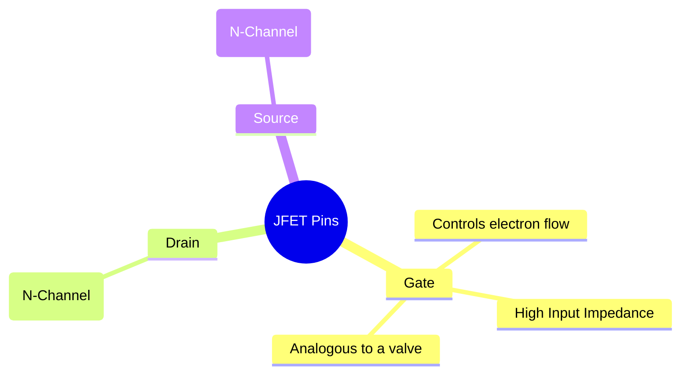

Before the massive proliferation of MOSFETs, the **JFET** (Junction Field-Effect Transistor) was the king of high input impedance amplification. While not used as frequently in modern digital logic, they remain indispensable artifacts in high-fidelity audio preamplifiers, sensitive instrumentation, and RF circuitry.

Understanding the JFET schematic symbol is essential for anyone delving into discrete analog circuit design.

## 1. Anatomy of the JFET Symbol

Unlike Bipolar Junction Transistors (BJTs) which are current-controlled devices, a JFET is a **voltage-controlled** device. The schematic symbol attempts to visually represent the physical construction of its internal semiconductor channel.

The symbol consists of a straight vertical line representing the channel, with two horizontal lines hooking into it (the Drain and Source). A third perpendicular line forms the Gate, complete with an arrow that dictates the semiconductor polarity.

### N-Channel vs. P-Channel JFETs

Just like BJTs have NPN and PNP, JFETs come in two distinct flavors.

| Characteristic | N-Channel JFET | P-Channel JFET |
| :--- | :--- | :--- |
| **Symbol Arrow** | Points **IN** toward the channel line | Points **OUT** away from the channel |
| **Majority Carriers** | Electrons | Holes |
| **Vgs for Pinch-Off** | Negative Voltage (e.g., -5V) | Positive Voltage (e.g., +5V) |
| **Typical Operation**| Normally ON -> Apply negative voltage array to turn OFF | Normally ON -> Apply positive voltage array to turn OFF |

> **Memory Trick:** "Pointing IN" means **N**-Channel. Look at the arrow on the Gate. If it points inward to the line, you are dealing with an N-Channel JFET (like the popular 2N5457).

## 2. Operation: The Depletion Mode

One of the most defining characteristics of a JFET is that it is a **Depletion Mode** device. This vastly affects how you design schematics around them.

* **MOSFETs (Enhancement Mode):** Are normally OFF. You must apply a voltage to the gate to turn them ON.
* **JFETs (Depletion Mode):** Are normally ON. With 0 Volts at the gate, maximum current flows from Drain to Source. You must apply a *reverse bias* voltage (negative for N-Channel) to expand the depletion region and literally "pinch off" the flow of electrons, turning the device OFF.

```mermaid
flowchart LR
    VGS[V_GS = 0V] --> I1[Maximum Drain Current flows]
    VGS2[V_GS = -2V] --> I2[Current is restricted]
    VGS3[V_GS = -5V] --> I3[Pinch-Off reached. Circuit is OFF]
    
    style VGS fill:#1e293b,stroke:#f59e0b
    style VGS3 fill:#1e293b,stroke:#ef4444
```

## 3. Typical Schematic Applications

Because the Gate of a JFET is reverse-biased during operation, essentially zero current flows into it. This yields an astronomically high input impedance (often measured in hundreds of Megaohms).

| Circuit Application | Why JFETs Are Chosen | Schematic Clues |
| :--- | :--- | :--- |
| **Audio Preamplifiers** | Extremely low noise and massive input impedance prevents loading of sensitive electric guitar pickups. | Often seen acting as a Source Follower buffer stage. |
| **Analog Switches** | Because they are purely voltage controlled with no gate current, they inject zero switching transients into the signal path. | Placed in series with an analog signal passing through the drain-source channel. |
| **Constant Current Sources** | A JFET behaves natively as a constant current sink when the gate is tied directly to the source. | Gate terminal wired directly around to the Source terminal. |

When diagramming these specialized analog circuits, precision is key. Ensure your Gate arrow orientation is correct to prevent manufacturing failures. Use the curated discrete semiconductor library in **[Circuit Diagram Maker](/editor/)** to place standard N-Channel and P-Channel JFET symbols accurately on your next canvas.
