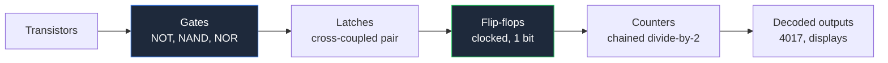
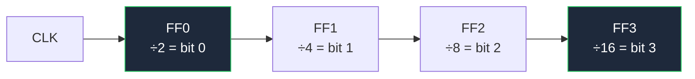

**Logic gate circuit diagrams describe behaviour, not component values.** That single difference changes how you draw them. An analog schematic lives or dies on whether the reader can find the 4k7 resistor; a digital schematic lives or dies on whether the reader can trace signal propagation through a chain of gates without losing their place. There are almost no values to annotate — so every ounce of clarity has to come from symbol choice and layout.

This guide covers both symbol dialects, then works upward through the hierarchy: gates built from bare transistors, gates composed into flip-flops, flip-flops chained into counters, and finally a real counter IC. It is one of six domain guides that sit under our [complete guide to circuit diagrams](/blog/complete-guide-to-circuit-diagrams/), which covers the universal layout conventions these rules build on.

## Two Symbol Dialects: ANSI Shapes vs IEC Rectangles

Digital logic is the one area where the American and international standards diverge dramatically. Everywhere else — resistors, capacitors, diodes — the shapes are similar or identical. In logic they are unrecognizably different.

**ANSI/IEEE 91-1984 distinctive shapes** give every gate a unique silhouette. You identify the function from the outline alone, at any zoom level, in peripheral vision.

**IEC 60617-12** (often loosely called the DIN style, after the older German DIN 40700) uses one rectangle for every gate, with a qualifying symbol inside that names the function.

| Gate | ANSI distinctive shape | IEC / DIN rectangle | Boolean |
| :--- | :--- | :--- | :--- |
| **AND** | Flat back, semicircular nose — a "D" | Rectangle with `&` | `Y = A · B` |
| **OR** | Curved back, pointed nose — a shield | Rectangle with `≥1` | `Y = A + B` |
| **NOT** | Triangle with a bubble on the output | Rectangle with `1` plus bubble | `Y = Ā` |
| **NAND** | AND shape plus output bubble | `&` plus output bubble | `Y = A · B` inverted |
| **NOR** | OR shape plus output bubble | `≥1` plus output bubble | `Y = A + B` inverted |
| **XOR** | OR shape plus a second curved back line | Rectangle with `=1` | `Y = A ⊕ B` |
| **XNOR** | XOR shape plus output bubble | `=1` plus output bubble | `Y = A ⊕ B` inverted |
| **Buffer** | Plain triangle, no bubble | Rectangle with `1` | `Y = A` |

The IEC qualifiers are more logical than they first appear. `&` is literally "and". `≥1` means "output is true when *at least one* input is true" — which is exactly what OR means. `=1` means "output is true when *exactly one* input is true" — exactly XOR. Once you read them that way you never forget them.

**Which should you use?** ANSI shapes for anything read by a human, IEC rectangles when your organization mandates them or when you are drawing complex gates where a distinctive shape does not exist. ANSI's advantage is real: a page of distinctive shapes is scannable, while a page of identical rectangles forces the reader to inspect every qualifier. Whichever you pick, never mix them on one sheet.

### The Bubble Is the Whole Story

A small circle on a pin means inversion. That is the single most load-bearing convention in digital drafting:

- Bubble on the **output** — the function is negated. AND becomes NAND.
- Bubble on an **input** — that input is inverted before the gate acts on it.
- Bubble on a **clock input** — the flip-flop triggers on the falling edge instead of the rising edge.
- Bubble on an IC pin, plus a name like `nCS` or `RESET#` — the signal is **active low**: it does its job when driven to 0 V.

Because bubbles are small, keep them clean. Never let a wire touch or overlap a bubble, and never place two gates so close that the output bubble of one merges visually with the input line of the next.

## Drawing Rules Specific to Digital Schematics

The universal conventions still apply — inputs left, outputs right, power top, ground bottom, snap to grid. Digital work adds four of its own.

**1. Gate inputs never cross each other.** If two wires feeding one gate cross on their way in, swap the input order instead. For AND, OR, NAND, NOR and XOR the inputs are interchangeable, so there is no excuse. A crossed gate input is the hardest error to spot in a digital drawing because it looks perfectly normal.

**2. Propagation reads left to right, always.** Digital circuits often loop, and the loops are meaningful — a latch is a loop. Keep every forward path strictly left-to-right so the loops stand out as the only backward wires on the sheet.

**3. Collapse parallel groups into buses.** Eight data lines drawn individually is eight chances to misread. `D[0..7]` on a single thick line is one.

**4. Label the clock domain.** Any sheet with more than one clock should name them (`CLK_16M`, `CLK_SLOW`) and keep each domain visually grouped. Clock lines are conventionally drawn straight and unbroken — a clock that wanders through six corners looks like a data line.



Each step in that chain is drawn with the same symbols at a higher level of abstraction. Understanding the bottom rung makes the rest obvious, so start there.

## Building Gates from Transistors

Every gate symbol hides a transistor arrangement. Drawing those arrangements is a genuinely useful exercise, because it explains why NAND and NOR are the cheap, natural gates and AND and OR are the expensive ones.

### NOT Gate Circuit

The simplest gate is a common-emitter NPN inverter:

- Input through a base resistor (a few kΩ) to the base of an NPN transistor.
- Collector resistor (1 kΩ–10 kΩ) from the collector up to VCC.
- Emitter straight to ground.
- Output taken at the collector.

Drive the input high and the transistor saturates, pulling the collector — and therefore the output — down to roughly 0.2 V. Drive the input low and the transistor turns off, so the collector resistor pulls the output up to VCC. Input high gives output low: inversion.

Draw it exactly as the hub guide prescribes and the function is visible: VCC at the top, collector resistor vertical, transistor below it with the emitter arrow pointing down into the ground rail, input entering from the left, output leaving from the right at the collector node. The whole gate reads in one glance.

### NAND Gate Using Transistors

Now stack two transistors in series between the output node and ground: the emitter of the upper transistor connects to the collector of the lower one, and the lower emitter goes to ground. Each base gets its own input through a base resistor. One collector resistor to VCC serves both.

The output is pulled low **only when both transistors conduct**, which requires both inputs high. Every other input combination leaves at least one transistor off, so the pull-up resistor wins and the output stays high.

| A | B | Q1 | Q2 | Output |
| :--- | :--- | :--- | :--- | :--- |
| 0 | 0 | off | off | **1** |
| 0 | 1 | off | on | **1** |
| 1 | 0 | on | off | **1** |
| 1 | 1 | on | on | **0** |

That is a NAND truth table. Series transistors give you NAND for free — and that is precisely why NAND is the universal building block of real logic families, not AND.

**Put the same two transistors in parallel** — both collectors on the output node, both emitters on ground — and the output is pulled low when *either* conducts. That is NOR. Series equals NAND, parallel equals NOR. Two arrangements, both gates, no extra parts.

To get a true AND you need the NAND followed by an inverter: three transistors instead of two. AND and OR are literally more expensive than their inverted cousins, which is why datasheets are full of NAND and NOR packages.

### XOR Gate Using Transistors

XOR is where discrete construction stops being elegant. The Boolean identity is:

```
Y = (A · B̄) + (Ā · B)
```

Output is high when the inputs differ. In discrete form that means two inverters to generate `Ā` and `B̄`, then two series pull-down pairs — one for `A · B̄`, one for `Ā · B` — with both pairs sharing a single collector pull-up resistor to wire-OR their results. Six transistors and five resistors for one gate.

Draw it as two clearly separated halves, one per product term, stacked vertically and meeting at the shared output node. If you try to draw all six transistors in one row it becomes unreadable immediately. This is also the moment to note that in any real design you would use one seventh of a 74HC86 instead — the discrete version exists to teach the identity, not to be built.

## Flip-Flop Circuits

A flip-flop is what happens when you feed a gate's output back to its own input. That loop gives the circuit memory — one bit of it.

### The SR Latch

Cross-couple two NOR gates: the output of gate 1 feeds an input of gate 2, and the output of gate 2 feeds an input of gate 1. The remaining free inputs become **S** (set) and **R** (reset), and the two outputs are **Q** and **Q̄**.

- Pulse S high: Q goes high and stays high after S returns low.
- Pulse R high: Q goes low and stays low.
- Both low: the latch holds its previous state — this is the memory.
- Both high: forbidden, because both outputs are forced low and the "Q̄ is the opposite of Q" contract breaks.

Swap the NOR gates for NAND gates and you get the active-low version, where the inputs are `S̄` and `R̄` and idle is both high.

> The SR latch is the one place where the no-crossing rule is deliberately broken. The conventional drawing puts the two gates one above the other with the feedback wires visibly crossing between them, because that X shape *is* the recognizable signature of a latch. Draw it any other way and readers will not recognize it.

### D and JK Flip-Flops

Add a clock and the latch becomes a flip-flop that only changes state at a defined moment.

| Type | Inputs | Behaviour | Drawing notes |
| :--- | :--- | :--- | :--- |
| **D** | D, CLK | Q takes the value of D at the clock edge | Most common; one data input, no forbidden state |
| **JK** | J, K, CLK | J sets, K resets, both high toggles | The toggle mode is what makes counters possible |
| **T** | T, CLK | Toggles when T is high | A JK with J and K tied together |

At schematic level you almost always draw these as rectangles, not as the underlying gates. Conventions for the block: D or J/K inputs on the left, clock on the left with a bubble if it is falling-edge triggered, Q on the upper right, Q̄ on the lower right, and asynchronous set/reset on the top and bottom edges. Following that layout means any reader recognizes the block instantly without reading the part number.

## Binary Counter Circuits

A JK flip-flop with both inputs tied high toggles on every clock edge. Its output is therefore exactly half the input frequency — a divide-by-2 stage. Chain them and each stage divides again:



Read the four Q outputs together and you have a 4-bit binary number that increments once per input clock: a binary counter counting 0 to 15. Because each stage clocks the next, this is an **asynchronous** or **ripple** counter — the stages update in sequence rather than simultaneously, so there is a brief settling period after each clock where the output is invalid.

Drawing rules for counters:

- **Left to right in bit order.** Bit 0 on the left, most significant bit on the right. Never reverse this; readers assume it absolutely.
- **Label each output with its bit weight**, `Q0`/`Q1`/`Q2`/`Q3` or `÷2`/`÷4`/`÷8`/`÷16`.
- **Run the clock along a straight horizontal line** beneath or above the chain and drop taps up into each stage. Do not thread the clock diagonally between flip-flops.
- **Tie unused asynchronous inputs explicitly** to their inactive rail and show it. A floating reset pin on a counter is a guaranteed field failure.

For a **synchronous** counter, every flip-flop shares one clock and combinational logic decides which bits toggle. The drawing changes character completely: one clean clock line to every stage, plus a triangular block of AND gates fanning across the sheet. It is more parts and more drawing, and it eliminates the ripple settling problem.

## The IC 4017 Decimal Counter

In practice you rarely draw a counter from flip-flops — you use a counter IC. The CD4017 is the classic: a 5-stage Johnson counter with decoded outputs, giving **ten outputs that go high one at a time, in sequence, one per clock pulse**. It is the heart of nearly every LED chaser, sequencer, and step-counting circuit ever built.

Its pinout is also the single best argument for the hub guide's rule about arranging IC pins by function rather than physical order:

| Pin | Function | Pin | Function |
| :--- | :--- | :--- | :--- |
| 1 | Q5 | 9 | Q8 |
| 2 | Q1 | 10 | Q4 |
| 3 | Q0 | 11 | Q9 |
| 4 | Q2 | 12 | Carry out |
| 5 | Q6 | 13 | Clock inhibit |
| 6 | Q7 | 14 | Clock |
| 7 | Q3 | 15 | Reset |
| 8 | VSS (GND) | 16 | VDD |

The ten outputs are scattered across both sides of the package in no useful order. If you draw the symbol in physical pin order, `Q0` through `Q9` zigzag around the block and every wire you attach crosses another. Draw it functionally instead — clock, inhibit and reset stacked on the left, `Q0` through `Q9` in numerical order down the right side, VDD on top, VSS on the bottom, with pin numbers in small text next to each — and a ten-LED chaser becomes ten parallel horizontal wires with zero crossings.

The three control pins matter when you draw one:

- **Clock (14)** advances the sequence on the rising edge.
- **Clock inhibit (13)** freezes the counter while high. Tie it to ground if unused — do not leave it floating.
- **Reset (15)** returns the count to `Q0` while high. Tie it to ground if unused, or drive it from the output you want to be the last step in a shortened sequence. Feeding `Q4` back into reset, for example, turns the 4017 into a 4-step sequencer, and that feedback wire is one of the few right-to-left wires that belongs on a digital sheet.
- **Carry out (12)** pulses once per ten clocks, so it feeds the clock of a second 4017 to cascade beyond ten steps.

A typical LED chaser therefore reads: a 555 astable on the left generating the clock, the 4017 in the middle, ten LEDs with current-limiting resistors fanning out to the right, and both power symbols vertical. Clock generation for exactly this kind of circuit is covered in the [amplifier and oscillator circuits guide](/blog/amplifier-and-oscillator-circuits/), and if the 4017 is driving anything larger than an LED, the switching stages in the [sensor and protection circuit guide](/blog/sensor-and-protection-circuit-diagrams/) are what belong between them.

## Digital Schematic Checklist

Run this before you call a logic drawing finished:

1. One symbol standard only — ANSI shapes or IEC rectangles, never both.
2. No crossed gate inputs anywhere.
3. Every bubble clearly separated from surrounding wires.
4. Active-low signals named consistently (`nRESET`, `/RESET` or `RESET#` — pick one).
5. Every unused input tied to a defined level, explicitly drawn.
6. Every unused output marked with a no-connect `X`.
7. Counter and register bits in ascending left-to-right order.
8. Clock lines straight, labelled, and grouped by domain.
9. Decoupling capacitor drawn at each IC's own power pin — CMOS logic draws current spikes on every transition and this is where you record that intent.
10. Pull-up and pull-down values annotated even though the circuit is "digital".

**[Start drawing your own schematic now.](/editor/)** The gate library includes both ANSI distinctive shapes and IEC rectangles, plus flip-flops, counters and the 4017, so you can lay out a chaser or a divider chain in a couple of minutes. If you want to work from a truth table instead of placing gates by hand, the [truth table to logic circuit converter](/truth-table-to-logic-circuit/) generates the gate network for you, and the [Boolean expression simplifier](/boolean-expression-simplifier/) reduces the expression first so you draw the smallest circuit rather than the most obvious one.
