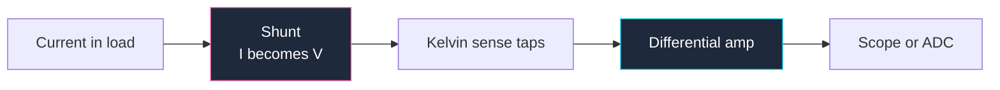

**Test infrastructure is the most under-drawn part of most schematics.** Designers spend a week on the signal path and then debug the board with a probe tip balanced against a resistor lead, because nowhere in the drawing did anyone say "we will need to measure this." Test points cost almost nothing at design time and are impossible to add after fabrication.

This guide covers how to draw the measurement side of a circuit: test points, shunts, instrument loading, and the small analog circuits that make measurement possible. It builds on the universal conventions in our [complete guide to circuit diagrams](/blog/complete-guide-to-circuit-diagrams/).

## Test Points Are Components

A test point has a reference designator — `TP` — and belongs on the schematic like any other part. Draw it as a small circle or a flag attached to the net, with the designator beside it.

What to annotate on each one:

- **Expected value.** `TP3 — 3.30 V ±2%` or `TP7 — 5 V square, 1 kHz, 50% duty`. This turns your schematic into a test procedure. Somebody with a meter and your drawing can validate a board without asking you anything.
- **What it is for.** `TP4 — regulator feedback node` tells a future debugger why it exists.

Placement rules that matter more than they sound:

**Put a ground test point next to every signal test point.** A scope measurement needs two connections. A board with twelve signal test points and one ground lug in the far corner is a board you will measure badly, because a long ground lead adds inductance and turns clean edges into ringing. Group them in pairs and the schematic communicates that intent to layout.

**Test the nets you cannot reach otherwise.** Any net that exists only between two BGA balls, or under a shield, or inside a hierarchical block, is invisible on a finished board. Those are the nets that need test points, not the ones already exposed on a header.

**Test both sides of anything that can fail open.** Fuses, series resistors, ferrite beads, and connectors. A test point on each side turns "the board is dead" into a five-second measurement.

**Mark no-load test points.** If a test point sits on a high-impedance node where probe capacitance would disturb the circuit, annotate it: `TP9 — use 10:1 probe only`.

## Drawing Instruments as Loads

An instrument is not a magic observer. It is a load, and on high-impedance nodes it changes the circuit you are trying to measure. When your schematic documents a test setup, draw the instrument as what it is.

| Instrument | Draw as | Typical values |
| :--- | :--- | :--- |
| **Scope, direct input** | Resistor in parallel with a capacitor to ground | 1 MΩ ∥ 15–25 pF |
| **Scope, 10:1 passive probe** | Same, higher R, lower C | 10 MΩ ∥ 10–15 pF |
| **Digital multimeter, DC volts** | Resistor to ground | ~10 MΩ |
| **Active/differential probe** | Buffer block with input impedance noted | High R, ~1–2 pF |

Draw the instrument inside a **dashed rectangle** labelled with the instrument name and its input impedance. The dashed outline is the standard way of saying "this is not part of the product" — the same convention used for optional assemblies and mechanical items. Then the reader can immediately see that the 20 pF hanging off the node is a measurement artefact, not a design component.

That 20 pF matters. On a 1 MΩ node it forms a low-pass filter with a corner around 8 kHz, so a scope probe on a high-impedance divider will show you a signal that does not exist without the probe. On a crystal oscillator, probe capacitance can stop the oscillator entirely. Drawing the probe as a load is how you predict that before you are confused by it.

**The scope ground is earth-referenced.** This is the most important annotation in any test schematic. A mains-powered oscilloscope's probe ground connects to the earth pin of its power cord. Clip it to a node that is not at earth potential and you create a short circuit through the building's earth conductor — destroying the probe, the circuit, or both. On a mains-referenced circuit such as a transformerless supply or a non-isolated SMPS primary, this is a genuine hazard rather than an inconvenience.

The correct answers are a differential probe, an isolated-input scope, or an isolation transformer on the *device under test*. The wrong answer is defeating the earth pin on the scope, which floats the entire instrument chassis — including every metal surface you will touch — up to whatever potential the probe ground is clipped to. If your schematic documents a measurement on a non-isolated circuit, put that warning in a boxed note on the sheet.

## Measuring Current with an Oscilloscope

A scope measures voltage. To see current you convert it, and the conversion belongs on the schematic.

### Shunt Resistors

A shunt is a small, precise resistor placed in the current path, so `V = I × R`. Drawing conventions:

- **Draw the shunt in the current path with thick lines**, and the sense connections with thin lines. The weight difference is the whole story: amps go through the shunt, microamps go to the amplifier.
- **Annotate the value with milliohm precision** in letter notation: `R010` for 10 mΩ, `0R05` for 50 mΩ.
- **Annotate the full-scale drop and the dissipation.** A 10 mΩ shunt at 5 A drops 50 mV and burns 250 mW. Both numbers are design constraints — the drop sets your amplifier gain, the dissipation sets the package.
- **Specify tolerance and temperature coefficient.** A 5% shunt makes a 5% current measurement. Write `1%, 50 ppm/°C` on the drawing.

**Low-side versus high-side** is a topology decision the schematic must make obvious. A low-side shunt sits between the load's return and ground: simple, ground-referenced, measurable with an ordinary op-amp — but it lifts the load's ground reference by the shunt drop, and it cannot see a fault that bypasses the return path. A high-side shunt sits between the supply and the load: it leaves ground intact and catches every fault, but the sense voltage rides on the full rail, so it needs a dedicated current-sense amplifier with adequate common-mode range. Annotate the common-mode voltage next to the amplifier — it is the number that selects the part.

### Kelvin (Four-Wire) Sense

At milliohm values, the resistance of your own wiring is a significant error. The fix is Kelvin connection: separate the **force** path that carries the current from the **sense** path that measures the voltage, and tap the sense connections at the *inside edges* of the shunt element itself.

This is a drawing problem before it is an electrical one. On the schematic, draw four distinct connections to the shunt symbol — two heavy force connections at the outer ends, two thin sense connections tapping inward — and add the note `KELVIN — sense at inner pads`. A four-terminal shunt drawn with two wires looks identical to a two-terminal one, and the layout engineer will connect it as a two-terminal part unless you say otherwise.

### Current Probes

A clamp-style current probe measures the magnetic field around a conductor and needs no electrical connection at all. Draw it as a labelled block coupled to the wire with the coupling symbol — two parallel lines beside the conductor, like a transformer core — and annotate the bandwidth and current range. The key advantage to note on the drawing: no ground reference, so no earth hazard.

## Small Circuits That Make Measurement Possible

### Continuity Tester Circuit

The simplest useful test instrument: a battery, a series resistor, an indicator, and two probes. Current flows and the LED lights when the probes are bridged.

The naive version has a real flaw worth documenting: an LED and a resistor will glow through several hundred ohms, so the tester reports "continuity" across a resistor. If you need to distinguish a 0.5 Ω solder joint from a 200 Ω leakage path, the circuit needs a comparator: probe current through a small sense resistor, compare against a reference, and drive the buzzer only below the threshold.

Either way, **annotate the threshold**: `indicates below 10 Ω`. A tester whose threshold is undocumented gives you answers you cannot interpret. Also annotate the open-circuit probe voltage, because a tester that puts 3 V across the circuit under test can forward-bias semiconductor junctions and report continuity through a transistor.

### Voltage Follower

An op-amp with its output wired straight back to its inverting input has a gain of exactly one — which sounds useless until you notice it transforms impedance. High impedance in, low impedance out.

That makes it the standard fix for measurement loading. Put a follower between a high-impedance divider and your ADC or meter, and the divider sees the op-amp's input impedance instead of the instrument's.

Drawing notes:

- **The feedback path is a bare wire**, output to inverting input, drawn above the triangle as usual. No components in the loop. That empty rectangle above the amplifier is the recognizable signature of a follower.
- **Use a FET-input op-amp for genuinely high-impedance sources** and annotate why: `FET input — Ib < 10 pA required`. A bipolar op-amp's input bias current flowing through a 10 MΩ source is a measurable error.
- **Annotate the input impedance** you are relying on, and keep any guard traces or input protection drawn adjacent to the input pin.

### Sample and Hold Circuit

A sample-and-hold captures a voltage at an instant and holds it steady while something else — usually an ADC — reads it. Three components: an analog switch, a hold capacitor, and a buffer.

The schematic must communicate three specifications that the parts alone do not:

- **Droop rate.** The held voltage decays as leakage discharges the capacitor: `dV/dt = I_leak / C`. Annotate the acceptable droop over the hold time. This is what selects the capacitor value and the buffer's input bias current.
- **Capacitor dielectric.** Write it on the drawing. Polypropylene or PTFE for a hold capacitor; a Y5V ceramic has dielectric absorption that will "remember" previous voltages and corrupt your sample. This is one of the rare cases where the dielectric is more important than the capacitance.
- **Acquisition time.** How long the switch must stay closed for the capacitor to reach final value, set by the source impedance and `C`. Annotate the minimum sample pulse width next to the control input.

Draw the switch as an analog switch symbol with its control input clearly labelled `SAMPLE`, the hold capacitor vertically to ground immediately after it, and the buffer to the right. Left to right: sample, hold, read.

### LM3914 Voltmeter and Bar Graph

The LM3914 turns an analog voltage into a ten-LED display: a linear ladder of comparators against an internal reference divider.

The pins that define a design:

- **Signal input (pin 5)** — the voltage being measured.
- **Divider low and high (pins 4 and 6)** — these set the display window. Tying them to a reference and ground gives you 0 V to full scale; tying them to two other voltages gives you an expanded-scale meter that only displays, say, 10.5 V to 14.5 V for a car battery. Annotate the window on the drawing, because these two pins *are* the specification.
- **Reference out and reference adjust (pins 7 and 8)** — a 1.25 V reference across a resistor sets the reference current, and the LED current follows at roughly ten times that value. Annotate both the reference resistor's value and the resulting LED current.
- **Mode (pin 9)** — tied to the positive supply for bar mode, left open for dot mode. This is a one-pin decision that completely changes the display's appearance, so label it explicitly: `pin 9 → V+ : BAR MODE`.

The detail that most schematics get wrong: **the LM3914's outputs are constant-current sinks, so the LEDs do not need series resistors.** Draw ten LEDs connected directly from the supply to the ten outputs, and add a note saying `LED current set by pin 7/8 reference — no series resistors`. Otherwise the next reviewer will "fix" your drawing by adding ten resistors that do nothing but waste voltage headroom.

Cascade two devices for a twenty-step display, and draw the reference chain between them explicitly rather than assuming.

## Test Bench Design: A Worked Order

When you draw a test fixture rather than a product, the sheet layout changes slightly. A useful order, left to right:

1. **Power entry and instrumentation supply**, clearly separated from the device under test's supply.
2. **The device under test**, drawn as a dashed block with only the pins the fixture touches.
3. **Signal conditioning** — dividers, followers, shunts and amplifiers between the DUT and the instruments.
4. **Instruments**, in dashed boxes with impedances annotated.
5. **Grounding scheme**, drawn explicitly. Show the single point where fixture ground and DUT ground meet, because ground loops are the number one cause of bad measurements and the schematic is where you prevent them.

> If your test fixture schematic does not show where the grounds join, you have not designed the fixture — you have drawn a wish. Every measurement problem that looks like noise is a grounding decision somebody did not write down.

## Measurement Schematic Checklist

1. Every hard-to-reach net has a `TP` with an expected value annotated.
2. Ground test points paired with signal test points.
3. Test points on both sides of every fuse, series element and connector.
4. Instruments drawn in dashed boxes with input impedance noted.
5. Probe capacitance considered and annotated on high-impedance nodes.
6. Earth-referenced ground hazard flagged on any non-isolated measurement.
7. Shunts drawn with thick force paths and thin sense paths.
8. Shunt value, tolerance, tempco, full-scale drop and dissipation annotated.
9. Kelvin connections drawn as four separate connections with an explicit note.
10. High-side sense amplifiers annotated with common-mode range.
11. Hold capacitor dielectric specified; droop and acquisition time annotated.
12. LM3914 window, mode pin and reference resistor annotated; no series LED resistors.
13. Fixture grounding scheme drawn, with the single tie point shown.

**[Start drawing your own schematic now.](/editor/)** Test points, shunts, op-amp buffers, analog switches and LED bar displays are all in the library, and you can set line weights to separate force paths from sense paths exactly as this guide describes. When the circuit you are testing is an oscillator or amplifier, the [amplifier and oscillator circuits guide](/blog/amplifier-and-oscillator-circuits/) covers how to draw it, and the [power supply circuit design guide](/blog/power-supply-circuit-diagrams/) covers the isolation questions that decide whether you can safely put a probe on it at all.
