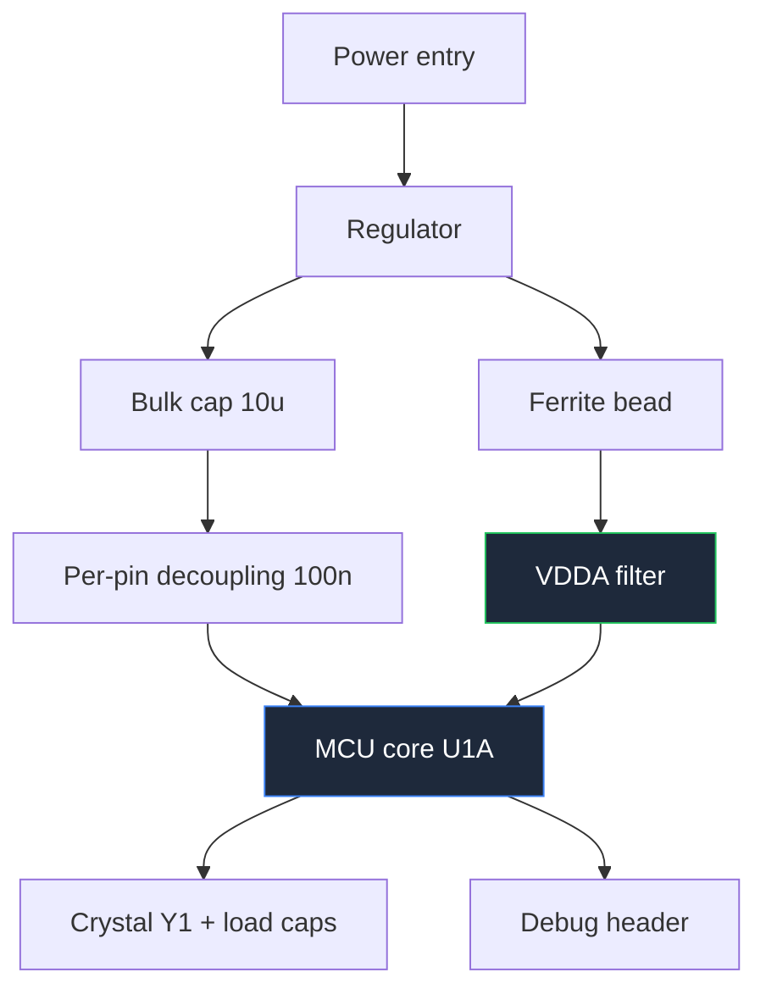

**A microcontroller schematic is the hardest kind of circuit diagram to draw well, because the component at its centre has more pins than the rest of the board combined.** A 100-pin MCU drawn as one rectangle produces a sheet where every wire crosses four others and nobody can find anything. The techniques in this guide exist to prevent exactly that.

This is the most demanding of the six domain guides under our [complete guide to circuit diagrams](/blog/complete-guide-to-circuit-diagrams/), and the one where the universal conventions pay off most.

## Split the MCU Into Functional Symbol Parts

The single highest-leverage decision in a microcontroller schematic: do not draw the MCU as one symbol. Split it into multiple parts of the same physical component — `U1A`, `U1B`, `U1C` — each drawn as its own rectangle, each grouped by function.

A typical split:

| Part | Contains | Placed with |
| :--- | :--- | :--- |
| **U1A — Core** | All VDD/VSS pins, VDDA, VREF, reset, crystal pins, debug pins | Power tree and crystal, own sheet or corner |
| **U1B — Port A/B** | GPIO used for sensors and inputs | Sensor conditioning circuits |
| **U1C — Port C/D** | GPIO used for outputs and drivers | Motor drivers, relays, LEDs |
| **U1D — Comms** | UART, SPI, I²C, USB pins | Connectors and level shifters |

The benefit compounds. Once the power and crystal pins are isolated in their own symbol, the decoupling network can sit next to them without competing for space with forty GPIO wires. Once the GPIO used for motor control lives in its own symbol, you can place it right beside the motor driver and the connection becomes four short parallel wires instead of four wires crossing the whole sheet.

The rules for splitting:

- **Every pin appears exactly once** across all parts. Duplicating a pin creates a netlist error that ERC will catch, and omitting one creates a pin nobody connected.
- **Use the same reference designator with letter suffixes.** `U1A`, `U1B`, and `U1C` are one physical chip; `U1`, `U2`, `U3` are three.
- **Put a note on each part** stating which package pin range it covers.
- **Keep power in one part.** Scattering VDD pins across three symbols destroys the point.

Within each rectangle, arrange the pins **by function, not by physical order**. Inputs left, outputs right, power top, ground bottom, and related pins grouped with a small visual gap between groups. Write the pin number in small text at the boundary and the pin name in normal text inside. The footprint handles physical geometry; the symbol exists to be read.

## Bus Notation

When eight or more related signals travel together, collapse them into a bus. A bus is drawn as a single thicker line labelled with a range: `D[0..7]`, `ADDR[0..15]`, `LCD[4..7]`.

Conventions:

- **Label the bus at both ends** with the identical range. That label is what makes the connection; the line is just a visual aid.
- **Draw a diagonal slash across the bus with the bit width beside it** — the standard marking for "this is a bundle, and here is how many".
- **Break out individual signals with short angled stubs**, each labelled with its member name. The angle is what distinguishes a bus breakout from an ordinary junction.
- **Never mix unrelated signals into one bus.** A bus is a group of signals with a shared purpose, not a convenient wire bundle. Putting `RESET` inside a data bus is a genuine error, not just untidy.

Buses are what make a parallel display or memory interface drawable. A 16×2 HD44780 character LCD in 4-bit mode needs `D4` through `D7` plus `RS` and `E`. Drawn as six individual wires it clutters the sheet; drawn as `LCD[4..7]` plus two named control lines it takes one line and reads instantly.

## Crystal Oscillators

The crystal circuit is small, and it is where designs mysteriously fail. Four elements, all of which belong on the drawing:

**The crystal** between the two oscillator pins, `XIN` and `XOUT` (or `OSC_IN`/`OSC_OUT`). Annotate the frequency, the load capacitance specification, and the tolerance in ppm. Load capacitance is not optional information — it determines the next component.

**Two load capacitors**, one from each crystal pin to ground. Their value derives from the crystal's specified load capacitance and the board's stray capacitance:

```
C1 = C2 = 2 × (C_load − C_stray)
```

With a 10 pF crystal and roughly 3 pF of stray capacitance, that gives about 14 pF each. Write both the crystal's `C_load` and your assumed stray value on the drawing, because the next person to change the crystal needs to know how you arrived at 14 pF.

**A series resistor** on the `XOUT` side, if the MCU datasheet calls for one. It limits drive level and prevents overdriving the crystal. Some families need it, some do not — check, and if you omit it, note that you checked.

**A layout note.** The oscillator loop must be physically tiny and guarded by ground. The schematic cannot enforce that, so write it: `KEEP CRYSTAL LOOP < 10 mm, GUARD WITH GROUND`. This is the clearest example in all of embedded design of a schematic annotation that exists solely to control layout.

Draw the crystal and its two capacitors as a tight, symmetric group immediately beside the MCU's oscillator pins. The symmetry is meaningful — asymmetric load capacitors produce an asymmetric drive — so if your drawing looks lopsided, fix the drawing.

## Decoupling and the Power Tree

An MCU with six VDD pins needs six decoupling capacitors, and the schematic is where that gets specified.

- **One 100 nF ceramic per VDD/VSS pair**, drawn immediately adjacent to the pin it serves. Not clustered in a corner. The whole point of the annotation is to say *which* capacitor belongs to *which* pin, because the layout engineer will place them accordingly.
- **One bulk capacitor of 4.7 µF to 10 µF per device**, drawn once near the power entry to the MCU.
- **Analog supply separately.** `VDDA` gets a ferrite bead from the digital rail plus its own 1 µF and 100 nF. Draw the bead explicitly, label it `FB1`, and annotate its impedance at the frequency you care about. Draw the analog ground connection as a single deliberate tie point to digital ground, and label it — a schematic that merges `AGND` and `DGND` invisibly is a schematic that guarantees ADC noise.
- **Reference voltage** gets its own filter, drawn as its own small group, with the reference source annotated.

A useful pattern is to draw the entire decoupling network as its own labelled block on the same sheet as the core symbol part, with a note: `C4–C9: one per VDD pin, place within 3 mm`. Ten capacitors in a row with one clear note is more readable and more actionable than ten capacitors scattered around the MCU rectangle.

**Reset network:** a 10 kΩ pull-up to VDD plus a 100 nF capacitor to ground on the reset pin, with the reset button and the debug header's reset line joining the same node. Many MCUs have an internal pull-up — if you are relying on it, write that on the drawing so nobody flags a missing part.

**Debug header:** never optional. A five-pin SWD header (`SWDIO`, `SWCLK`, `nRST`, `VDD`, `GND`) or a six-pin ISP header costs almost nothing and is the difference between a debuggable board and a paperweight. Draw it with pin one clearly marked.



## Motor Driver Circuits and the H-Bridge

An H-bridge reverses the voltage across a motor using four switches. Draw it as an actual letter **H** — two switches at the top connected to the supply, two at the bottom connected to ground, and the motor across the middle bar. The shape is the explanation, and any other arrangement wastes it.

Annotations that must appear:

- **Which diagonal pair is on for which direction.** A short table on the sheet — `Q1+Q4 = forward, Q2+Q3 = reverse` — turns the drawing into documentation.
- **Dead time.** If both switches in one leg conduct simultaneously they short the supply. Write `DEAD TIME ≥ 500 ns` next to the gate drive. No symbol expresses this constraint, so text must.
- **Flyback or clamp diodes** across each switch, unless the devices have adequate body diodes and you say so explicitly.
- **Separate motor and logic supplies.** Draw `VMOTOR` and `VLOGIC` as distinct rails with distinct labels, and show the single point where their grounds meet. Motor current returning through logic ground is the most common cause of a microcontroller resetting whenever the motor starts.

For a packaged driver, draw the IC as a functional block rather than the internal bridge. The **L293D** is the classic: two full bridges in a 16-pin package, with logic supply on pin 16, motor supply on pin 8, enable pins 1 and 9, four inputs and four outputs, and four ground pins in the middle of the package that double as the heatsink path. Two details worth annotating: the `D` suffix means internal clamp diodes are included — the plain L293 has none, so if you substitute it you must add eight external diodes. And the middle ground pins are the thermal path, so annotate `PINS 4,5,12,13 — GROUND AND HEATSINK, CONNECT TO COPPER POUR`.

An **L298N** needs external diodes and brings out current-sense pins, which should be drawn with thin sense lines to the shunt resistors, exactly as covered in the [measurement and test circuit guide](/blog/measurement-test-circuit-diagrams/).

When the driver becomes a **PCB** rather than a module, the schematic annotations that carry over are the ones about current: mark the motor path thick, note the peak current, put a bulk capacitor at the driver's supply pins and annotate `place within 10 mm of VS`, and specify the ground tie point.

## Sensor Arrays: Draw One, Note the Rest

A line-follower robot uses three to five reflective infrared sensors in a row. Each channel is identical: an IR LED with a current-limiting resistor, a phototransistor with a pull-up, and either a comparator or a direct connection to an ADC input.

Do not draw five identical copies. Draw **one channel in full detail**, box it, and label the box `SENSOR CHANNEL — 5 PLACES, S1..S5`. Then draw the remaining four as a compact repeated block or a table of designators. This is standard practice for repeated circuitry and it is dramatically more readable than five copies, because a reader only has to verify the topology once.

What to annotate:

- **Sensor spacing** as a mechanical note, since it determines the robot's behaviour and is invisible in the schematic.
- **LED current** and whether the LEDs are switched or always on.
- **Whether the output is analog or thresholded.** An array feeding an ADC and an array feeding comparators are different designs; the sheet must say which.
- **Ambient light rejection**, if the design modulates the LEDs.

The same "draw one, note the rest" rule applies to LED matrices, relay banks, and multi-channel amplifiers.

## Raspberry Pi and Module-Based Designs

When a Raspberry Pi is the processor, the schematic changes character: you are not designing the computer, you are designing what attaches to it. So draw the Pi as a **40-pin header block** and show only the pins you actually use.

Rules for module-based designs:

- **Name every pin you draw by both its header number and its GPIO number**, `PIN 12 / GPIO18`, because both appear in software and documentation.
- **Annotate the logic level: 3.3 V, and the GPIO pins are not 5 V tolerant.** This is the single most destructive mistake in Pi projects. Any 5 V peripheral needs a level shifter, drawn explicitly.
- **Annotate the current limits** — per-pin and total — next to the header block.
- **Show the Pi's power separately.** The Pi's own supply is not a rail your circuit generates casually; annotate the current requirement.
- **Draw unused header pins as a note**, not as forty stubs going nowhere.

An **electronic voting machine** built on a Pi is, at schematic level, a set of debounced buttons with pull-ups, a display, and possibly a printer or storage interface. The interesting engineering is in the button interface and the display, so give those the detail and draw the Pi as a block. Button debouncing is covered in the [sensor and protection circuit guide](/blog/sensor-and-protection-circuit-diagrams/).

A **web-controlled IoT notice board** is similarly simple in hardware: a Pi, a display interface, a power supply sized for both, and level shifting where needed. The schematic's value is that it documents the display's interface mode, the pins consumed, and the power budget. Draw the display as a block with its interface named — `SPI, 4-wire` or `I²C, addr 0x3C` — since the interface mode determines the pin count and cannot be inferred from the part number.

## Battery Management System Circuits

A BMS schematic is where the vertical voltage convention does its best work, because the circuit literally is a voltage ladder.

**Draw the cell stack vertically**, most positive cell at the top, pack negative at the bottom. Each cell's positive terminal is a node in ascending order, and the sense connections tap those nodes in the same ascending order. Drawn this way, the ladder is self-checking: a sense wire connected to the wrong cell is visually obvious because it breaks the monotonic sequence.

Elements that belong on the drawing:

- **Per-cell sense taps**, drawn as thin lines with a small series resistor and filter capacitor at each tap. Annotate the sense resistor's value — it limits fault current into the monitor IC.
- **Balancing**, either passive (a resistor and a switch across each cell) or active. Draw one balancing channel in detail and note the repetition, as with sensor arrays. Annotate the balancing current.
- **Protection MOSFETs.** Li-ion packs conventionally use two N-channel MOSFETs back-to-back in the *negative* path — one for charge, one for discharge — so that each device's body diode blocks one direction. Draw both explicitly with their body diodes visible and label them `CHG` and `DSG`, because the back-to-back arrangement looks like a mistake to anyone who has not seen it, and getting the orientation wrong produces a pack that cannot be turned off.
- **Current sense shunt** in the same negative path, with Kelvin sense connections drawn as thin lines.
- **Temperature sensing**, one or more NTC thermistors drawn as dividers with their physical placement noted — `mounted on cell 3 tab`. Placement is the whole measurement, and only the schematic note records it.
- **Pack connector and pre-charge path**, if present.

Add a boxed note with the pack's chemistry, cell count, nominal and maximum voltage, and maximum charge and discharge current. A BMS schematic without those numbers cannot be reviewed, because every threshold in the design derives from them.

## Microcontroller Schematic Checklist

1. Large MCU split into functional symbol parts with a consistent designator and letter suffixes.
2. Every package pin appears exactly once across all parts.
3. Pins arranged by function within each symbol, with pin numbers at the boundary.
4. One 100 nF per VDD pin, drawn adjacent to that pin, plus bulk capacitance.
5. `VDDA` filtered with a ferrite bead and its own capacitors; analog and digital grounds joined at one drawn point.
6. Crystal with two load capacitors, values derived and shown, plus the layout note.
7. Reset network drawn, including reliance on internal pull-ups as a text note.
8. Debug or programming header present with pin 1 marked.
9. Buses labelled identically at both ends, with width slash and angled breakouts.
10. Motor drivers drawn as an H, with the direction table, dead-time note and separate supply rails.
11. Repeated circuits drawn once and annotated with their multiplicity.
12. Module logic levels and current limits annotated; level shifters drawn where required.
13. Unused pins explicitly tied or marked no-connect.
14. Every connector pin numbered and its mating part specified.

> The test for a microcontroller schematic is whether somebody can find a given pin's support circuitry in under ten seconds. If the decoupling for `VDD3` is two hundred millimetres away from `VDD3`, the drawing has failed, no matter how correct the netlist is.

**[Start drawing your own schematic now.](/editor/)** Multi-part IC symbols, buses, crystals, H-bridges, connectors and display blocks are all in the library, and the grid keeps decoupling groups aligned beside the pins they serve. If your project starts with an Arduino rather than a bare MCU, the [Arduino circuit maker](/arduino-circuit-maker/) has the board pinouts pre-drawn, and the [schematic to breadboard converter](/schematic-to-breadboard/) turns a finished drawing into a build guide.
