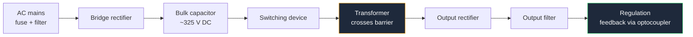

**A power supply schematic is the only kind of circuit diagram that must communicate physical facts, not just electrical ones.** Everywhere else you are free to place a symbol wherever the drawing reads best. In a power supply, the position of a component tells the reader which side of an isolation barrier it lives on, and the weight of a line tells them how much current it carries. Get that wrong and the drawing is not merely ugly — it is dangerous, because the next person builds what you drew.

This guide covers the drawing conventions specific to power electronics: the barrier, the transformer, the rectifier, the filter, the regulator, and the line-weight vocabulary that ties them together. It builds on the universal rules in our [complete guide to circuit diagrams](/blog/complete-guide-to-circuit-diagrams/).

## Layout Law: High Voltage Left, Low Voltage Right

Every isolated supply has two electrically separate worlds. The schematic must make the split obvious at a glance, and the convention is:

- **Primary side on the left.** Mains input, fuse, input filter, bridge, bulk capacitor, switching device.
- **Isolation barrier as a vertical line down the middle**, drawn as a dashed or solid line running the full height of the sheet.
- **Secondary side on the right.** Output rectifier, output filter, regulation, load connector.
- **Only the components that legitimately bridge the gap** cross that line: the transformer, the optocoupler, and the Y-class safety capacitor. Nothing else. Ever.

That last rule is what makes the convention valuable. A reviewer checking an isolated supply does exactly one thing first: they look at the barrier and count what crosses it. If they find a ground connection, a resistor, or a signal wire crossing, the design is wrong and they stop reading. Your drawing should let them do that check in five seconds.

Label the sides. `PRIMARY — 230 VAC, HAZARDOUS` on the left, `SECONDARY — SELV` on the right. Add the required creepage distance as a text note on the barrier itself. Those annotations are not decoration; they are instructions to the PCB layout engineer, who cannot infer millimetres of clearance from a schematic unless you write them down.

Note the bulk capacitor voltage in that chain. A 230 V RMS input rectifies to roughly 325 V DC, and a 120 V input to roughly 170 V. Annotate that value on the drawing next to the capacitor. It is the number that tells everyone downstream why a 400 V part is fitted there and why nobody touches that node with a scope probe.

## Thick Lines and Thin Lines

On a schematic, line weight carries no electrical meaning — a thin wire and a thick wire are equally ideal conductors. That is exactly why the convention works: the weight is free to carry *information*.

| Line weight | Use for |
| :--- | :--- |
| **Thick** | Any path carrying significant current: rails, switch nodes, ground returns, motor and load feeds |
| **Normal** | General signal and control connections |
| **Thin or dashed** | Sense lines, feedback taps, test connections that carry no real current |

Mark the current on the thick paths as a text annotation — `5 A max` next to a rail costs you nothing and tells the layout engineer how wide to make the copper. In a switching supply, also mark the **switch node**, the point that swings between the input rail and ground at the switching frequency. It is the noisiest node in the circuit, and flagging it on the schematic is how you communicate "keep this net short" before layout begins.

## Transformer Symbols

The transformer symbol is two coils facing each other with core lines between them. Three details separate a good transformer symbol from a vague one:

**Core type is shown by the lines between the windings.** Two parallel lines mean a ferromagnetic core. No lines mean an air core. Draw them, because a reader must be able to tell a mains transformer from an RF coupling transformer without the part number.

**Phasing dots define polarity.** A dot at one end of each winding means those two ends go positive together. In a flyback converter the secondary is deliberately wound in *anti-phase*, and the only thing on the drawing that communicates that is dot placement. Omit the dots on a flyback and the built circuit will not work, so this is not a stylistic choice.

**Taps are drawn explicitly.** A centre-tapped secondary shows the tap as a wire leaving the midpoint of the winding. That single line is the whole difference between a single-rail supply and a dual-rail one.

Orient the transformer vertically, primary on the left of the core and secondary on the right, so the core lines land directly on your isolation barrier. When the barrier passes through the core, the drawing states the design intent without a single word of text.

## Bridge Rectifiers

Draw a bridge rectifier as a **diamond of four diodes**, not as four diodes scattered across the sheet. The diamond is instantly recognizable and it makes the current path traceable: the two AC nodes are opposite each other, the DC positive is opposite the DC negative, and every diode points the same way around the loop.

Two acceptable orientations exist. AC on the left and right vertices with DC positive at the top and negative at the bottom is the most common. AC on the top and bottom with DC on the left and right also reads well and often produces fewer wire crossings when the transformer sits to the left.

One crossover is essentially unavoidable in a bridge — the second AC wire has to reach the far vertex. Draw it as a clean plain crossing with no junction dot, keep it away from other symbols, and it will read as deliberate. For a **packaged** bridge such as a KBP or DB series part, drawing a rectangle with `~`, `~`, `+` and `−` pins is entirely legitimate and often clearer, because that is what the part actually is: one component, not four.

Annotate the diode part number and the peak reverse voltage requirement. In a mains bridge the diodes see the full peak input voltage, and writing `1N4007, 1000 V` on the drawing prevents somebody substituting a 1N4148 during a shortage.

## Filter Capacitors

The reservoir capacitor after a rectifier is where two drawing errors happen constantly.

**Polarity.** Use the polarized capacitor symbol — one straight plate, one curved plate — with the straight plate toward the positive rail and an explicit `+` sign next to it. Never use the non-polarized two-straight-lines symbol for an electrolytic. A reversed electrolytic on a 325 V rail is a genuinely violent failure.

**Voltage rating on the drawing.** `2200µF 35V` is a complete annotation; `2200µF` is not. The rating is a design decision derived from the rectified peak, not a purchasing detail, so it belongs on the schematic.

Draw the reservoir capacitor immediately after the bridge with a short, direct path to both the positive rail and the ground return. In a switching supply, that loop — bulk capacitor, switch, and return — is the high current loop, and drawing it tight and closed on the schematic is how you tell the layout engineer to keep it tight in copper.

Add the small high-frequency capacitor in parallel with the bulk electrolytic, drawn beside it. Electrolytics have too much inductance to handle switching-frequency current; the ceramic next to it does that job. Showing both, side by side, records that intent.

## Voltage Regulator Circuits

The 78xx family is still the fastest way to get a clean rail, and its schematic block is simple: a rectangle with input on the left, output on the right, ground on the bottom.

| Detail | 78xx positive regulator | 79xx negative regulator |
| :--- | :--- | :--- |
| **TO-220 pin 1** | Input | Ground |
| **TO-220 pin 2** | Ground | Input |
| **TO-220 pin 3** | Output | Output |
| **Typical input cap** | 0.33 µF | 2.2 µF |
| **Typical output cap** | 0.1 µF | 1 µF |

The pinouts are **not** the same, which is the single most common mistake in dual-rail designs. Someone draws a 7912 with the same pin order as the 7812 next to it, the board gets built, and the negative rail is dead. Write the pin numbers on both symbols and check them against the datasheet every time.

Three more annotations that belong on a linear regulator:

- **Dropout.** A 7805 needs roughly 2 V of headroom, so the input must stay above about 7 V *including ripple troughs*. Note the minimum input voltage on the drawing.
- **Dissipation.** Power burned is `(Vin − Vout) × I`. A 7805 dropping 12 V to 5 V at 500 mA dissipates 3.5 W and needs a heatsink. That is a schematic-level note, because it determines the package.
- **Input and output capacitors adjacent to the pins they serve**, exactly as with IC decoupling. A regulator without its input capacitor oscillates, and drawing the capacitor two inches away in a corner is how it gets left off the board.

For a **12V dual power supply**, the layout follows the vertical voltage convention strictly: the `+12V` rail at the top of the sheet, ground in the middle, and `−12V` at the bottom. A centre-tapped transformer feeds a bridge, the centre tap becomes ground, and the two rails leave from the bridge's positive and negative vertices to a 7812 and a 7912 respectively. Drawn this way, the symmetry is visible and a missing connection is obvious.

## SMPS and Buck Converter Circuits

Switching supplies replace the heat of a linear regulator with a switch, an inductor, and a control loop. The schematic has to make the power stage and the control loop visually separate, because they behave completely differently.

**Draw the power stage as a closed loop.** For a **DC-DC buck converter**: input capacitor, high-side switch, inductor, output capacitor, and the low-side path — either a catch diode or a synchronous MOSFET. Keep those five components physically adjacent on the sheet, forming a compact rectangle. The output voltage is set by the duty cycle, `Vout ≈ D × Vin`, so annotate the intended duty range and switching frequency on the drawing.

**Draw the control loop as thin lines.** The feedback divider from the output back to the controller's `FB` pin carries microamps. Drawing it thin, and routing it clearly away from the switch node, communicates the most important layout constraint in the whole circuit.

**Mark the hot loop.** Add a text note or a dashed outline around the input capacitor and both switches. That loop carries the switching current spikes, and it is the number one cause of EMI failures. It is also invisible unless you say so.

A **12V SMPS from mains** is a flyback: bridge and bulk capacitor on the primary, a MOSFET switching the transformer primary, a fast rectifier and output capacitor on the secondary, and feedback from the output back to the primary controller through an optocoupler and a TL431 reference. On the drawing, the optocoupler is the second component allowed to cross the barrier, and drawing it straddling the line — LED side on the secondary, transistor side on the primary — makes the isolated feedback path unmistakable.

The switching supply's snubber and clamp networks deserve annotation too. An RCD clamp across the primary looks like three arbitrary components unless you label the block `PRIMARY CLAMP` and note the leakage energy it absorbs.

## Transformerless Power Supplies

A capacitive-dropper supply replaces the transformer with an X-rated capacitor in series with the mains. It is small, cheap, and **not isolated** — every node in the circuit, including what you have labelled "ground", sits at mains potential.

The schematic must state this. Conventions that matter:

- **Do not draw an earth-ground symbol anywhere in the circuit.** Use a floating common symbol and name the net `COM` or `MAINS_RTN`, never `GND` or `EARTH`.
- **Add a boxed hazard note** on the sheet: no galvanic isolation, no test equipment with an earthed ground, no user-accessible connections.
- **Show the series X-capacitor with its class** (`X1` or `X2`) and voltage rating. A general-purpose film capacitor in that position is a fire.
- **Show the bleeder resistor** across the X-capacitor and the inrush-limiting series resistor. Both are safety components, not optional extras.
- **Show the zener or shunt regulator** that sets the output, plus the reservoir capacitor.

Because the whole circuit floats at mains potential, a transformerless supply is the one schematic where you should annotate what must *not* be connected. That is unusual for a circuit diagram, and appropriate here.

## Inverters: Going the Other Way

A **sine wave inverter circuit** runs the chain backwards — low-voltage DC to high-voltage AC — and the drawing conventions invert with it. The low-voltage battery side goes on the left, the transformer sits in the middle, and the high-voltage AC output is on the right, with the barrier again through the transformer core.

The switching stage is either a push-pull pair driving a centre-tapped primary or a full H-bridge driving a plain primary. Draw an H-bridge as an actual letter H — two switches high, two switches low, load across the middle — because the shape is the explanation. Add the dead-time note next to the gate drive block: if both switches in one leg conduct simultaneously, they short the supply, and that constraint lives on the schematic as a text note because no symbol expresses it.

For SPWM designs, draw the modulator as a labelled block with its inputs and outputs named rather than expanding every comparator. One sheet, one function: the modulator gets its own sheet if it needs one. Our worked example of the full chain is in the [12V to 220V AC circuit diagram guide](/blog/how-to-make-12v-to-220v-ac-circuit-diagram/).

## Power Supply Schematic Checklist

1. Isolation barrier drawn as a full-height line, with only the transformer, optocoupler and Y-capacitor crossing it.
2. Both sides labelled with their voltage and hazard class.
3. Creepage and clearance requirements noted as text on the barrier.
4. Transformer core lines and phasing dots present.
5. Bridge drawn as a diamond or a packaged rectangle, with diode PIV annotated.
6. Every electrolytic drawn with the polarized symbol, `+` marked, and a voltage rating.
7. Regulator pin numbers written on the symbol and verified against the datasheet.
8. Dropout, dissipation and minimum input voltage noted.
9. Input and output capacitors drawn adjacent to the pins they serve.
10. High-current paths drawn thick, with current annotated.
11. Feedback and sense lines drawn thin and routed away from switch nodes.
12. Switch node and hot loop explicitly flagged.
13. Fuse and its rating on the input, always.

> A power supply schematic is read by people who will put their hands inside the finished device. Every annotation above exists so that a reader can tell, without measuring anything, which parts of the circuit will hurt them.

**[Start drawing your own schematic now.](/editor/)** Transformers, bridge rectifiers, polarized capacitors, 78xx blocks and MOSFET switches are all in the library, and you can set line weights to mark high-current paths the way this guide describes. Once the supply is drawn, the loads that hang off it — [MOSFET switching and protection stages](/blog/sensor-and-protection-circuit-diagrams/) and [microcontroller power trees](/blog/microcontroller-circuit-diagrams/) — are covered in the companion guides.
