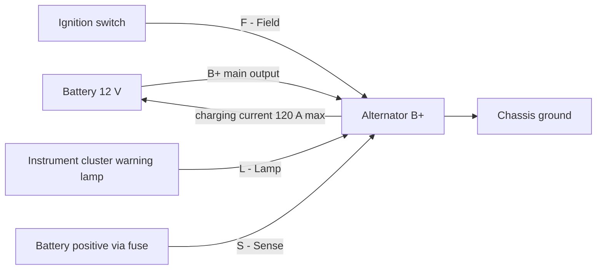
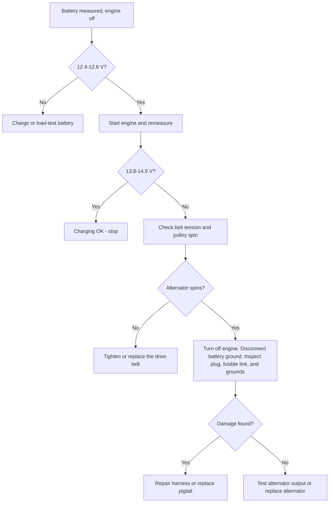
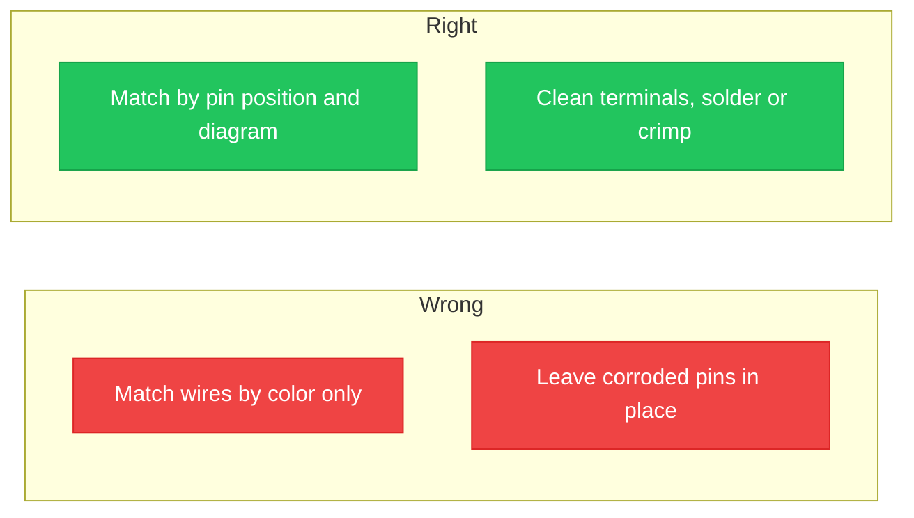

**<b>The 2005 Kia Sedona alternator wiring diagram is the schematic that maps how the alternator, battery, voltage regulator, and wiring harness connect inside the charging circuit.</b> The charging system keeps the battery charged and supplies the electrical system whenever the engine runs.

A wiring diagram is a drawing of an electrical circuit. The drawing shows every terminal, wire, color, and connection point on the 2005 Kia Sedona. The wiring layout reads from the B+ main output stud to the battery, and from the small four-pin connector (factory code **E-70**) to the instrument cluster, the ignition circuit, and the regulator sense line.

There are 3 main benefits of reading an alternator wiring diagram:

1. Diagnose the charging fault before replacing parts
2. Reconnect a new alternator or pigtail correctly
3. Avoid damaging the voltage regulator with a wrong connection

The diagram has 4 main uses: alternator replacement, charging-system troubleshooting, harness and connector repair, and voltage checks against the rated output. The wiring layout has 5 main parts: the alternator, the battery, the internal voltage regulator, the charge lamp circuit, and the wiring harness that joins them.

The 2005 Sedona V6 charging system is rated around 120 amps (A) at 12 volts (V). A healthy system charges at 13.8–14.5 V measured across the battery with the engine running.

## Understanding the Alternator Wiring Diagram

The alternator converts the engine's rotating mechanical energy, delivered by the serpentine belt, into electrical power. A rotor spins inside a stator and generates alternating current (AC). A diode rectifier converts the AC to direct current (DC). The voltage regulator holds the output in the 13.8–14.5 V range.

The wiring diagram layout puts the alternator at the center with 2 connection points: one B+ stud and one multi-pin connector. Lines on the diagram represent wires. Each line carries a color label that matches the factory harness. Read the heavy charging wire from the battery to the B+ stud first, then trace the small connector circuits to their destinations.

| Terminal | Name | Function on the 2005 Sedona |
| :--- | :--- | :--- |
| **B+** | Main output | Heavy-gauge wire to the battery positive through the fusible link. Live whenever the battery is connected. |
| **S** | Sense | Carries battery voltage back to the internal regulator. |
| **L** | Lamp | Drives the charge warning lamp and excites the field at start-up. |
| **F** | Field / ignition | Enables charging when the ignition key turns to ON. |
| **GND** | Ground return | Battery negative return through the chassis. |

> The 2005 Sedona uses an internal voltage regulator. Never connect an external regulator and never bypass the connector plug to run a field wire directly.

## Color Coding and Wire Functions

Kia wiring diagrams identify every wire by a two-character color code. The base color comes first and the stripe color comes second. The 2005 Sedona factory manual uses these codes:

| Code | Color | Code | Color |
| :--- | :--- | :--- | :--- |
| **B** | Black | **O** | Orange |
| **W** | White | **P** | Pink |
| **R** | Red | **Br** | Brown |
| **G** | Green | **Gr** | Gray |
| **L** | Blue | **Y** | Yellow |
| **Lg** | Light green | **Pp** | Purple |

A code such as W/B reads as a white wire with a black stripe, and B/W reads as a black wire with a white stripe. Following the color coding during repairs prevents reversed connections that damage the regulator.

On the alternator connector, the small-block circuits carry these functions:

- **L** circuit — feeds the charge lamp; commonly a red or black wire on the plug
- **S** circuit — sense; commonly white
- **F** circuit — field; commonly blue
- **GND** — battery ground return; commonly black

> Replacement pigtails ship with different colors than the factory harness. Match wire function by connector pin position, not by color. Read the pin numbers on the connector face before splicing.

The B+ output wire runs at 6 AWG (13.3 mm²) and stays live whenever the battery is connected, even with the ignition off.

## Common Issues and Troubleshooting Tips

There are 6 common symptoms of alternator wiring trouble on the 2005 Sedona:

1. Charge warning lamp stays on while driving
2. Headlights dim at idle and brighten with engine speed
3. Battery discharges overnight
4. Electrical accessories flicker
5. Burning smell at the alternator plug
6. Engine stalls or fails to restart

Common issues occur at 5 points in the charging circuit: the alternator plug, the battery connections, the fusible link, the serpentine belt, and the ground strap.

**Charging system reference values:**

| Check | Healthy Reading |
| :--- | :--- |
| Battery voltage, engine off | 12.4–12.6 V |
| Battery voltage, engine running | 13.8–14.5 V |
| Alternator rated output | 120 A |

Follow the step-by-step troubleshooting guide in order:

1. Measure the battery with the engine off. A reading below 12.4 V means the battery is discharged or failing. Charge or load-test the battery first.
2. Start the engine and measure again at the battery. A healthy charging system reads 13.8–14.5 V.
3. If voltage stays near the resting value, check the serpentine belt tension and confirm the alternator pulley spins with the engine.
4. Turn the engine off, disconnect the negative battery terminal, and inspect the connector and wiring harness for melted plastic, corrosion, or charred pins.
5. Check the fusible link between the B+ stud and the battery for a blown link.
6. Test the engine-to-chassis ground strap for high resistance at the battery connections.
7. Reconnect everything, start the engine, and confirm the charge lamp turns off.

> If a replacement alternator still does not charge, the fault sits in the wiring harness or the ground, not in the new alternator. Test the connector circuits before replacing parts a second time.

## Visual Aids and Diagrams

The wiring layout at the top of this guide shows the B+ path through the fusible link and the circuits of the E-70 connector. The image below maps each alternator terminal to its function and its common wire color:

The diagram shows 5 terminals: B+, L, S, F, and GND. Each card lists the terminal letter, the circuit name, and the physical job the wire performs in the wiring layout. Use the image during a repair to confirm the function of every wire before reconnecting.

Common wiring mistakes appear as either a wrong habit or a right habit. Compare the two columns:

There are 4 common wiring mistakes to avoid:

1. Match the small connector circuits by color instead of by pin position
2. Reuse a melted or corroded pigtail
3. Leave the B+ stud nut loose or overtightened
4. Skip the negative battery disconnect and arc the B+ stud to the case

## Safety Precautions

Disconnect the negative battery terminal before touching any alternator wiring. The B+ stud carries full battery voltage at all times, and a wrench that touches the stud and the alternator case arcs violently.

Follow these 8 safety precautions:

1. Disconnect the negative battery terminal first and reconnect it last
2. Use insulated tools around the B+ stud
3. Remove metal jewelry before working
4. Wear safety glasses
5. Work on a cool engine; the alternator case gets hot
6. Keep sparks away from the battery; hydrogen gas is flammable
7. Torque the B+ nut to specification
8. Double-check polarity before reconnecting the battery

> The negative battery cable grounds the entire body. Removing it isolates the charging circuit and is the single most important step before any electrical repair.

## Conclusion

Understanding the Sedona alternator wiring diagram keeps the charging system reliable and makes DIY repairs safe. A wiring layout maps the 5 main parts, shows the B+ output to the battery, and traces the small connector circuits to the charge lamp, sense, and field.

Read the color coding before touching any wire. Following the troubleshooting steps isolates common issues at the alternator plug, fusible link, battery connections, belt, and ground. Apply the safety precautions before any work on the electrical system.

If a charging fault persists after wiring checks, seek professional help. A mis-wired voltage regulator damages the alternator, and a technician with the factory harness data isolates the fault faster.

For practice, draw and save your own charging-system schematic in the free browser editor: [open the circuit editor](/editor/).