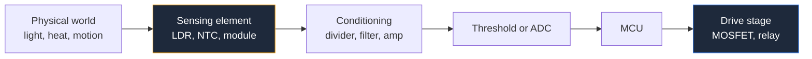

**Sensor interface circuit design is where schematic position stops being cosmetic and starts being documentation.** A 10 kΩ resistor drawn above a node is a pull-up. The identical resistor drawn below the same node is a pull-down. Same part, same value, opposite function — and the only thing telling the reader which one you meant is where you put it on the page.

That makes the interface layer between the physical world and your microcontroller the best place to learn schematic discipline. This guide covers pull-ups and dividers, sensor front ends, switching stages, debouncing, and protection circuits. It builds on the layout conventions in our [complete guide to circuit diagrams](/blog/complete-guide-to-circuit-diagrams/).

## Position Encodes Function

The vertical axis of a schematic represents potential. Applied to interface circuits, that gives you an unbreakable convention:

| Component | Draw it | Reader concludes |
| :--- | :--- | :--- |
| **Pull-up resistor** | Vertically, from the node up to the supply symbol | Node idles high |
| **Pull-down resistor** | Vertically, from the node down to ground | Node idles low |
| **Series resistor** | Horizontally, in the signal path | Current limiting or impedance matching |
| **Bypass capacitor** | Vertically, from the node down to ground | Noise filtering |
| **Divider** | Two vertical resistors in a column, tap in the middle | Scaling a voltage |

Draw a pull-up horizontally off to the side and the reader has to trace the wire to find out where it goes. Draw it vertically upward into a `VCC` symbol and there is nothing to trace. The information is in the geometry.

Values worth annotating rather than assuming:

- **10 kΩ** is the default pull-up for a general logic input or button.
- **4.7 kΩ** is the standard I²C pull-up at 100 kHz on a short bus; drop to 2.2 kΩ for 400 kHz or longer traces. I²C pull-ups are mandatory because the bus is open-drain — the devices can only pull low, never high. Draw both `SDA` and `SCL` pull-ups adjacent to each other near the bus master and label the block `I2C PULL-UPS`.
- **100 kΩ or higher** for low-power designs where the pull-up current matters.
- **Internal pull-ups** exist on most microcontroller pins. If you are relying on one, write a note on the schematic: `PA3 uses internal pull-up — no external part`. Otherwise the next reviewer flags a missing resistor, or worse, adds one.

## Voltage Dividers and Resistive Sensors

Most cheap sensors are just resistors that change value. To read one with an ADC you convert resistance to voltage with a divider:

```
Vout = Vin × R2 / (R1 + R2)
```

The design decision is which leg holds the sensor, and it determines the direction the output moves.

### LDR Light Detector Circuit

A light-dependent resistor drops to a few hundred ohms in bright light and rises to hundreds of kilohms in darkness.

- **LDR on top, fixed resistor to ground:** output rises as light increases. Bright equals high.
- **Fixed resistor on top, LDR to ground:** output falls as light increases. Bright equals low.

Both are correct circuits. Only one matches your firmware. So the schematic must show the arrangement unambiguously — and because both are just "two resistors in a column", the *only* way to make it unambiguous is to draw them in the correct physical order with the tap clearly marked and to annotate the intent: `bright → high` beside the tap. One text label prevents a class of bug that costs an afternoon.

Choose the fixed resistor as roughly the geometric mean of the LDR's dark and light resistance, and write both endpoints on the drawing: `LDR: 1k bright / 200k dark`. That is design intent no part number can express.

### Thermistor Thermostat Circuit

An NTC thermistor falls in resistance as it heats. A thermostat turns that into a switching decision, and the schematic reads as four blocks left to right:

1. **The divider.** NTC plus a fixed resistor, tap into the comparator.
2. **The setpoint.** A potentiometer divider feeding the comparator's other input. Draw it as a mirror image of the sensor divider — the symmetry tells the reader that these two voltages are being compared.
3. **The comparator with hysteresis.** A resistor from the output back to the **non-inverting** input. Without it the relay chatters at the threshold. Because it is positive feedback, it goes to the `+` input, and that is visible in the drawing if your input labels are honest.
4. **The output stage.** Transistor or MOSFET driving the relay coil.

Two details that belong on the drawing: comparators like the LM393 have **open-collector outputs** and need a pull-up resistor — draw it, because the part will appear to do nothing without it. And annotate the hysteresis width in degrees or millivolts next to the feedback resistor, because that resistor's value is the only place the specification lives.

### Sensor Modules Are Blocks, Not Circuits

A PIR motion detector such as the common HC-SR501 is a module: a pyroelectric sensor, an amplifier, a comparator and a timer already assembled on a small board with three pins. Do not attempt to draw its internals.

Draw it as a **labelled rectangle** with its pins named by function — `VCC`, `OUT`, `GND` — and annotate the electrical facts your circuit depends on:

- Supply range and current draw.
- Output logic level. Many PIR modules output 3.3 V logic even when powered from 5 V, which matters enormously if you are feeding a 5 V input expecting a full-swing signal.
- Output behaviour: a level that stays high for an adjustable retrigger period, not a pulse.
- Any on-board adjustment (sensitivity, delay) as a note, since it is not a schematic component but it is a build instruction.

The same treatment applies to ultrasonic rangefinders, IMU breakouts and GPS modules. A block with named pins and annotated levels is a *better* schematic than a fake internal drawing, because it describes what you can actually control.



## MOSFET Switching Circuits

A microcontroller pin can source a few milliamps. Anything real — a motor, a relay, an LED strip — needs a switch, and for DC loads that means a MOSFET.

### Low-Side N-Channel Switching

The default topology, and the easiest to draw correctly:

- **Load between the positive rail and the drain.** Load on top, transistor below it — matching the top-to-bottom current convention.
- **Source directly to ground.**
- **Gate driven from the GPIO through a series resistor**, typically 22 Ω to 220 Ω. It damps ringing and limits the current the pin has to supply into the gate capacitance.
- **Gate pull-down of 10 kΩ to 100 kΩ.** This is the component most often omitted. While the microcontroller is in reset, its pins are high impedance and the gate floats — which can partially turn the MOSFET on. The pull-down guarantees the load is off at power-up. Draw it vertically down to ground from the gate node, where its function is unmistakable.
- **Flyback diode across any inductive load**, cathode to the positive rail. Draw it directly beside the load, parallel to it, forming a visible closed loop with the coil. That loop is the current path when the field collapses, and if it is not on the drawing it will not be on the board, and the MOSFET will die.

Annotations that matter: the gate threshold. A "logic level" MOSFET is one specified to be fully on at the gate voltage you actually have. Write `VGS(th) ≤ 2.5 V — logic level required` next to the symbol when driving from 3.3 V. A standard MOSFET specified at 10 V will conduct partially at 3.3 V, get hot, and fail slowly — the worst failure mode there is. Also annotate `RDS(on) at VGS = 3.3 V`, not the headline figure from the front page of the datasheet.

### High-Side P-Channel Switching

When the load must have its ground connection fixed, you switch the positive side with a P-channel MOSFET: source to the positive rail, drain to the load, load to ground.

Drawing rules change slightly. The transistor now sits **above** the load, which is correct — current still flows top to bottom. The gate must be pulled *below* the source to turn on, so the drive circuit usually includes an N-channel transistor or an open-drain output pulling the gate down, plus a pull-up resistor from gate to source to keep it off by default. Draw that pull-up as a short vertical resistor between gate and source; it is the P-channel equivalent of the N-channel gate pull-down, and leaving it out has the same consequence.

## Switch Debounce Circuits

A mechanical switch does not close once. It closes, bounces open, closes again — typically for 1 to 20 ms. A microcontroller polling fast enough sees a burst of presses.

Three hardware solutions, in ascending order of quality:

**RC filter alone.** Pull-up resistor, switch to ground, series resistor into a capacitor to ground, and the filtered node into the input pin. Choose `R × C` around 10 ms to 50 ms. The weakness is that the filtered edge is slow, and feeding a slow edge into an ordinary logic input can cause the input to oscillate as it crosses the threshold. Acceptable for a microcontroller ADC or a slow poll; not for a clock or interrupt input.

**RC filter plus a Schmitt trigger.** The correct general solution. The filtered node feeds a Schmitt-trigger input such as a 74HC14 inverter, whose hysteresis converts the slow ramp into a single clean fast edge. Draw the Schmitt symbol with its hysteresis glyph inside the buffer body — that little step shape is the entire point of the component, and swapping in a plain buffer symbol quietly removes the design.

**SPDT switch plus an SR latch.** The perfect debounce. A single-pole double-throw switch plus two cross-coupled NAND gates latches on first contact and ignores all subsequent bounce. It needs a three-terminal switch, which is why it is less common. Draw the latch in the conventional crossed configuration so it is recognizable, as described in the [logic gate circuit diagrams guide](/blog/logic-gate-circuit-diagrams/).

Whichever you use, annotate the time constant on the drawing — `RC ≈ 22 ms` — because that number is the specification and the components are just its implementation.

## Reverse Polarity Protection

Somebody will connect the battery backwards. Two standard answers, and the drawings differ in an instructive way.

**Series diode.** One diode in the positive rail, anode to the battery. Simple, obviously correct from the symbol alone, and costs you a forward drop — 0.7 V for silicon, 0.3 V for a Schottky. On a 12 V rail that is acceptable; on a 3.7 V battery it is a significant fraction of your energy budget. Annotate the drop and the current rating.

**P-channel MOSFET "ideal diode".** A P-channel MOSFET in the positive rail with its gate referenced to ground through a resistor, plus a Zener clamp across gate-source to protect the gate on high-voltage rails. The drop becomes `I × RDS(on)`, often a few millivolts.

The MOSFET version has a specific trap that belongs in every schematic review: **the circuit works because of the direction of the MOSFET's internal body diode, and the body diode is drawn as part of the symbol.** Orient the transistor wrong and you build something that either blocks normal current or conducts reverse current — and in both cases the schematic looks entirely plausible. Draw the body diode explicitly, label source and drain by name on the symbol, and verify the orientation against the datasheet rather than against your memory of the symbol. Then annotate the Zener's job, because a Zener across gate-source looks decorative until you know it exists to stop the gate oxide from failing at 30 V.

## Overvoltage Protection

Three topologies, three very different drawings:

| Approach | Components | Behaviour | Drawing notes |
| :--- | :--- | :--- | :--- |
| **Zener or TVS clamp** | Series resistor plus a shunt Zener/TVS to ground | Absorbs transients, limits voltage | Draw the shunt device vertically to ground, right at the input |
| **Crowbar** | SCR triggered by a Zener, plus a fuse | Deliberately shorts the rail and blows the fuse | Draw the fuse — the circuit is incomplete and dangerous without it |
| **Series disconnect** | N-channel FET in the rail, comparator control | Opens the rail above a threshold | Draw the sense divider thin, the power path thick |

Two general rules. **Protection components go at the connector**, drawn as the leftmost items on the sheet, before anything they protect — the drawing order should match the electrical order so a reader can see that nothing bypasses the protection. And **annotate the clamping voltage and the energy rating**, since a TVS diode's part number encodes both and no reviewer memorises TVS part numbers.

For a crowbar in particular, the fuse is not optional and not a detail: the SCR latches on and stays on, so the fuse is the only thing that ends the event. A crowbar schematic without a fuse describes a circuit that destroys itself.

## Interface Schematic Checklist

1. Every pull-up drawn vertically upward to a supply symbol; every pull-down vertically down to ground.
2. Reliance on internal microcontroller pull-ups noted in text.
3. I²C pull-ups present, grouped and labelled.
4. Divider taps clearly marked with the direction of the output — `bright → high`, `hot → low`.
5. Sensor endpoints annotated: dark and light resistance, temperature range, module output logic level.
6. Modules drawn as labelled blocks with pins named by function, never as invented internals.
7. Every MOSFET gate has both a series resistor and a pull-down or pull-up to its default-off state.
8. Gate threshold requirement annotated where drive voltage is 3.3 V or 5 V.
9. Flyback diode across every inductive load, drawn parallel to the load, cathode to the positive rail.
10. Debounce time constant annotated; Schmitt trigger symbols drawn with the hysteresis glyph.
11. Protection components drawn at the connector, upstream of everything they protect.
12. Crowbar circuits include the fuse.
13. Comparator open-collector outputs given a pull-up.

**[Start drawing your own schematic now.](/editor/)** LDRs, thermistors, MOSFETs, Schmitt triggers, relays, Zeners and switches are all in the component library, and the grid keeps dividers aligned in clean vertical columns. Once your sensor front end is drawn, the [microcontroller schematic layout guide](/blog/microcontroller-circuit-diagrams/) covers wiring it into an MCU, and the [power supply circuit design guide](/blog/power-supply-circuit-diagrams/) covers the rails that feed both.
