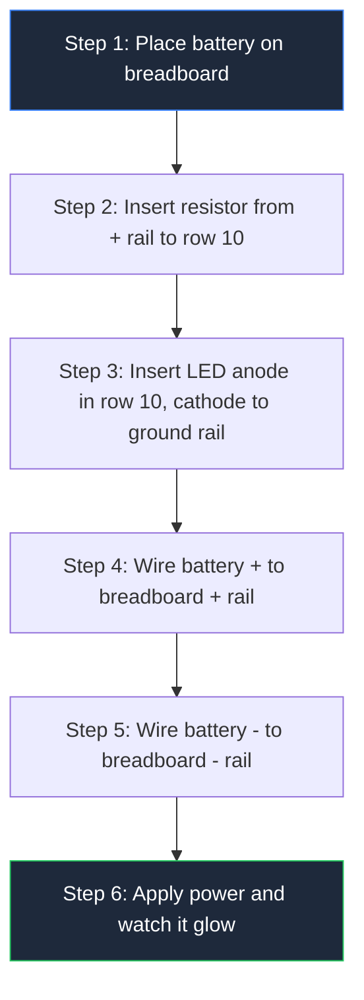
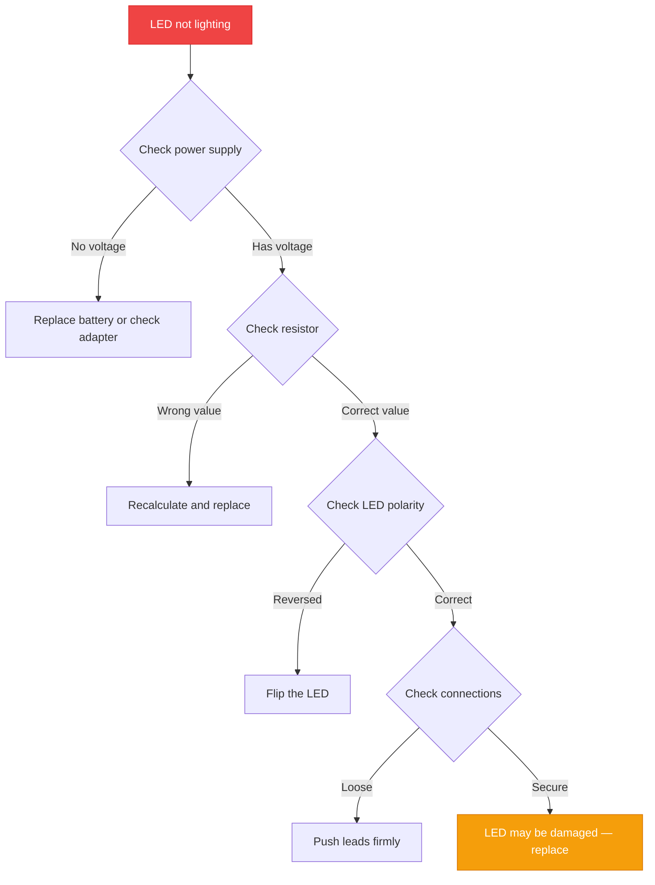

**Building a simple LED driver circuit takes 3 components, 5 minutes, and zero prior experience.** This guide walks you through every step — from selecting parts to testing your finished circuit — so you can light up your first LED without burning it out.


## Why LEDs Burn Out Without a Driver

An LED is a **current-hungry device**. Unlike a light bulb, it has no internal resistance to slow down the flow of electricity. Connect a 9V battery directly to an LED, and the LED draws unlimited current — then dies in seconds.

An LED driver circuit solves this problem. It sits between the power supply and the LED, controlling exactly how much current flows through. The simplest version uses **one resistor**.

> **The rule:** Every LED needs a current-limiting resistor. No exceptions.

## What You Need (Parts List)

| Component | Specification | Purpose |
|-----------|--------------|---------|
| **Power Supply** | 9V battery or 5V USB adapter | Provides voltage |
| **LED** | 5mm red (or any color) | Emits light |
| **Resistor** | 330Ω (1/4W) | Limits current |
| **Breadboard** | Any size | Prototyping platform |
| **Jumper Wires** | 4x male-to-male | Connections |

**Total cost:** Under $2 at most electronics stores.

## Understanding LED Specs (The Only Two Numbers That Matter)

Every LED has two critical specifications printed on its datasheet:

**Forward Voltage (Vf)** — The voltage drop across the LED when it's on. Different colors have different values:

| LED Color | Forward Voltage |
|-----------|----------------|
| Red | 1.8V – 2.2V |
| Yellow | 2.0V – 2.2V |
| Green | 2.0V – 3.0V |
| Blue | 3.0V – 3.5V |
| White | 3.0V – 3.5V |

**Forward Current (If)** — The current the LED needs to produce light. Most standard LEDs run at **20mA (0.02A)**.

> **Quick tip:** The LED package itself tells you polarity. The **longer lead** is the anode (+). The **flat edge** on the body marks the cathode (−).

## The Resistor Calculation (One Formula)

The resistor value follows Ohm's Law:

$$R = \frac{V_{supply} - V_{LED}}{I_{LED}}$$

**Example: Red LED with 9V battery**

```
V_supply = 9V
V_LED    = 2V
I_LED    = 0.02A

R = (9V - 2V) / 0.02A = 350Ω
```

Use the nearest standard value: **330Ω or 360Ω**.

**Example: Blue LED with 5V USB**

```
R = (5V - 3.2V) / 0.02A = 90Ω → Use 100Ω
```

**Example: White LED with 12V supply**

```
R = (12V - 3.3V) / 0.02A = 435Ω → Use 470Ω
```

### Power Rating Check

The resistor also needs to handle the heat it generates:

```
P = V × I = 7V × 0.02A = 0.14W
```

A standard **1/4W (0.25W) resistor** handles this with room to spare.

## Build It: Step-by-Step



### Step 1: Place the Battery

Snap the 9V battery onto its connector. Connect the **red wire** (positive) to the breadboard's **red (+) rail**. Connect the **black wire** (negative) to the **blue (−) rail**.

### Step 2: Insert the Resistor

Push one lead of the 330Ω resistor into the **+ rail**. Push the other lead into **row 10** (any hole in that row).

### Step 3: Connect the LED

Identify the LED leads. The **longer lead** is the anode (+). Insert the anode into **row 10** (same row as the resistor). Insert the cathode (shorter lead) into the **− rail**.

### Step 4: Test

The LED should glow steadily. If it doesn't:

- **Check polarity** — Flip the LED around
- **Check connections** — Push leads firmly into the breadboard
- **Check resistor value** — Verify it's 330Ω, not 33Ω or 3.3kΩ

## Common Mistakes (And How to Avoid Them)

| Mistake | What Happens | How to Fix It |
|---------|--------------|---------------|
| No resistor | LED burns out instantly | Always add a current-limiting resistor |
| Wrong polarity | LED doesn't light | Flip the LED — anode to +, cathode to − |
| Resistor too small | LED is very bright then dies | Use higher resistance value |
| Resistor too large | LED is dim | Use lower resistance value |
| Loose connections | LED flickers | Push all leads firmly into the breadboard |

## Multiple LEDs in Series

Need to light two or more LEDs from one supply? Connect them in series (anode-to-cathode chain):

```
Total V_LED = Vf₁ + Vf₂ + Vf₃ + ...

R = (V_supply - Total V_LED) / I_LED
```

**Example: Three red LEDs (2V each) with 12V supply**

```
Total V_LED = 2V + 2V + 2V = 6V
R = (12V - 6V) / 0.02A = 300Ω → Use 330Ω
```

## When You Need More Than a Resistor

A resistor works for simple, single-LED circuits. For more advanced applications, you need dedicated drivers:

| Driver Type | Use Case | Example |
|-------------|----------|---------|
| **Resistor** | Single LED, fixed supply | Indicator lights |
| **Transistor driver** | Switching high-current LEDs | Automotive lighting |
| **IC driver** | Constant current, dimming | LED strips, displays |
| **PWM controller** | Brightness control | Smart home lighting |

## Safety Checklist

- **Always use a resistor** — Even for low-voltage circuits
- **Disconnect power** before modifying the circuit
- **Check polarity** before applying power
- **Use appropriate power ratings** — A 1/8W resistor in a 1W circuit will burn
- **Dispose of dead LEDs** with electronic waste, not regular trash

## Troubleshooting Flowchart



## Real-World Projects

Once you master the basic LED driver circuit, you can build:

- **Arduino status indicators** — Signal program states with colored LEDs
- **Automotive dash lights** — Custom gauge cluster illumination
- **Night lights** — Low-power LED circuits with light sensors
- **LED art installations** — Matrix displays and POV devices
- **Emergency indicators** — Battery-backed warning lights

## What's Next

Practice building the circuit with different LED colors and resistor values. Each color has a different forward voltage, so the resistor calculation changes. Once you are comfortable with single-LED circuits, explore transistor drivers for switching LEDs on and off with a microcontroller.

Open the [Circuit Diagram Maker editor](/editor/) to sketch your circuit before building it on a breadboard.