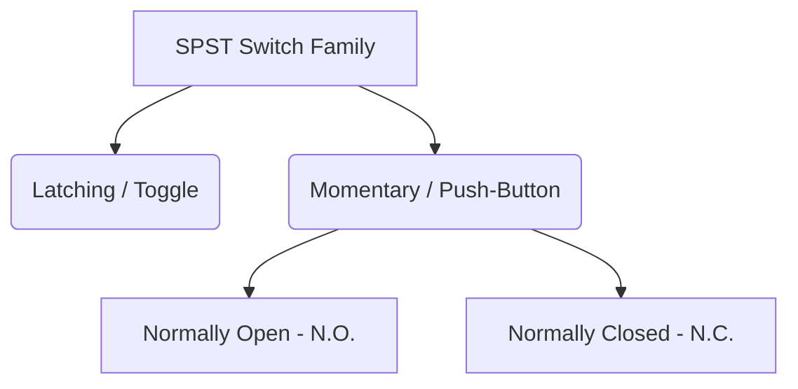

At the heart of every interface humans use to control electricity lies the mechanical switch. The simplest, most ubiquitous incarnation of this component is the **SPST**, or Single Pole Single Throw switch.

Whether you are designing a high-voltage power mains breaker or simply mapping out a push-button on an Arduino breadboard, the SPST symbol is your logical starting point.

## 1. What SPST Actually Means

Engineers classify switches using two variables: **Poles** and **Throws**.

* **Pole (P):** The number of independent electrical circuits the switch can control simultaneously. 
* **Throw (T):** The number of closed states (ON positions) each pole has.

Therefore, an SPST is a *Single Pole* (controls one circuit) and *Single Throw* (has only one closed, conductive position).

```mermaid
flowchart LR
    A[Human Input] --> B((SPST Mechanism))
    B -- Open / Default --> C[Infinite Resistance / OFF]
    B -- Closed / Actuated --> D[Zero Resistance / ON]
    
    style B fill:#0f172a,stroke:#f59e0b
```

## 2. Reading the SPST Schematic Symbol

The standard IEEE symbol for an SPST switch is highly intuitive—it literally looks like what it does.

| Visual Element | Meaning in the Real World |
| :--- | :--- |
| **Two Open Circles** | The stationary electrical contact pads where wires terminate. |
| **Diagonal Broken Line** | The mechanical conductive arm, physically disjointed from the second pad to indicate an 'Open' default state. |
| **Designator (`S` or `SW`)** | Standard reference tags. e.g., `SW1`. |

> **Normal State Assumption:** Unless otherwise specified, mechanical switches are drawn in their **unactuated, resting state**. For a standard SPST light switch, this means the schematic depicts it as OFF.

## 3. Variations of the SPST: Push-Buttons

A toggle switch stays where you put it (latching). A push-button only actuates while your finger is on it (momentary). The SPST designation applies to both, but the symbols change slightly to distinguish human interaction modes.

| Switch Type | Schematic Alteration | Real-World Example |
| :--- | :--- | :--- |
| **Push-Button (N.O.)** | Instead of an angled arm, a flat bridge hovers *above* the two contact pads. Pushing down bridges the gap. | Keyboard keys, computer power buttons, doorbell buttons. |
| **Push-Button (N.C.)** | The flat bridge rests *underneath* or touching the pads, keeping the circuit ON by default. Pushing down breaks connections. | Emergency Stop (E-Stop) buttons on heavy machinery. |

## 4. Hardware Implementation Warnings

When incorporating an SPST switch into a digital logic circuit (like a Raspberry Pi GPIO pin), a naive schematic design will lead to disastrously unpredictable software behavior.

### The "Floating Pin" Problem

If you connect one side of an SPST switch to 5V and the other side straight to a microcontroller pin, what happens when the switch is open? The pin is not reading 0V—it is disconnected and "floating", acting like an antenna picking up surrounding electromagnetism.

**The Fix: Pull-Down Resistors**

Always include a resistor (typically 10kΩ) connected between the digital pin and Ground. 

1. **Switch OFF:** The pin reads 0V securely through the resistor.
2. **Switch ON:** The 5V supply overpowers the resistor, triggering a secure HIGH state.

Incorporate SPST variations into your designs securely via the **[Circuit Diagram Editor](/editor/)**. Expand the left 'Switches' library to find N.O. and N.C. implementations!
