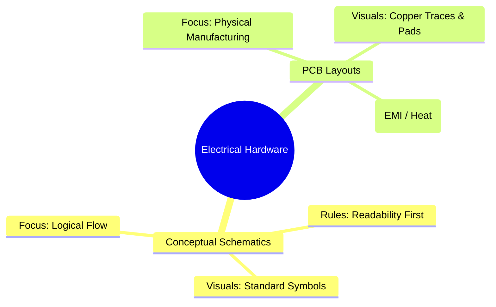
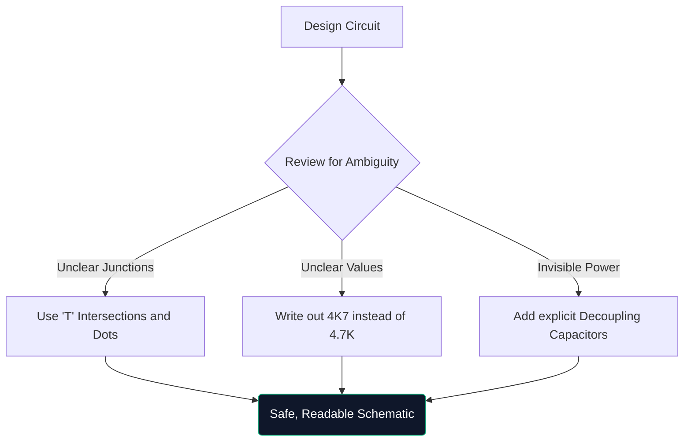

Welcome to the definitive masterclass on circuit diagrams. Whether you are hacking together Arduino prototypes on a weekend or studying electrical engineering, understanding schematic architecture is non-negotiable. 

This guide moves beyond the basics, evaluating how modern diagrams are constructed, verified, and manufactured.

## Theoretical Schematics vs. PCB Layouts

A very common point of confusion is the difference between a schematic diagram and a Printed Circuit Board (PCB) layout. They are entirely different representations of the same electrical truth.

| Trait | Schematic Diagram | PCB Layout |
| :--- | :--- | :--- |
| **Purpose** | To understand *how* the circuit works logically | To dictate *where* the copper goes physically |
| **Component Representation** | Abstract symbols (triangles, zigzags) | Physical 1:1 footprint pads (e.g., SOIC-8, 0805) |
| **Connections** | Perfect geometric lines | 45-degree angle copper traces |
| **Environment** | Clean, white background paper | Multi-layered literal 3D space |

## Anatomy of an Advanced Schematic

When circuits grow beyond 100 components, visual paradigms shift. You cannot simply connect everything with drawn wires.

1. **Title Blocks**: Professional schematics always feature a block in the bottom right corner denoting Company Name, Engineer of Record, Revision Number, and Date.
2. **Net Labels & Ports**: Wires do not connect sub-systems; named labels do. If two wires are labeled `CLK_OUT`, they are electrically connected, even if they are on different pages.
3. **Hierarchical Blocks**: Massive designs (like a computer motherboard) use hierarchy. A single rectangular block labeled "Memory Interface" contains an entirely separate schematic page inside it.

## The Rule of "Defensive Drawing"

Similar to defensive driving, defensive drawing implies assuming the person reading your schematic will misunderstand it unless you explicitly guide them.

> **Why write `4K7`?** In printed or photocopied schematics, a tiny decimal point (`.`) easily disappears due to artifacts. Writing `4.7K` risks someone reading it as `47K`, which could fry a component. Writing `4K7` makes the multiplier act as the decimal point, practically eliminating misreads.

## Transitioning to Digital CAD Tools

Drawing on graph paper is excellent for brainstorming, but practically useless for production. When you migrate your designs to a tool like [Circuit Diagram Maker](/editor/), you gain several superpowers:

* **Netlists**: Digital tools mathematical prove connections.
* **Reusability**: Copy-pasting complex regulated power supplies from previous projects saves hours.
* **Vector Quality**: Exporting as SVG guarantees perfectly crisp lines regardless of how much you zoom in.

The leap from theory to reality begins with a well-drawn line. Start your journey today!
