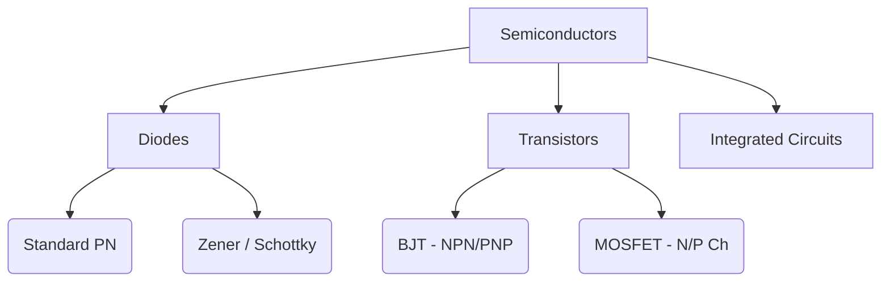

Los símbolos electrónicos son el lenguaje universal de la ingeniería de hardware. Así como las notas musicales dictan el tono y el ritmo, los símbolos de los circuitos transmiten la función, las propiedades y la conectividad eléctrica en una hoja de papel.

En esta guía completa, analizamos la morfología visual de los elementos más importantes que encontrará en cualquier esquema.

## Diferencias estándar globales: IEEE vs. IEC

Antes de profundizar en símbolos específicos, es fundamental reconocer que los símbolos pueden verse diferentes dependiendo de dónde se dibujó el esquema. Los dos estándares dominantes son **IEEE/ANSI** (principalmente americanos) e **IEC** (Europa e internacional).

```mermaid
flowchart LR
    subgraph Regional Standards
    A((Schematic Origin))
    A -- US / Americas --> B[IEEE / ANSI]
    A -- Europe / Int'l --> C[IEC]
    end
    
    B -.-> D(Zigzag Resistors)
    C -.-> E(Rectangle Resistors)
    
    style B fill:#1e293b,stroke:#f59e0b
    style C fill:#1e293b,stroke:#3b82f6
```

En Circuit Diagram Maker, utilizamos principalmente el estándar IEEE/ANSI, ya que sigue siendo muy popular en los ecosistemas digitales y de aficionados, aunque ambos son técnicamente correctos.

## Componentes pasivos

Los componentes pasivos no requieren una fuente de alimentación externa para funcionar y no pueden amplificar una señal.

| Componente | Apariencia del símbolo estándar | Descripción funcional |
| :--- | :--- | :--- |
| **Resistencia** | Definido por una línea en zigzag nítida y dentada. Las variantes variables presentan una flecha que atraviesa la línea. | Disipa energía en forma de calor para restringir el flujo de corriente eléctrica. |
| **Condensador** | Dos líneas paralelas separadas por un espacio. Las variantes polarizadas curvan una de las líneas para indicar el terminal negativo. | Almacena energía eléctrica temporalmente en un campo eléctrico. |
| **Inductor** | Serie de bucles redondeados o semicírculos que representan bobinas de alambre. | Se opone a los cambios en el flujo de corriente almacenando energía en un campo magnético. |

## Componentes activos (semiconductores)

Los componentes activos requieren una fuente de energía y pueden controlar el flujo de electricidad, a menudo amplificando señales.

| Componente | Indicadores visuales | Uso principal |
| :--- | :--- | :--- |
| **Diodo** | Un triángulo que apunta hacia una línea plana. La línea indica el cátodo (negativo). | Una válvula unidireccional para electricidad. |
| **LED** | Un símbolo de diodo estándar con dos pequeñas flechas apuntando hacia afuera, lo que significa emisión de luz. | Indicadores visuales y optoelectrónica. |
| **Transistor BJT** | Una línea vertical flanqueada por tres conexiones: base, colector y un emisor con una flecha que indica NPN o PNP. | Interruptores y amplificadores controlados por corriente. |
| **MOSFET** | Presenta líneas de límite separadas que resaltan la puerta aislada y los diodos del sustrato interno. | Conmutación controlada por voltaje para alta potencia. |

## Dispositivos mecánicos y de salida

Estas partes interactúan con el mundo físico, ya sea recibiendo aportaciones humanas o generando resultados físicos.

| Componente | Taquigrafía esquemática | Solicitud |
| :--- | :--- | :--- |
| **Cambiar (SPST)** | Una línea discontinua que puede girar hacia abajo para completar el circuito. | Control básico de encendido/apagado. |
| **Relé** | Generalmente se representa como un inductor (la bobina interna) acoplado con contactos de interruptor aislados. | Conmutación de cargas de alto voltaje mediante microcontroladores de bajo voltaje. |
| **Motor** | Un círculo que contiene una 'M', a menudo con terminales positivos y negativos designados. | Conversión de corriente eléctrica en cinética rotacional. |

> **Consejo de diseño:** Siempre que utilice interruptores o relés mecánicos, incluya siempre un *diodo de retorno* entre cargas inductivas para proteger sus componentes semiconductores de picos de voltaje.

Comprender estos símbolos es el primer paso hacia la fluidez del circuito. Consulte nuestro [editor en línea](/editor/) para arrastrar, soltar y experimentar con estas formas al instante.