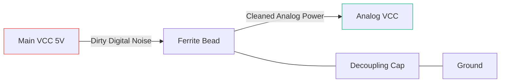

La electrónica digital de alta velocidad genera mucho ruido electromagnético. Sin mitigación, esta interferencia de alta frecuencia se filtra en líneas analógicas sensibles o se irradia hacia afuera, lo que hace que su dispositivo falle espectacularmente las pruebas de emisiones de la FCC.

El arma principal contra esta interferencia es la **cuenta de ferrita**. Comprender su símbolo esquemático y su ubicación determina si su circuito funciona limpiamente o se ahoga en su propio ruido.

## 1. Visualizando el símbolo de la perla de ferrita

Una perla de ferrita funciona inherentemente como un inductor con grandes pérdidas. Debido a esto, su símbolo esquemático está estrechamente relacionado con el símbolo del inductor estándar, pero está diseñado para enfatizar su función específica.

```mermaid
graph LR
    A[Inductor Basis] --> B(Standard Inductor Symbol)
    A --> C(Rectangle Over Wire)
    B -.-> D(Addition of a dashed line or solid bar)
    D --> E[IEEE Ferrite Symbol]
    C --> F[IEC Ferrite Symbol]
    
    style E fill:#0f172a,stroke:#3b82f6
    style F fill:#0f172a,stroke:#10b981
```

| Rasgo | Estándar IEEE/ANSI | Norma IEC | Notas |
| :--- | :--- | :--- | :--- |
| **Forma** | Serie de semicírculos con barra/caja | Un bloque rectangular sólido | Funcionalmente idéntico en resultado |
| **Prefijo de designador** | `FB` | `FB` o `L` | Se recomienda encarecidamente el uso de `FB` para evitar confusiones con los inductores de potencia |
| **Unidad de medida** | Ohmios (Ω) a MHz específicos | Ohmios (Ω) a MHz específicos | A diferencia de los inductores medidos en Henries (H) |

> **Distinción crucial:** Nunca califique una perla de ferrita por inductancia. Las perlas de ferrita se especifican por su **impedancia (en ohmios) a una frecuencia específica** (normalmente 100 MHz).

## 2. Mecánica operativa básica

¿Por qué utilizar una perla de ferrita en lugar de un inductor estándar?

* Un **inductor** almacena energía y la devuelve al circuito. Es altamente reactivo y conserva la energía.
* Una **cuenta de ferrita** está diseñada activamente para tener *pérdidas*. A altas frecuencias, se comporta como una resistencia, convirtiendo el ruido de alta frecuencia no deseado directamente en calor.

| Rango de frecuencia | Comportamiento de las perlas de ferrita | Resultado en Circuito |
| :--- | :--- | :--- |
| **Baja frecuencia / CC** | Menos de 1 MHz | Actúa como un simple cable (~0 Ω). La energía CC pasa libremente. |
| **Frecuencia de resonancia** | Altamente reactivo | Almacena energía brevemente. |
| **Alta Frecuencia** | Más de 50 MHz+ | Actúa como una resistencia de alto valor. Bloquea y disipa el ruido de RF en forma de calor. |

## 3. Mejores prácticas para la colocación de esquemas

Utilizar correctamente el símbolo FB requiere una ubicación estratégica. Colocar perlas de ferrita al azar en un esquema puede empeorar el timbre y la resonancia.

### Desacoplamiento de fuentes de alimentación (filtros Pi)

El uso más común de un símbolo "FB" es aislar la energía digital sucia de la energía analógica limpia.

En la configuración anterior (parte de un filtro Pi), la perla de ferrita bloquea la entrada de transitorios de alta frecuencia a la línea AVCC, mientras que el condensador desvía cualquier ondulación restante a tierra.

### Supresión EMI de línea de datos

Al tender cables de datos USB largos o trazas HDMI, los símbolos "FB" suelen colocarse en serie cerca del conector. Esto garantiza que el cable largo y físicamente expuesto no actúe como una antena e irradie ruido de la CPU por la habitación.

Para agregar una perla de ferrita a su próximo esquema, abra el **[Editor de diagramas de circuitos](/editor/)**, busque "Ferrita" y especifique su clasificación de impedancia.