Construir un inversor de energía (convertir una batería de automóvil de 12 V en corriente alterna de 220 V capaz de hacer funcionar electrodomésticos) es un rito de iniciación para los ingenieros electrónicos.

Antes de levantar un soldador, debe lograr una comprensión perfecta del esquema subyacente. Los circuitos de alto voltaje son implacables y un diagrama mal dibujado garantiza MOSFET quemados o descargas eléctricas graves. Esta guía analiza la arquitectura de un inversor de onda cuadrada fundamental.

> **Advertencia de seguridad:** La alimentación de 220 V CA es letal. Este artículo es una exploración de la lógica esquemática y el diseño teórico, no un modelo de fabricación. Nunca construya circuitos de alto voltaje sin capacitación eléctrica avanzada.

## La arquitectura de los tres pilares

Por muy complejo que sea un inversor moderno, el esquema siempre se puede dividir visual y lógicamente en tres bloques funcionales distintos.

```mermaid
flowchart LR
    DC_SRC[(12V DC Battery)] --> OSC[1. Oscillator Block]
    OSC -- Low Power Square Wave --> AMP[2. Power Switch Block]
    AMP -- High Current 12V Wave --> TX[3. Step-Up Transformer]
    TX -- Magnetic Induction --> AC_OUT((220V AC Output))
    
    style OSC fill:#0f172a,stroke:#3b82f6
    style AMP fill:#0f172a,stroke:#f59e0b
    style TX fill:#0f172a,stroke:#ef4444
```

### Etapa 1: El oscilador (los cerebros)

La corriente continua (CC) de una batería fluye en línea recta. Los transformadores no pueden avanzar en línea recta; Requieren campos magnéticos fluctuantes. Por lo tanto, debemos convertir la CC en una onda de CA artificial (normalmente 50 Hz o 60 Hz según la región geográfica).

| Componente usado | Función esquemática | Por qué se elige |
| :--- | :--- | :--- |
| **CD4047 IC / 555 Temporizador** | Multivibrador Astable | Genera una onda cuadrada notablemente estable mediante el cálculo de una constante de tiempo RC. |
| **Red de resistencias y condensadores** | Calibradores de temporización | Los valores (por ejemplo, `R=100kΩ`, `C=0.1μF`) dictan de forma única la frecuencia precisa de 50 Hz. |

### Etapa 2: Los interruptores de encendido (el músculo)

El chip lógico produce una onda prístina de 50 Hz, pero con límites de corriente excepcionalmente bajos (a menudo por debajo de 20 mA). Si lo introdujeras en un transformador, no generaría suficiente flujo magnético para encender una bombilla.

Colocamos transistores de alta potencia entre el oscilador y las bobinas del transformador.

1. La señal débil del oscilador llega a la **Puerta** de un MOSFET de canal N masivo (como el IRF3205).
2. El MOSFET actúa como un relé electrónico de alta resistencia.
3. Cambia furiosamente el enorme amperaje de la batería de 12 V directamente a través de las bobinas del transformador 50 veces por segundo.

### Etapa 3: El transformador elevador

En este punto del esquema, tenemos cantidades masivas de corriente de 12 V pulsando de un lado a otro. La etapa final requiere pasar esto a través de las bobinas primarias de un transformador.

| Característica | Detalles esquemáticos | Implicaciones en el mundo real |
| :--- | :--- | :--- |
| **Bobina primaria (izquierda)** | Configuración con toma central (`12V - 0 - 12V`) | Permite la conmutación push-pull de ida y vuelta desde dos MOSFET alternos. |
| **Líneas principales** | Dos líneas continuas dibujadas verticalmente | Representa el núcleo de hierro/ferrita necesario para la inducción magnética de alta eficiencia. |
| **Bobina secundaria (derecha)** | Relación de bobinado enormemente aumentada | La física convierte el flujo magnético pulsante de 12 V en una onda letal y volátil de 220 V. |

## Consideraciones de dibujo

Cuando utilice el **[Editor de diagramas de circuitos](/editor/)** para redactar este diseño, recuerde las mejores prácticas de diseño:

* Dibuje las líneas gruesas que transportan la corriente de la batería de 12 V más gruesas que las líneas del oscilador de baja potencia.
* Conecte a tierra los pines de origen MOSFET de forma explícita y única; no los encamine cerca de la tierra sensible del oscilador para evitar el acoplamiento de ruido.
* ¡Delinee gráficamente las salidas de 220V! Coloque etiquetas de advertencia y puertos de salida (como el símbolo de un enchufe) en lugar de dejar cables desnudos que terminen en el vacío.