Abrir un esquema complejo por primera vez es como mirar un lenguaje extraño. Docenas de líneas que se cruzan, abreviaturas crípticas y símbolos irregulares se fusionan en una pared de ruido visual.

Sin embargo, los ingenieros experimentados no leen los esquemas mirando la página completa. Aíslan, rastrean y conquistan. Aquí está la metodología paso a paso para descifrar cualquier diagrama de circuito.

## Paso 1: Aislar la infraestructura eléctrica central

Antes de entender qué *hace* un circuito, debes entender *cómo respira*.

Cada esquema tiene puntos de entrada para la energía eléctrica. Su primera tarea es localizar todos los rieles de voltaje principales y referencias a tierra.

```mermaid
flowchart TD
    A[Start: Scan Edges] --> B{Look for Power Symbols}
    B -- Found Battery/Jack --> C[Trace the initial VCC and GND lines]
    B -- Found Net Labels --> D[Locate generic +5V, +3.3V pads]
    C --> E[Are there Voltage Regulators?]
    D --> E
    E -- Yes --> F[Mentally divide circuit into Voltage Zones]
    E -- No --> G[Circuit runs on single voltage]
    
    style A fill:#0f172a,stroke:#3b82f6
    style F fill:#1e293b,stroke:#f59e0b
```



| Símbolo/Texto | Significado | Requisito de acción |
| :--- | :--- | :--- |
| `VCC`/`VDD` | Tensión de alimentación positiva para circuitos integrados. | Realice un seguimiento de esto para asegurarse de que todos los circuitos integrados reciban energía. |
| `GND`/`VSS` | La referencia del terreno común. | Supongamos que todos estos símbolos se conectan físicamente entre sí. |
| `LDO` / `dólar` | Un chip que regula la tensión hacia abajo. | Tenga en cuenta qué componentes están aguas abajo utilizando el nuevo voltaje más bajo. |

## Paso 2: Desmitificar los "cerebros" (CI)

Una vez que sepas por dónde fluye el poder, busca los rectángulos más grandes en la página. Los circuitos integrados (CI) dictan la función principal del esquema.

Si encuentra un IC con la etiqueta "U1" con un número de pieza críptico como "NE555" o "ATmega328P", deje de leer el esquema inmediatamente. Abra una nueva pestaña y extraiga la **hoja de datos**.

No es necesario comprender la física interna de los semiconductores; simplemente mire el "Diagrama de distribución de pines" de la hoja de datos. Si el pin 4 es "RESET" y el pin 8 es "VCC", asigne inmediatamente esa lógica al dibujo.

## Paso 3: realizar un seguimiento de las entradas y salidas

Los circuitos son máquinas funcionales. Reciben información ambiental, la procesan y generan un resultado.

```mermaid
quadrantChart
    title Input/Output Hardware Identification
    x-axis Analog/Physical --> Digital/Data
    y-axis Input Devices --> Output Devices
    quadrant-1 Digital Receivers (e.g. WiFi)
    quadrant-2 Digital Displays (e.g. OLEDs)
    quadrant-3 Physical Actuators (e.g. Motors)
    quadrant-4 Physical Sensors (e.g. Thermistors)
    "Push Button": [0.1, 0.4]
    "Photoresistor": [0.2, 0.2]
    "UART RX": [0.8, 0.4]
    "UART TX": [0.8, 0.6]
    "Speaker": [0.3, 0.8]
    "LED": [0.4, 0.7]
```

Trace los cables hacia afuera desde los circuitos integrados centrales. Si un pin IC se conecta a un LED, se trata de una salida visual. Si un pin se conecta a un interruptor SPST que va a tierra, se trata de una entrada humana.

## Paso 4: Validar cruces y cruces

El error de lectura más común entre los principiantes consiste en malinterpretar los cables que se cruzan entre sí.

* **Un punto produce un nudo:** Si dos líneas que se cruzan presentan un punto sólido en su cruce, están físicamente soldadas/conectadas entre sí. La corriente puede fluir entre ellos.
* **Sin punto se produce un puente:** Si dos líneas forman una cruz simple (+), *no* se tocan. Son como dos autopistas que se cruzan en un paso elevado.

## Paso 5: Reconocer los subcircuitos (el arma secreta)

Los ingenieros rara vez diseñan circuitos completamente desde cero. Pegan subcircuitos modulares estándar. Una vez que aprenda a reconocer estas "palabras" visuales, dejará de leer "letras" individuales.

| Patrón visual | Subcircuito estándar | Función |
| :--- | :--- | :--- |
| Condensador cruzando de `VCC` a `GND` justo al lado de un IC. | **Condensador de desacoplamiento** | Absorbe el ruido. Ignórelo al analizar el flujo lógico. |
| Resistencia de un pin digital que se envuelve hasta "+5V". | **Resistencia de pull-up** | Previene la flotación de pines; garantiza un estado predeterminado ALTO estable. |
| Dos resistencias colocadas en serie entre voltaje y tierra, conectadas en el medio. | **Divisor de voltaje** | Cae un voltaje proporcionalmente para que un pin del sensor lo lea de forma segura. |

Pon esta teoría en práctica. Abra el **[Editor de diagramas de circuitos](/editor/)**, cargue una plantilla y mapee la potencia, el cerebro, las entradas y las salidas usted mismo.