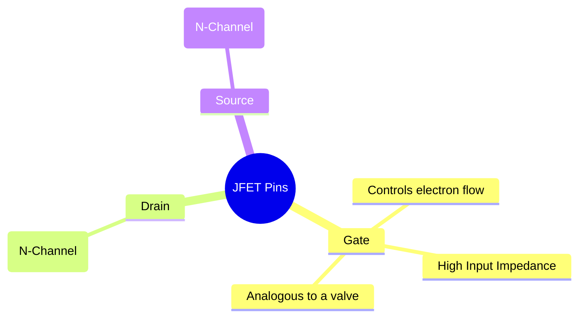

Antes de la proliferación masiva de MOSFET, el **JFET** (transistor de efecto de campo de unión) era el rey de la amplificación de alta impedancia de entrada. Si bien no se utilizan con tanta frecuencia en la lógica digital moderna, siguen siendo artefactos indispensables en preamplificadores de audio de alta fidelidad, instrumentación sensible y circuitos de RF.

Comprender el símbolo esquemático JFET es esencial para cualquiera que profundice en el diseño de circuitos analógicos discretos.

## 1. Anatomía del símbolo JFET

A diferencia de los transistores de unión bipolares (BJT), que son dispositivos controlados por corriente, un JFET es un dispositivo **controlado por voltaje**. El símbolo esquemático intenta representar visualmente la construcción física de su canal semiconductor interno.

El símbolo consiste en una línea recta vertical que representa el canal, con dos líneas horizontales que se enganchan en él (el Drenaje y la Fuente). Una tercera línea perpendicular forma la Puerta, completa con una flecha que dicta la polaridad del semiconductor.

### JFET de canal N frente a canal P

Al igual que los BJT tienen NPN y PNP, los JFET vienen en dos versiones distintas.

| Característica | JFET de canal N | JFET de canal P |
| :--- | :--- | :--- |
| **Símbolo Flecha** | Apunta **IN** hacia la línea del canal | Puntos **FUERA** lejos del canal |
| **Aerotransportadores mayoritarios** | Electrones | Agujeros |
| **Vgs para pellizco** | Voltaje negativo (por ejemplo, -5 V) | Voltaje positivo (por ejemplo, +5 V) |
| **Operación típica**| Normalmente ENCENDIDO -> Aplique una matriz de voltaje negativo para apagar | Normalmente ENCENDIDO -> Aplique una matriz de voltaje positivo para apagar |

> **Truco de memoria:** "Apuntar hacia adentro" significa **N**-Canal. Mira la flecha en la puerta. Si apunta hacia el interior de la línea, se trata de un JFET de canal N (como el popular 2N5457).

## 2. Operación: El modo de agotamiento

Una de las características más definitorias de un JFET es que es un dispositivo **Modo de agotamiento**. Esto afecta enormemente la forma en que diseña los esquemas a su alrededor.

* **MOSFET (modo de mejora):** Normalmente están APAGADOS. Debe aplicar voltaje a la puerta para encenderla.
* **JFET (Modo de agotamiento):** Normalmente están ENCENDIDOS. Con 0 voltios en la puerta, la corriente máxima fluye desde el drenaje a la fuente. Debe aplicar un voltaje de *polarización inversa* (negativo para el canal N) para expandir la región de agotamiento y literalmente "pellizcar" el flujo de electrones, apagando el dispositivo.

```mermaid
flowchart LR
    VGS[V_GS = 0V] --> I1[Maximum Drain Current flows]
    VGS2[V_GS = -2V] --> I2[Current is restricted]
    VGS3[V_GS = -5V] --> I3[Pinch-Off reached. Circuit is OFF]
    
    style VGS fill:#1e293b,stroke:#f59e0b
    style VGS3 fill:#1e293b,stroke:#ef4444
```

## 3. Aplicaciones esquemáticas típicas

Debido a que la puerta de un JFET tiene polarización inversa durante el funcionamiento, esencialmente no fluye corriente hacia ella. Esto produce una impedancia de entrada astronómicamente alta (a menudo medida en cientos de megaohmios).

| Aplicación del circuito | Por qué se eligen los JFET | Pistas esquemáticas |
| :--- | :--- | :--- |
| **Preamplificadores de audio** | El ruido extremadamente bajo y la impedancia de entrada masiva evitan la carga de pastillas sensibles de guitarra eléctrica. | A menudo se ve actuando como una etapa de búfer de seguimiento de origen. |
| **Interruptores analógicos** | Debido a que están controlados exclusivamente por voltaje sin corriente de puerta, inyectan cero transitorios de conmutación en la ruta de la señal. | Colocado en serie con una señal analógica que pasa por el canal drenaje-fuente. |
| **Fuentes de corriente constante** | Un JFET se comporta de forma nativa como un sumidero de corriente constante cuando la puerta está conectada directamente a la fuente. | Terminal de puerta conectado directamente al terminal de fuente. |

Al diagramar estos circuitos analógicos especializados, la precisión es clave. Asegúrese de que la orientación de la flecha de su puerta sea correcta para evitar fallas de fabricación. Utilice la biblioteca de semiconductores discretos seleccionada en **[Circuit Diagram Maker](/editor/)** para colocar símbolos JFET estándar de canal N y canal P con precisión en su próximo lienzo.