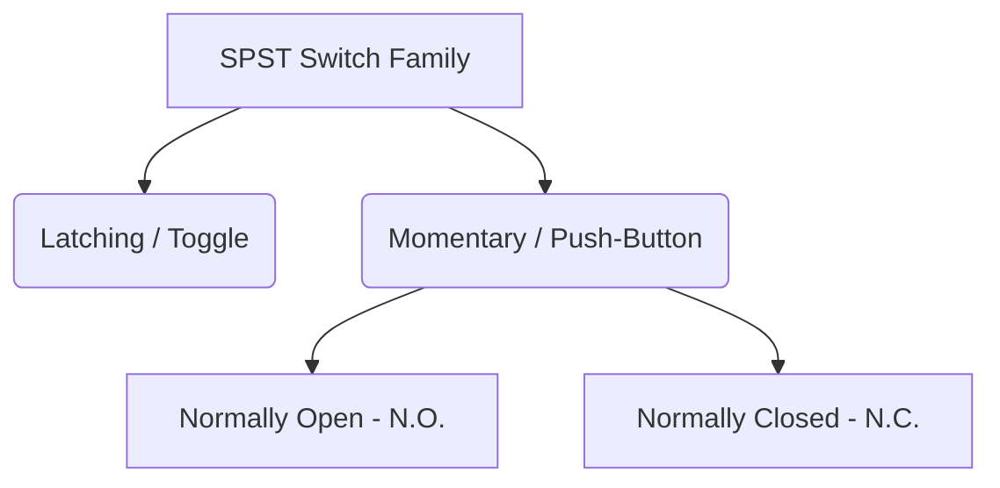

En el corazón de cada interfaz que los humanos utilizamos para controlar la electricidad se encuentra el interruptor mecánico. La encarnación más simple y ubicua de este componente es el **SPST**, o interruptor unipolar de un solo paso.

Ya sea que esté diseñando un disyuntor de red eléctrica de alto voltaje o simplemente mapeando un botón en una placa Arduino, el símbolo SPST es su punto de partida lógico.

## 1. Qué significa realmente SPST

Los ingenieros clasifican los interruptores utilizando dos variables: **Polos** y **Lanzamientos**.

* **Polo (P):** El número de circuitos eléctricos independientes que el interruptor puede controlar simultáneamente. 
* **Lanzamiento (T):** El número de estados cerrados (posiciones ON) que tiene cada polo.

Por lo tanto, un SPST es un *unipolar* (controla un circuito) y un *simple tiro* (tiene solo una posición conductora cerrada).

```mermaid
flowchart LR
    A[Human Input] --> B((SPST Mechanism))
    B -- Open / Default --> C[Infinite Resistance / OFF]
    B -- Closed / Actuated --> D[Zero Resistance / ON]
    
    style B fill:#0f172a,stroke:#f59e0b
```

## 2. Lectura del símbolo esquemático SPST

El símbolo estándar IEEE para un conmutador SPST es muy intuitivo: literalmente parece lo que hace.

| Elemento visual | Significado en el mundo real |
| :--- | :--- |
| **Dos círculos abiertos** | Las almohadillas de contacto eléctrico estacionarias donde terminan los cables. |
| **Línea discontinua diagonal** | El brazo conductor mecánico, físicamente separado de la segunda almohadilla para indicar un estado predeterminado "Abierto". |
| **Designador (`S` o `SW`)** | Etiquetas de referencia estándar. por ejemplo, "SW1". |

> **Supuesto de estado normal:** A menos que se especifique lo contrario, los interruptores mecánicos se dibujan en su **estado de reposo, no accionado**. Para un interruptor de luz SPST estándar, esto significa que el esquema lo muestra como APAGADO.

## 3. Variaciones del SPST: Pulsadores

Un interruptor de palanca permanece donde lo colocas (enganche). Un pulsador sólo se activa mientras el dedo está sobre él (momentáneo). La designación SPST se aplica a ambos, pero los símbolos cambian ligeramente para distinguir los modos de interacción humana.

| Tipo de interruptor | Alteración esquemática | Ejemplo del mundo real |
| :--- | :--- | :--- |
| **Pulsador (N.A.)** | En lugar de un brazo en ángulo, un puente plano se cierne *sobre* las dos almohadillas de contacto. Empujar hacia abajo cierra la brecha. | Teclas del teclado, botones de encendido de la computadora, botones del timbre. |
| **Pulsador (N.C.)** | El puente plano descansa *debajo* o toca las almohadillas, manteniendo el circuito encendido de forma predeterminada. Empujar hacia abajo rompe las conexiones. | Botones de parada de emergencia (E-Stop) en maquinaria pesada. |

## 4. Advertencias de implementación de hardware

Al incorporar un interruptor SPST en un circuito lógico digital (como un pin GPIO de Raspberry Pi), un diseño esquemático ingenuo conducirá a un comportamiento del software desastrosamente impredecible.

### El problema del "pasador flotante"

Si conecta un lado de un interruptor SPST a 5 V y el otro lado directamente a un pin del microcontrolador, ¿qué sucede cuando el interruptor está abierto? El pin no indica 0 V; está desconectado y "flotando", actuando como una antena que capta el electromagnetismo circundante.

**La solución: resistencias desplegables**

Incluya siempre una resistencia (normalmente de 10 kΩ) conectada entre el pin digital y Tierra.

1. **Apagar:** El pin lee 0V de forma segura a través de la resistencia.
2. **Encendido:** El suministro de 5 V domina la resistencia, lo que activa un estado ALTO seguro.

Incorpore variaciones de SPST en sus diseños de forma segura a través del **[Editor de diagramas de circuitos](/editor/)**. Expanda la biblioteca 'Switches' de la izquierda para encontrar N.A. y N.C. implementaciones!