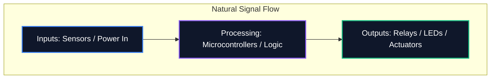

Que vous partagiez un schéma sur un forum ou que vous le soumettiez à une fabrication professionnelle de PCB, la lisibilité de votre schéma est tout aussi importante que son exactitude logique. Un schéma désordonné entraîne des erreurs de routage, des composants mal compris et une perte de temps.

Ce guide décrit les meilleures pratiques de base utilisées par les ingénieurs électroniciens professionnels pour créer des schémas de circuits propres, maintenables et hautement lisibles.

## 1. Déroulement du schéma : de gauche à droite, de haut en bas

Un schéma est un document technique, et comme tout document, il doit être lu naturellement. Dans la conception électronique, la convention standard stipule que les entrées circulent depuis la gauche et les sorties sortent vers la droite.

De même, les tensions plus élevées doivent être explicitement placées en haut du schéma, et les tensions plus faibles ou la masse en bas.



## 2. Symboles d'alimentation et de terre

Ne tirez jamais de longs fils enroulés reliant chaque broche de terre ensemble. Cela crée une toile d’araignée impossible à lire. Utilisez plutôt les symboles d’alimentation locale et de masse sur le composant.

| Mauvaise pratique | Meilleure pratique | Pourquoi c'est important |
| :--- | :--- | :--- |
| Lier toutes les masses avec un seul fil continu | Utilisation de symboles « GND » locaux sur chaque composant | Réduit l'encombrement visuel ; définit explicitement les chemins de retour sans traçage complexe |
| Placer des lignes VCC se croisant sur des traces de signal | Utilisation des symboles locaux `VCC` / `+5V` pointant vers le haut | Empêche les lignes de signal d'être visuellement confondues avec la fourniture d'énergie |
| Étiquetage de différents motifs avec le même symbole | Différencier la masse analogique (AGND) et la masse numérique (DGND) | Critique pour éviter les boucles de masse et la propagation du bruit dans les conceptions à signaux mixtes |

## 3. Points de jonction et croisements

L’une des erreurs les plus dangereuses dans la conception schématique est l’ambiguïté à l’endroit où les fils se croisent.

```mermaid
graph TD
    A[Is it a connection?]
    A --> B{Is there a junction dot?}
    B -- Yes --> C[Wires are electrically connected (Node)]
    B -- No --> D[Wires are crossing without connecting]
    
    style A fill:#1e293b,stroke:#f59e0b
    style C fill:#1e293b,stroke:#10b981
    style D fill:#1e293b,stroke:#ef4444
```

> **Conseil de pro :** N'utilisez jamais de jonctions « à 4 voies » (une croix en forme de « + »). Si quatre fils doivent se rencontrer, décalez-les en deux jonctions en « T » à 3 voies. Cela élimine complètement toute ambiguïté ; si le point de jonction disparaît lors de l'impression ou de la mise à l'échelle, la forme en « T » implique toujours sans ambiguïté une connexion, contrairement à une croix nue.

## 4. Regroupement de composants logiques

Lorsqu'il s'agit de grands schémas contenant des microcontrôleurs avec plus de 64 broches, essayer de relier physiquement chaque fil au composant est un exercice futile. Au lieu de cela, les outils professionnels utilisent **Net Labels**.

Regroupez les blocs fonctionnels de votre circuit en zones visuelles. Par exemple, placez l'alimentation dans un coin, le MCU au centre et les pilotes de moteur dans un autre. Connectez-les uniquement en utilisant des Net Labels descriptifs (par exemple, `SPI_MOSI`, `UART_TX`, `MOTOR_PWM`).

## 5. Désignateurs et valeurs de référence

Un symbole de résistance nue ne dit rien au spectateur. Chaque composant doit avoir un indicateur de référence unique et une valeur explicite.

| Catégorie de composant | Préfixe standard | Exemple |
| :--- | :--- | :--- |
| **Résistances** | `R` | `R1 (10 kΩ)` |
| **Condensateurs** | `C` | `C4 (100nF)` |
| **Circuits intégrés** | `U` ou `IC` | 'U2 (LM358)' |
| **Diodes / LED** | 'D' | `D1 (1N4148)` |
| **Transistors / MOSFET** | 'Q' | `T1 (2N2222)` |
| **Inducteurs** | 'L' | 'L1 (4,7μH)' |
| **Connecteurs/En-têtes** | 'J' ou 'P' | `J1 (prise d'alimentation)` |

Le respect de ces conventions garantit que votre schéma sera instantanément compris par n'importe quel ingénieur, partout dans le monde. Commencez à appliquer ces règles dès aujourd'hui dans [Éditeur de schémas de circuits](/editor/).