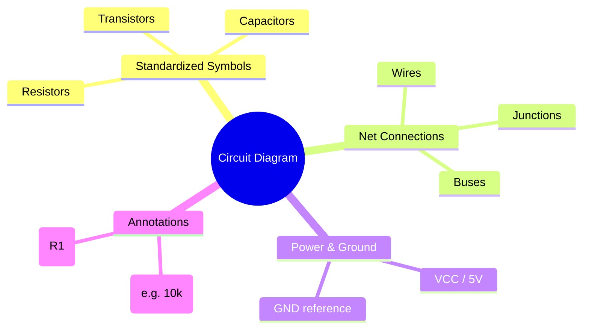
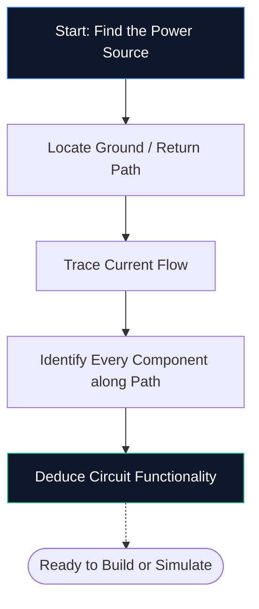

Si vous n'avez jamais ouvert d'éditeur de schémas auparavant, c'est le seul guide dont vous avez besoin. Nous passerons en revue les principes fondamentaux : ce qu'est un schéma de circuit, comment décoder les symboles et comment dessiner votre tout premier schéma dans **Circuit Diagram Maker** – le tout sans installer un seul logiciel.

## Qu'est-ce qu'un schéma de circuit exactement ?

Un schéma de circuit est une carte de l’électricité. Tout comme un plan de métro montre comment les stations se connectent sans représenter les tunnels à l'échelle, un schéma de circuit montre comment les composants électroniques se connectent sans se soucier de la taille physique ou de l'emplacement des cartes.

Au lieu de dessins réalistes, les schémas utilisent des **symboles standardisés**. Une résistance apparaît comme une ligne en zigzag, un condensateur comme deux plaques parallèles et une diode comme un triangle rencontrant une barre. Ce raccourci universel permet de conserver les diagrammes propres, imprimables et lisibles dans tous les pays et dans toutes les langues.

> **Pourquoi les abstractions sont importantes :** Une résistance physique est un petit cylindre avec des bandes colorées, mais sur un schéma de 50 composants, ce détail créerait un chaos visuel. Les symboles compressent l'image afin que votre cerveau puisse se concentrer sur *la façon dont les choses se connectent* plutôt que sur *à quoi elles ressemblent*.

## Les 10 symboles incontournables pour tout débutant

Avant de pouvoir lire – ou dessiner – un seul schéma, vous devez reconnaître les éléments de base. Mémorisez le tableau ci-dessous et vous pourrez décoder à vue la plupart des circuits amateurs.

| Forme du symbole | Composant | Fonction principale | Désignateur |
| :--- | :--- | :--- | :--- |
| **Ligne en zigzag** | Résistance | Limite le flux de courant | `R` |
| **Deux lignes parallèles** | Condensateur | Stocke la charge, filtre le bruit | `C` |
| **Série de boucles** | Inducteur | Stocke l'énergie dans un champ magnétique | 'L' |
| **Triangle + barre** | Diodes | Permet le courant dans une direction | 'D' |
| **Triangle + barre + flèches** | LED | Émet de la lumière lorsqu'il est orienté vers l'avant | `D` / `LED` |
| **Lignes parallèles longues/courtes** | Batterie | Fournit une tension CC | `BT` |
| **Trois lignes empilées** | Sol | Point de référence à 0 V | `GND` |
| **Forme triangulaire** | Ampli-op | Amplifie la différence de tension | `U` / `IC` |
| **Rectangle avec épingles** | Circuit intégré | Exécute des fonctions complexes | `U` / `IC` |
| **Lignes droites** | Fils | Transporter le courant entre les composants | *(Aucun)* |

## Comment lire un schéma en cinq étapes

La lecture d’un schéma de circuit suit à chaque fois le même processus mental. Pratiquez ces cinq étapes sur n’importe quel schéma et le modèle deviendra une seconde nature.

1. **Trouvez la source d'alimentation** — Recherchez un symbole de batterie ou des étiquettes telles que VCC, 5 V ou 3,3 V. C'est là que l'énergie électrique entre dans le circuit.
2. **Localiser la terre** — Recherchez le symbole de terre à trois lignes ou une étiquette GND. Chaque circuit doit avoir un chemin de retour.
3. **Tracez le flux de courant** — Suivez les fils depuis la borne positive, à travers chaque composant et jusqu'à la terre. Le courant conventionnel circule du positif vers le négatif.
4. **Identifiez chaque composant** — Faites correspondre chaque symbole au tableau ci-dessus, puis lisez l'étiquette à côté pour connaître les valeurs exactes (par exemple, 10 kΩ signifie 10 000 ohms).
5. **Comprenez le but** — Demandez-vous ce que fait le circuit. Une LED plus une résistance est un simple voyant lumineux. Un ampli-op avec des résistances de rétroaction est un amplificateur de signal.

## Votre premier schéma : le circuit LED

Tout débutant en électronique commence ici : une LED alimentée par une résistance de limitation de courant. Ouvrez l'[Éditeur Circuit Diagram Maker](/editor/) et suivez.

**Pipeline d'architecture de circuits :**

```mermaid
graph LR
    PWR(Battery 9V) -- Positive Wire --> R1(Resistor 330Ω)
    R1 -- Controlled Current --> D1((Red LED))
    D1 -- Return Path --> GND(Ground)
    
    style PWR fill:#1e293b,stroke:#f59e0b
    style R1 fill:#1e293b,stroke:#3b82f6
    style D1 fill:#1e293b,stroke:#ef4444
    style GND fill:#1e293b,stroke:#64748b
```

**Instructions étape par étape :**

1. Faites glisser un symbole **Batterie** de la barre latérale vers le canevas.
2. Placez une **Résistance** à droite de la batterie.
3. Placez une **LED** à droite de la résistance.
4. Appuyez sur **W** pour activer le mode filaire.
5. Cliquez sur la borne positive de la batterie, puis cliquez sur la broche gauche de la résistance pour dessiner un fil.
6. Connectez la broche droite de la résistance à l'anode LED.
7. Reliez la cathode LED à la borne négative de la batterie.
8. Double-cliquez sur la résistance et tapez **330 Ω**.
9. Cliquez sur **Exporter → SVG** pour enregistrer un fichier de qualité publication.

## Cinq erreurs courantes (et comment les éviter)

| Erreur | Qu'est-ce qui ne va pas | Solution rapide |
| :--- | :--- | :--- |
| **Chemin au sol manquant** | Le circuit semble ouvert ; le courant ne peut pas circuler | Câblez toujours un chemin de retour à la terre |
| **Croisements de fils sans points** | Deux fils qui se croisent semblent connectés alors qu'ils ne le sont pas | Ajoutez un point de jonction uniquement là où les fils se rejoignent réellement |
| **Aucune valeur de composant** | Les évaluateurs ne peuvent pas vérifier votre conception | Étiquetez chaque résistance, condensateur et IC |
| **Câblage désordonné** | Les fils diagonaux ou superposés réduisent la lisibilité | Utiliser le routage Manhattan (horizontal et vertical uniquement) |
| **Aucun indicatif de référence** | La liste des pièces devient impossible à créer | Étiquetez chaque pièce R1, C1, U1, D1, etc. |

## Où aller ensuite

Une fois que vous êtes à l'aise pour dessiner des schémas de base, explorez ces ressources pour passer au niveau supérieur :

* **[Symboles de schéma de circuit expliqués](/blog/circuit-diagram-symbols-explained/)** — analyse approfondie de chaque catégorie de symboles
* **[Comment créer un schéma de circuit en ligne](/blog/how-to-make-circuit-diagram-online/)** — techniques avancées et conseils de flux de travail
* **[Bibliothèque de composants](/components/)** — parcourez les plus de 40 symboles disponibles dans Circuit Diagram Maker