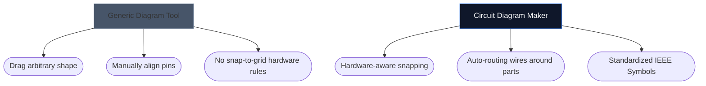

Choisir le bon outil pour dessiner vos schémas électroniques peut souvent dicter la vitesse à laquelle vous pouvez itérer sur un nouveau projet matériel. Alors que les concepteurs de circuits imprimés avancés nécessitent des environnements de bureau lourds, les amateurs, les étudiants et les fabricants ont souvent besoin de quelque chose de complètement différent : l'accessibilité et la vitesse.

Ci-dessous, nous analysons comment notre outil se compare aux principales alternatives du secteur.

## Matrice de catégorisation des outils

Avant de plonger dans les outils individuels, il est crucial de comprendre quel niveau de logiciel votre projet exige réellement. Utiliser un logiciel de PCB d'entreprise pour dessiner une disposition de LED à 4 composants est excessif.

## 1. Créateur de schémas de circuits contre Fritzing

Fritzing est célèbre pour combler le fossé entre le prototypage de maquette et les schémas. Cependant, Fritzing nécessite une installation et a eu du mal avec les mises à jour de maintenance au fil des ans.

| Fonctionnalité | Créateur de schémas de circuits | Frittage |
| :--- | :--- | :--- |
| **Objectif principal** | Dispositions schématiques standard | Visualisations de la maquette |
| **Installation** | Aucun (100 % basé sur un navigateur) | Installation de bureau requise |
| **Coût** | 100% Gratuit | Payant (Donationware) |
| **Courbe d'apprentissage** | Extrêmement faible | Modéré |

> **Le verdict :** Si vous avez spécifiquement besoin de visualiser des fils physiques plongeant dans une maquette, Fritzing est supérieur. Si vous avez besoin de schémas électroniques standard et universels *instantanément*, utilisez Circuit Diagram Maker.

## 2. Créateur de schémas de circuits contre KiCad et Altium

KiCad est une suite de circuits imprimés open source légendaire et Altium Designer est la norme du secteur des entreprises. Ils sont immensément puissants.

| Couche de capacités | Créateur de schémas de circuits | KiCad / Altium |
| :--- | :--- | :--- |
| **Type de sortie** | Images SVG/PNG | Fichiers Gerber, nomenclature, Pick&Place |
| **Simulation** | Visuel / Simpliste | Intégration profonde de SPICE |
| **Vitesse d'accès au premier schéma** | < 10 secondes | 10 à 30 minutes (installation/configuration) |

> **Le verdict :** Utilisez KiCad ou Altium lorsque vous envoyez des couches de cuivre à une usine de Shenzhen. Utilisez Circuit Diagram Maker lorsque vous joignez un schéma à un devoir de physique, un article de blog ou une question de forum.

## 3. Créateur de schémas de circuits vs draw.io / Lucidchart

Les outils de création de diagrammes génériques comme draw.io sont incroyablement populaires pour les organigrammes. Cependant, ils manquent de compréhension sémantique de l’électronique.

Lorsque vous utilisez un outil électronique dédié, l'éditeur comprend qu'un fil ne peut pas simplement « se terminer » de manière aléatoire sans jonction, et il mappe intrinsèquement les propriétés standard (comme les Ohms aux résistances).

## Quel outil vous convient le mieux ?

Le meilleur outil est celui qui vous échappe. Pour une idéation rapide, des devoirs pédagogiques et des publications Web, [Circuit Diagram Maker](/editor/) offre une combinaison imbattable de vitesse et d'esthétique moderne.