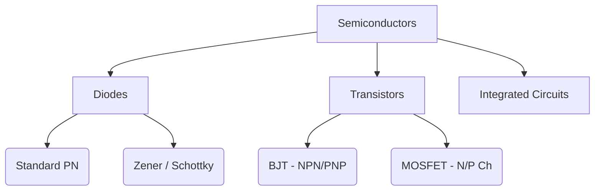

Les symboles électroniques sont le langage universel de l’ingénierie matérielle. Tout comme les notes de musique dictent la hauteur et le rythme, les symboles de circuits transmettent la fonction électrique, les propriétés et la connectivité sur une feuille de papier.

Dans ce guide complet, nous décortiquons la morphologie visuelle des éléments les plus importants que vous rencontrerez dans tout schéma.

## Différences entre les normes mondiales : IEEE et CEI

Avant de plonger dans des symboles spécifiques, il est crucial de reconnaître que les symboles peuvent avoir un aspect différent selon l'endroit où le schéma a été dessiné. Les deux normes dominantes sont **IEEE/ANSI** (principalement pour les Amériques) et **IEC** (Europe et international).

```mermaid
flowchart LR
    subgraph Regional Standards
    A((Schematic Origin))
    A -- US / Americas --> B[IEEE / ANSI]
    A -- Europe / Int'l --> C[IEC]
    end
    
    B -.-> D(Zigzag Resistors)
    C -.-> E(Rectangle Resistors)
    
    style B fill:#1e293b,stroke:#f59e0b
    style C fill:#1e293b,stroke:#3b82f6
```

Dans Circuit Diagram Maker, nous utilisons principalement la norme IEEE/ANSI, car elle reste très populaire dans les écosystèmes numériques et amateurs, bien que les deux soient techniquement correctes.

## Composants passifs

Les composants passifs ne nécessitent pas de source d'alimentation externe pour fonctionner et ne peuvent pas amplifier un signal.

| Composant | Apparence des symboles standard | Description fonctionnelle |
| :--- | :--- | :--- |
| **Résistance** | Défini par une ligne en zigzag nette et irrégulière. Les variantes variables comportent une flèche perçant la ligne. | Dissipe l'énergie sous forme de chaleur pour restreindre le flux de courant électrique. |
| **Condensateur** | Deux lignes parallèles séparées par un espace. Les variantes polarisées courbent l'une des lignes pour indiquer la borne négative. | Stocke temporairement l’énergie électrique dans un champ électrique. |
| **Inducteur** | Une série de boucles arrondies ou de demi-cercles représentant des bobines de fil. | S'oppose aux changements dans le flux de courant en stockant l'énergie dans un champ magnétique. |

## Composants actifs (semi-conducteurs)

Les composants actifs nécessitent une source d’énergie et peuvent contrôler le flux d’électricité, amplifiant souvent les signaux.

| Composant | Indicateurs visuels | Utilisation principale |
| :--- | :--- | :--- |
| **Diode** | Un triangle pointant vers une ligne plate. La ligne indique la cathode (négative). | Un clapet anti-retour pour l'électricité. |
| **LED** | Un symbole de diode standard avec deux petites flèches pointant vers l’extérieur, signifiant l’émission de lumière. | Indicateurs visuels et optoélectronique. |
| **Transistor BJT** | Une ligne verticale flanquée de trois connexions : base, collecteur et émetteur avec une flèche dictant NPN ou PNP. | Commutateurs et amplificateurs commandés par courant. |
| **MOSFET** | Présente des lignes de démarcation séparées mettant en évidence la grille isolée et les diodes du substrat interne. | Commutation contrôlée en tension pour une puissance élevée. |

## Périphériques mécaniques et de sortie

Ces éléments interagissent avec le monde physique, soit en recevant une contribution humaine, soit en générant une sortie physique.

| Composant | Raccourci schématique | Demande |
| :--- | :--- | :--- |
| **Commutateur (SPST)** | Une ligne brisée qui peut pivoter vers le bas pour compléter le circuit. | Contrôle de puissance marche/arrêt de base. |
| **Relais** | Habituellement représenté comme un inducteur (la bobine interne) couplé à des contacts de commutateur isolés. | Commutation de charges haute tension via des microcontrôleurs basse tension. |
| **Moteur** | Un cercle contenant un « M », souvent avec des bornes positives et négatives désignées. | Conversion du courant électrique en cinétique de rotation. |

> **Conseil de conception :** Chaque fois que vous utilisez des commutateurs ou des relais mécaniques, incluez toujours une *diode flyback* entre les charges inductives pour protéger vos composants semi-conducteurs des pics de tension !

Comprendre ces symboles est la première étape vers la maîtrise des circuits. Consultez notre [éditeur en ligne](/editor/) pour glisser, déposer et expérimenter ces formes instantanément.