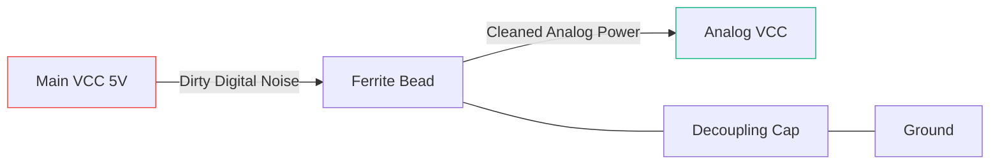

L'électronique numérique à grande vitesse crée beaucoup de bruit électromagnétique. Sans atténuation, ces interférences haute fréquence se propagent dans les lignes analogiques sensibles ou rayonnent vers l'extérieur, provoquant l'échec spectaculaire des tests d'émission FCC de votre appareil.

L'arme principale contre cette interférence est la **perle de ferrite**. Comprendre son symbole schématique et son emplacement détermine si votre circuit fonctionne proprement ou s'il se noie dans son propre bruit.

## 1. Visualisation du symbole de la perle de ferrite

Une perle de ferrite fonctionne intrinsèquement comme un inducteur à fortes pertes. Pour cette raison, son symbole schématique est étroitement lié au symbole de l'inductance standard, mais conçu pour souligner son rôle spécifique.

```mermaid
graph LR
    A[Inductor Basis] --> B(Standard Inductor Symbol)
    A --> C(Rectangle Over Wire)
    B -.-> D(Addition of a dashed line or solid bar)
    D --> E[IEEE Ferrite Symbol]
    C --> F[IEC Ferrite Symbol]
    
    style E fill:#0f172a,stroke:#3b82f6
    style F fill:#0f172a,stroke:#10b981
```

| Caractère | Norme IEEE/ANSI | Norme CEI | Remarques |
| :--- | :--- | :--- | :--- |
| **Forme** | Série de demi-cercles avec une barre/boîte | Un bloc rectangulaire solide | Fonctionnellement identique dans le résultat |
| **Préfixe de désignation** | `FB` | `FB` ou `L` | L'utilisation de « FB » est fortement recommandée pour éviter toute confusion avec les inductances de puissance |
| **Unité de mesure** | Ohms (Ω) à des MHz spécifiques | Ohms (Ω) à des MHz spécifiques | Contrairement aux inducteurs mesurés en Henries (H) |

> **Distinction cruciale :** N'évaluez jamais une perle de ferrite par inductance. Les billes de ferrite sont spécifiées par leur **impédance (en Ohms) à une fréquence spécifique** (généralement 100 MHz).

## 2. Mécaniques opérationnelles de base

Pourquoi utiliser une perle de ferrite au lieu d'un inducteur standard ?

* Un **inducteur** stocke l'énergie et la renvoie au circuit. Il est très réactif et préserve l'énergie.
* Une **perle de ferrite** est activement conçue pour être *avec perte*. Aux hautes fréquences, il se comporte comme une résistance, convertissant directement les bruits haute fréquence indésirables en chaleur.

| Gamme de fréquences | Comportement des perles de ferrite | Résultat sur Circuit |
| :--- | :--- | :--- |
| **Basse fréquence / CC** | Moins de 1 MHz | Agit comme un simple fil (~0 Ω). L’alimentation CC passe librement. |
| **Fréquence de résonance** | Très réactif | Stocke l'énergie brièvement. |
| **Haute fréquence** | Plus de 50 MHz+ | Agit comme une résistance de grande valeur. Bloque et dissipe le bruit RF sous forme de chaleur. |

## 3. Meilleures pratiques pour le placement schématique

Utiliser correctement le symbole FB nécessite un placement stratégique. Frapper des perles de ferrite de manière aléatoire sur un schéma peut en fait aggraver la sonnerie et la résonance.

### Alimentations de découplage (Pi-Filters)

L'utilisation la plus courante d'un symbole « FB » consiste à isoler l'alimentation numérique sale de l'alimentation analogique propre.

Dans la configuration ci-dessus (qui fait partie d'un filtre Pi), la perle de ferrite empêche les transitoires haute fréquence d'entrer dans la ligne AVCC, tandis que le condensateur shunte toute ondulation restante vers la terre.

### Suppression EMI de la ligne de données

Lors du routage de longs câbles de données USB ou de traces HDMI, les symboles « FB » sont souvent placés en série près du connecteur. Cela garantit que le long fil physiquement exposé n'agit pas comme une antenne et ne rayonne pas de bruit du processeur à travers la pièce.

Pour ajouter une perle de ferrite à votre prochain schéma, ouvrez **[Éditeur de schéma de circuit](/editor/)**, recherchez « Ferrite » et spécifiez votre impédance !