Construire un onduleur – convertissant une batterie de voiture de 12 V en courant alternatif de 220 V capable de faire fonctionner des appareils électroménagers – est un rite de passage pour les ingénieurs en électronique.

Avant de soulever un fer à souder, vous devez parvenir à une compréhension parfaite du schéma sous-jacent. Les circuits haute tension sont impitoyables, et un schéma mal dessiné garantit des MOSFET brûlés ou un choc électrique grave. Ce guide décompose l'architecture d'un onduleur à onde carrée fondamental.

> **Avertissement de sécurité :** L'alimentation 220 V CA est mortelle. Cet article est une exploration de la logique schématique et de la conception théorique, et non un plan de fabrication. Ne construisez jamais de circuits haute tension sans une formation électrique avancée.

## L'architecture à trois piliers

Quelle que soit la complexité d’un onduleur moderne, le schéma peut toujours être divisé visuellement et logiquement en trois blocs fonctionnels distincts.

```mermaid
flowchart LR
    DC_SRC[(12V DC Battery)] --> OSC[1. Oscillator Block]
    OSC -- Low Power Square Wave --> AMP[2. Power Switch Block]
    AMP -- High Current 12V Wave --> TX[3. Step-Up Transformer]
    TX -- Magnetic Induction --> AC_OUT((220V AC Output))
    
    style OSC fill:#0f172a,stroke:#3b82f6
    style AMP fill:#0f172a,stroke:#f59e0b
    style TX fill:#0f172a,stroke:#ef4444
```

### Étape 1 : L'oscillateur (le cerveau)

Le courant continu (CC) d’une batterie circule en ligne droite. Les transformateurs ne peuvent pas accélérer une ligne droite ; ils nécessitent des champs magnétiques fluctuants. Par conséquent, nous devons convertir le DC en une onde AC artificielle (généralement 50 Hz ou 60 Hz selon la région géographique).

| Composant utilisé | Rôle schématique | Pourquoi il est choisi |
| :--- | :--- | :--- |
| **CD4047 IC / 555 Minuterie** | Multivibrateur Astable | Produit une onde carrée remarquablement stable en calculant une constante de temps RC. |
| **Réseau de résistances et de condensateurs** | Calibrateurs de synchronisation | Les valeurs (par exemple, « R=100kΩ », « C=0,1μF ») dictent de manière unique la fréquence précise de 50 Hz. |

### Étape 2 : Les interrupteurs d'alimentation (le muscle)

La puce logique produit une onde pure de 50 Hz, mais à des limites de courant exceptionnellement basses (souvent inférieures à 20 mA). Si vous l'injectiez dans un transformateur, il ne générerait pas suffisamment de flux magnétique pour faire fonctionner une ampoule.

Nous plaçons des transistors de haute puissance entre l'oscillateur et les bobines du transformateur.

1. Le signal faible de l'oscillateur frappe la **Gate** d'un énorme MOSFET à canal N (comme l'IRF3205).
2. Le MOSFET agit comme un relais électronique robuste.
3. Il commute furieusement l'ampérage massif de la batterie 12 V directement à travers les bobines du transformateur 50 fois par seconde.

### Étape 3 : Le transformateur élévateur

À ce stade du schéma, nous avons des quantités massives de courant 12 V qui vont et viennent. La dernière étape nécessite de l'acheminer à travers les bobines primaires d'un transformateur.

| Fonctionnalité | Détails du schéma | Implication dans le monde réel |
| :--- | :--- | :--- |
| **Bobine primaire (gauche)** | Configuration à prise centrale (`12V - 0 - 12V`) | Permet une commutation push-pull aller-retour à partir de deux MOSFET alternés. |
| **Lignes principales** | Deux lignes continues tracées verticalement | Représente le noyau de fer/ferrite nécessaire à une induction magnétique à haut rendement. |
| **Bobine secondaire (droite)** | Rapport d'enroulement massivement augmenté | La physique transforme le flux magnétique pulsé de 12 V en une onde mortelle et volatile de 220 V. |

## Considérations sur le dessin

Lorsque vous utilisez **[Éditeur de schémas de circuits](/editor/)** pour rédiger cette conception, n'oubliez pas les bonnes pratiques de mise en page :

* Tracez les lignes lourdes transportant le courant de la batterie 12 V plus épaisses que les lignes de l'oscillateur de faible puissance.
* Mettez à la terre les broches de la source MOSFET de manière explicite et unique ; ne les acheminez pas près de la masse sensible de l'oscillateur pour éviter le couplage du bruit.
* Délimitez graphiquement les sorties 220V ! Placez des étiquettes d'avertissement et des ports de sortie (comme un symbole de prise) plutôt que de laisser des fils nus se terminant dans le vide.