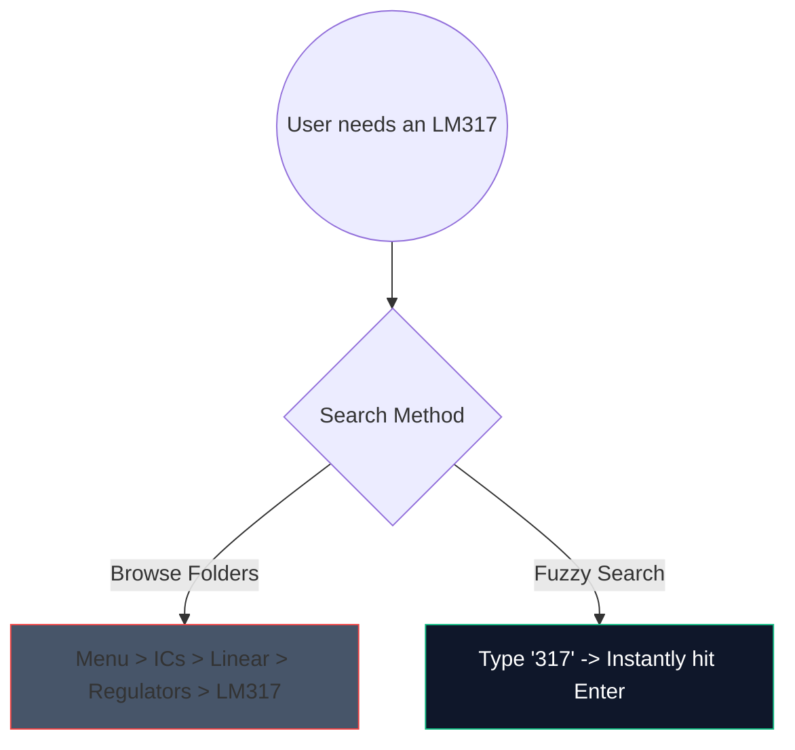

L’époque où l’on téléchargeait des logiciels de bureau lourds de 2 Go juste pour dessiner un simple circuit amplificateur est révolue. La CAO (conception assistée par ordinateur) basée sur un navigateur est là et elle est incroyablement rapide.

Voici exactement comment utiliser les outils Web modernes pour générer des schémas de qualité production en moins de 5 minutes.

## Pourquoi la conception de circuits basée sur un navigateur ?

Si vous êtes un éducateur, un étudiant ou un amateur rédigeant de la documentation, la vitesse et l'accessibilité l'emportent sur les fonctionnalités brutes.

```mermaid
flowchart LR
    subgraph Traditional Workflow
    DL[Download/Install] --> CONF[Configure Libraries] --> DRAW1[Draw]
    end
    
    subgraph Web Workflow
    URL[Go to URL] --> DRAW2[Draw immediately]
    end
    
    style URL fill:#0f172a,stroke:#3b82f6
    style DRAW2 fill:#1e293b,stroke:#10b981
```

| Métrique | Application de bureau | Créateur de schémas de circuits |
| :--- | :--- | :--- |
| **Espace de stockage** | 1 Go - 5 Go+ | 0 Mo (basé sur le cloud) |
| **Compatibilité du système d'exploitation** | Souvent des ports Windows uniquement ou bogués | Universellement compatible avec le Web |
| **Heure de démarrage** | 15 à 30 secondes | < 1 seconde |
| **Portabilité** | Confiné à une seule machine | Accessible partout |

## Hacks de flux de travail de base pour la vitesse

Lorsque vous utilisez un éditeur Web, l'utilisation de raccourcis clavier transforme l'expérience du « clic » en un état de flux ininterrompu.

Voici les raccourcis au ROI le plus élevé à mémoriser dans notre éditeur :

| Actions | Commande de raccourci clavier | Avantage du flux de travail |
| :--- | :--- | :--- |
| **Routage des fils** | `W` | Bascule instantanément votre curseur en mode connexion, permettant un routage net rapide sans passer à une barre d'outils. |
| **Rotation des composants** | `R` (tout en tenant la pièce) | L’orientation des résistances ou des transistors avant de les placer permet d’économiser énormément de temps de nettoyage plus tard. |
| **Sélection en double** | `Ctrl + D` ou `Alt-Drag` | Ne retirez pas 8 LED du menu ; placez-en un, configurez-le et dupliquez-le 7 fois instantanément. |
| **Toile panoramique** | `Barre d'espace + Glisser` | Maintient votre niveau de zoom cohérent tout en parcourant des mises en page massives et complexes. |

## Utilisation de la recherche de composants

La recherche visuelle dans des menus déroulants massifs est fastidieuse. Nous avons intégré un mécanisme de recherche flou robuste.

Appuyez simplement sur la barre de recherche et tapez « NPN » plutôt que de cliquer sur « Semi-conducteurs -> Transistors -> BJT ». L’outil sélectionne instantanément la correspondance la plus probable.

## Exportation pour un usage professionnel

Créer le diagramme ne représente que la moitié de la bataille ; l’injecter dans votre thèse ou votre blog technique est l’autre moitié.

Exportez toujours vos modèles de circuits au format **SVG (Scalable Vector Graphics)** autant que possible, plutôt qu'en PNG ou JPG. Un SVG stocke des lignes définies mathématiquement plutôt que des pixels, ce qui signifie que vous pouvez adapter votre schéma à la taille d'un panneau d'affichage et qu'il restera perpétuellement net sans flou de rastérisation.

Prêt à tester votre vitesse ? **[Lancez l'application](/editor/)** et essayez de créer un circuit LED clignotant à 555 minuteries !