Ouvrir un schéma complexe pour la première fois, c'est comme regarder une langue étrangère. Des dizaines de lignes qui se croisent, d’abréviations énigmatiques et de symboles irréguliers se fondent dans un mur de bruit visuel.

Cependant, les ingénieurs expérimentés ne lisent pas les schémas en regardant la page entière. Ils isolent, tracent et conquièrent. Voici la méthodologie étape par étape pour déchiffrer n’importe quel schéma de circuit.

## Étape 1 : Isoler l'infrastructure électrique de base

Avant de comprendre ce que *fait* un circuit, vous devez comprendre *comment il respire*.

Chaque schéma comporte des points d’entrée pour l’énergie électrique. Votre première tâche consiste à localiser tous les principaux rails de tension et références à la terre.

```mermaid
flowchart TD
    A[Start: Scan Edges] --> B{Look for Power Symbols}
    B -- Found Battery/Jack --> C[Trace the initial VCC and GND lines]
    B -- Found Net Labels --> D[Locate generic +5V, +3.3V pads]
    C --> E[Are there Voltage Regulators?]
    D --> E
    E -- Yes --> F[Mentally divide circuit into Voltage Zones]
    E -- No --> G[Circuit runs on single voltage]
    
    style A fill:#0f172a,stroke:#3b82f6
    style F fill:#1e293b,stroke:#f59e0b
```



| Symbole/Texte | Signification | Exigence d'action |
| :--- | :--- | :--- |
| `VCC` / `VDD` | Tension d'alimentation positive pour les circuits intégrés. | Suivez cela pour vous assurer que chaque circuit intégré est alimenté. |
| `GND` / `VSS` | La référence commune. | Supposons que tous ces symboles soient physiquement connectés entre eux. |
| `LDO` / `buck` | Une puce régulant la tension vers le bas. | Notez quels composants sont en aval utilisant la nouvelle tension inférieure. |

## Étape 2 : Démystifier les « cerveaux » (CI)

Une fois que vous savez où circule le pouvoir, recherchez les plus grands rectangles sur la page. Les circuits intégrés (CI) dictent la fonction principale du schéma.

Si vous rencontrez un CI étiqueté « U1 » avec un numéro de pièce énigmatique comme « NE555 » ou « ATmega328P », arrêtez immédiatement de lire le schéma. Ouvrez un nouvel onglet et extrayez la **fiche technique**.

Vous n’avez pas besoin de comprendre la physique interne des semi-conducteurs ; regardez simplement le "Schéma de brochage" de la fiche technique. Si la broche 4 est « RESET » et la broche 8 est « VCC », mappez immédiatement cette logique au dessin.

## Étape 3 : Suivez les entrées et les sorties

Les circuits sont des machines fonctionnelles. Ils reçoivent un apport environnemental, le traitent et produisent un résultat.

```mermaid
quadrantChart
    title Input/Output Hardware Identification
    x-axis Analog/Physical --> Digital/Data
    y-axis Input Devices --> Output Devices
    quadrant-1 Digital Receivers (e.g. WiFi)
    quadrant-2 Digital Displays (e.g. OLEDs)
    quadrant-3 Physical Actuators (e.g. Motors)
    quadrant-4 Physical Sensors (e.g. Thermistors)
    "Push Button": [0.1, 0.4]
    "Photoresistor": [0.2, 0.2]
    "UART RX": [0.8, 0.4]
    "UART TX": [0.8, 0.6]
    "Speaker": [0.3, 0.8]
    "LED": [0.4, 0.7]
```

Tracez les fils vers l’extérieur des circuits intégrés centraux. Si une broche IC se connecte à une LED, il s'agit d'une sortie visuelle. Si une broche se connecte à un commutateur SPST mis à la terre, il s'agit d'une entrée humaine.

## Étape 4 : Valider les intersections et les croisements

L’erreur de lecture la plus courante chez les débutants consiste en une mauvaise compréhension des fils qui se croisent.

* **Un point donne un nœud :** Si deux lignes qui se croisent comportent un point solide à leur croisement, elles sont physiquement soudées/connectées ensemble. Le courant peut circuler entre eux.
* **Aucun point ne donne un pont :** Si deux lignes forment une simple croix (+), elles ne se touchent *pas*. Ils s'apparentent à deux autoroutes qui se croisent sur un viaduc.

## Étape 5 : Reconnaître les sous-circuits (l'arme secrète)

Les ingénieurs conçoivent rarement des circuits entièrement à partir de zéro. Ils collent ensemble des sous-circuits modulaires standards. Une fois que vous apprenez à reconnaître ces « mots » visuels, vous arrêtez de lire des « lettres » individuelles.

| Modèle visuel | Sous-circuit standard | Fonction |
| :--- | :--- | :--- |
| Condensateur passant de « VCC » à « GND » juste à côté d'un IC. | **Condensateur de découplage** | Absorbe le bruit. Ignorez-le lors de l’analyse du flux logique. |
| Résistance d'une broche numérique s'enroulant jusqu'à « +5 V ». | **Résistance de traction** | Empêche les épingles flottantes ; assure un état par défaut ÉLEVÉ stable. |
| Deux résistances placées en série entre la tension et la masse, prises au milieu. | **Diviseur de tension** | Fait chuter une tension proportionnellement pour être lue en toute sécurité par une broche de capteur. |

Mettez cette théorie en pratique. Ouvrez l'**[Éditeur de schémas de circuits](/editor/)**, chargez un modèle et cartographiez vous-même l'alimentation, le cerveau, les entrées et les sorties !