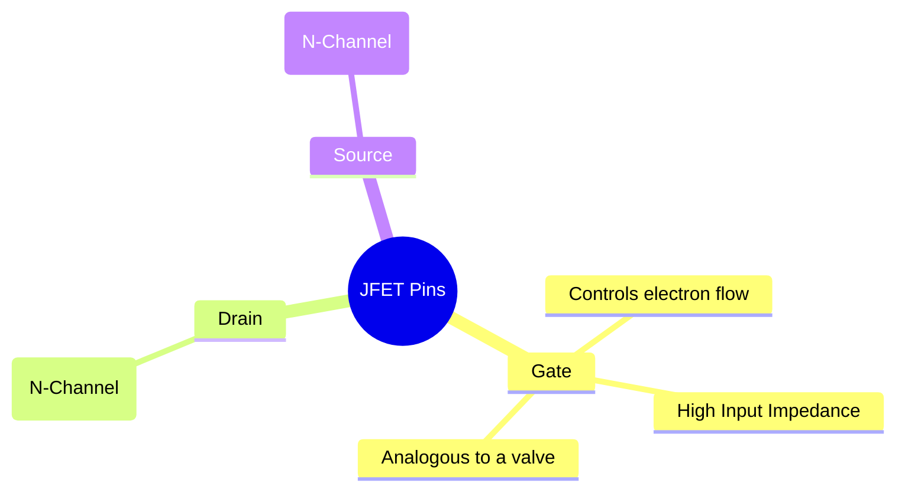

Avant la prolifération massive des MOSFET, le **JFET** (Junction Field-Effect Transistor) était le roi de l'amplification à haute impédance d'entrée. Bien qu'ils ne soient pas utilisés aussi fréquemment dans la logique numérique moderne, ils restent des artefacts indispensables dans les préamplificateurs audio haute fidélité, les instruments sensibles et les circuits RF.

Comprendre le symbole schématique JFET est essentiel pour quiconque se lance dans la conception de circuits analogiques discrets.

## 1. Anatomie du symbole JFET

Contrairement aux transistors à jonction bipolaire (BJT) qui sont des dispositifs contrôlés en courant, un JFET est un dispositif **contrôlé en tension**. Le symbole schématique tente de représenter visuellement la construction physique de son canal semi-conducteur interne.

Le symbole consiste en une ligne droite verticale représentant le canal, avec deux lignes horizontales qui s'y accrochent (le drain et la source). Une troisième ligne perpendiculaire forme la porte, complétée par une flèche qui dicte la polarité du semi-conducteur.

### JFET canal N et canal P

Tout comme les BJT ont NPN et PNP, les JFET se déclinent en deux versions distinctes.

| Caractéristique | JFET canal N | JFET canal P |
| :--- | :--- | :--- |
| **Flèche de symbole** | Pointe **IN** vers la ligne du canal | Points **OUT** loin du canal |
| **Transporteurs majoritaires** | Électrons | Trous |
| **Vgs pour pincer** | Tension négative (par exemple, -5 V) | Tension positive (par exemple +5 V) |
| **Opération typique**| Normalement allumé -> Appliquer un tableau de tension négative pour éteindre | Normalement allumé -> Appliquer un tableau de tension positive pour éteindre |

> **Astuce mémoire :** "Pointer vers l'intérieur" signifie **N**-Channel. Regardez la flèche sur la porte. S'il pointe vers l'intérieur de la ligne, vous avez affaire à un JFET à canal N (comme le populaire 2N5457).

## 2. Fonctionnement : Le mode d'épuisement

L'une des caractéristiques les plus déterminantes d'un JFET est qu'il s'agit d'un appareil **Mode d'épuisement**. Cela affecte grandement la façon dont vous concevez des schémas autour d'eux.

* **MOSFET (mode d'amélioration) :** Sont normalement éteints. Vous devez appliquer une tension au portail pour les allumer.
* **JFET (mode d'épuisement) :** Sont normalement activés. Avec 0 Volt à la porte, le courant maximum circule du drain à la source. Vous devez appliquer une tension *polarisation inverse* (négative pour le canal N) pour étendre la région d'appauvrissement et littéralement « pincer » le flux d'électrons, éteignant ainsi l'appareil.

```mermaid
flowchart LR
    VGS[V_GS = 0V] --> I1[Maximum Drain Current flows]
    VGS2[V_GS = -2V] --> I2[Current is restricted]
    VGS3[V_GS = -5V] --> I3[Pinch-Off reached. Circuit is OFF]
    
    style VGS fill:#1e293b,stroke:#f59e0b
    style VGS3 fill:#1e293b,stroke:#ef4444
```

## 3. Applications schématiques typiques

Étant donné que la porte d'un JFET est polarisée en inverse pendant le fonctionnement, un courant pratiquement nul y circule. Cela produit une impédance d'entrée astronomiquement élevée (souvent mesurée en centaines de mégaohms).

| Application de circuits | Pourquoi les JFET sont choisis | Indices schématiques |
| :--- | :--- | :--- |
| **Préamplificateurs audio** | Un bruit extrêmement faible et une impédance d'entrée massive empêchent le chargement des micros sensibles de guitare électrique. | Souvent vu comme un étage tampon Source Follower. |
| **Commutateurs analogiques** | Parce qu'ils sont purement contrôlés en tension, sans courant de grille, ils injectent des transitoires de commutation nuls dans le chemin du signal. | Placé en série avec un signal analogique passant par le canal drain-source. |
| **Sources de courant constant** | Un JFET se comporte nativement comme un puits de courant constant lorsque la porte est directement liée à la source. | Borne de porte câblée directement autour du terminal source. |

Lors de la création de schémas de ces circuits analogiques spécialisés, la précision est essentielle. Assurez-vous que l'orientation de la flèche de votre porte est correcte pour éviter les échecs de fabrication. Utilisez la bibliothèque de semi-conducteurs discrets organisée dans **[Circuit Diagram Maker](/editor/)** pour placer avec précision les symboles JFET standard des canaux N et P-Channel sur votre prochaine toile.