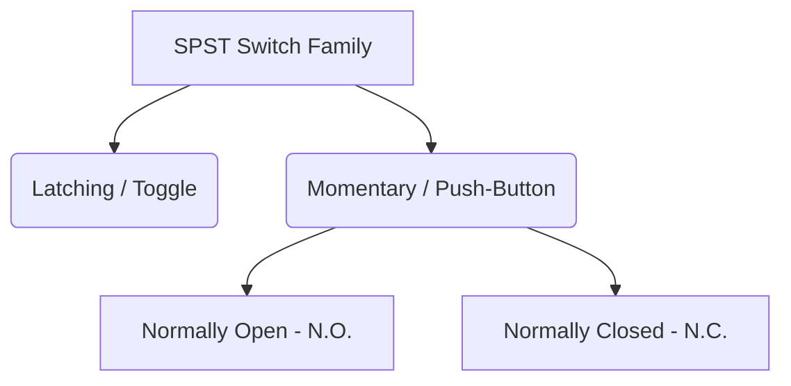

Au cœur de chaque interface utilisée par les humains pour contrôler l’électricité se trouve l’interrupteur mécanique. L'incarnation la plus simple et la plus répandue de ce composant est le **SPST**, ou interrupteur unipolaire unidirectionnel.

Que vous conceviez un disjoncteur secteur haute tension ou que vous dessiniez simplement un bouton-poussoir sur une maquette Arduino, le symbole SPST est votre point de départ logique.

## 1. Ce que signifie réellement SPST

Les ingénieurs classent les commutateurs en utilisant deux variables : **Pôles** et **Throws**.

* **Pôle (P) :** Le nombre de circuits électriques indépendants que le commutateur peut contrôler simultanément. 
* **Lancer (T) :** Le nombre d'états fermés (positions ON) de chaque pôle.

Par conséquent, un SPST est un *Unipolaire* (contrôle un circuit) et un *Single Throw* (n'a qu'une seule position fermée et conductrice).

```mermaid
flowchart LR
    A[Human Input] --> B((SPST Mechanism))
    B -- Open / Default --> C[Infinite Resistance / OFF]
    B -- Closed / Actuated --> D[Zero Resistance / ON]
    
    style B fill:#0f172a,stroke:#f59e0b
```

## 2. Lecture du symbole schématique SPST

Le symbole IEEE standard pour un commutateur SPST est très intuitif : il ressemble littéralement à ce qu'il fait.

| Élément visuel | Signification dans le monde réel |
| :--- | :--- |
| **Deux cercles ouverts** | Les plages de contact électriques fixes où se terminent les fils. |
| **Ligne brisée diagonale** | Le bras conducteur mécanique, physiquement disjoint du deuxième plot pour indiquer un état par défaut « Ouvert ». |
| **Indicateur (`S` ou `SW`)** | Balises de référence standards. par exemple, « SW1 ». |

> **Hypothèse d'état normal :** Sauf indication contraire, les interrupteurs mécaniques sont dessinés dans leur **état de repos non actionné**. Pour un interrupteur d'éclairage SPST standard, cela signifie que le schéma le représente comme OFF.

## 3. Variations du SPST : Boutons-poussoirs

Un interrupteur à bascule reste là où vous le placez (verrouillage). Un bouton-poussoir ne s'actionne que lorsque votre doigt est dessus (momentané). La désignation SPST s'applique aux deux, mais les symboles changent légèrement pour distinguer les modes d'interaction humaine.

| Type de commutateur | Modification schématique | Exemple concret |
| :--- | :--- | :--- |
| **Bouton-poussoir (N.O.)** | Au lieu d'un bras incliné, un pont plat plane *au-dessus* des deux plages de contact. Pousser vers le bas comble le fossé. | Touches du clavier, boutons d'alimentation de l'ordinateur, boutons de sonnette. |
| **Bouton-poussoir (N.C.)** | Le pont plat repose *en dessous* ou touche les pads, gardant le circuit allumé par défaut. Appuyer vers le bas rompt les connexions. | Boutons d'arrêt d'urgence (E-Stop) sur les machines lourdes. |

## 4. Avertissements relatifs à la mise en œuvre du matériel

Lors de l'intégration d'un commutateur SPST dans un circuit logique numérique (comme une broche GPIO du Raspberry Pi), une conception schématique naïve entraînera un comportement logiciel désastreusement imprévisible.

### Le problème de la « goupille flottante »

Si vous connectez un côté d'un commutateur SPST au 5 V et l'autre côté directement à une broche du microcontrôleur, que se passe-t-il lorsque le commutateur est ouvert ? La broche ne lit pas 0 V : elle est déconnectée et « flottante », agissant comme une antenne captant l'électromagnétisme environnant.

**La solution : résistances pull-down**

Incluez toujours une résistance (généralement 10 kΩ) connectée entre la broche numérique et la masse.

1. **Éteindre :** La broche lit 0 V en toute sécurité à travers la résistance.
2. **Allumer :** L'alimentation 5 V domine la résistance, déclenchant un état ÉLEVÉ sécurisé.

Incorporez des variantes SPST dans vos conceptions en toute sécurité via l'**[Circuit Diagram Editor](/editor/)**. Développez la bibliothèque « Commutateurs » de gauche pour trouver N.O. et implémentations N.C. !