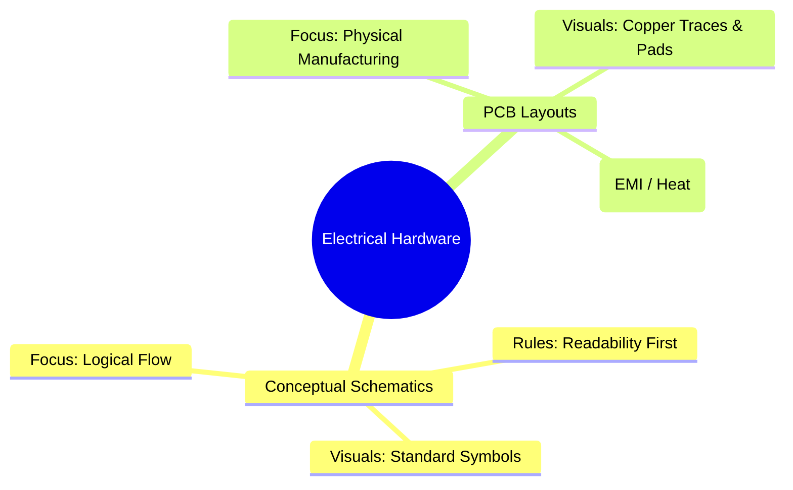
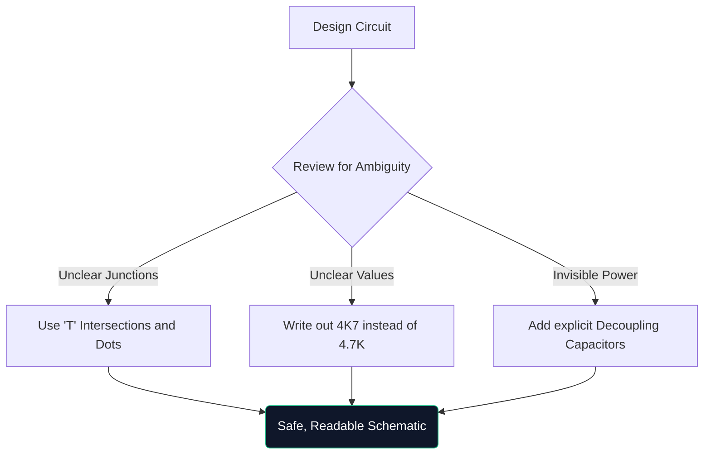

Bienvenue à la masterclass définitive sur les schémas de circuits. Que vous assembliez des prototypes Arduino pendant un week-end ou que vous étudiiez l'ingénierie électrique, la compréhension de l'architecture schématique n'est pas négociable.

Ce guide va au-delà des bases et évalue la manière dont les diagrammes modernes sont construits, vérifiés et fabriqués.

## Schémas théoriques et schémas de circuits imprimés

Un point de confusion très courant est la différence entre un diagramme schématique et une disposition de circuit imprimé (PCB). Ce sont des représentations entièrement différentes de la même vérité électrique.

| Caractère | Diagramme schématique | Disposition des PCB |
| :--- | :--- | :--- |
| **Objectif** | Comprendre *comment* le circuit fonctionne logiquement | Pour dicter *où* le cuivre va physiquement |
| **Représentation des composants** | Symboles abstraits (triangles, zigzags) | Tampons d'empreinte physiques 1:1 (par exemple, SOIC-8, 0805) |
| **Connexions** | Lignes géométriques parfaites | Traces de cuivre à un angle de 45 degrés |
| **Environnement** | Papier de fond propre et blanc | Espace 3D littéral multicouche |

## Anatomie d'un schéma avancé

Lorsque les circuits dépassent 100 composants, les paradigmes visuels changent. Vous ne pouvez pas simplement tout connecter avec des fils tirés.

1. **Blocs de titre** : les schémas professionnels comportent toujours un bloc dans le coin inférieur droit indiquant le nom de l'entreprise, l'ingénieur responsable, le numéro de révision et la date.
2. **Étiquettes et ports Net** : Les fils ne connectent pas les sous-systèmes ; les étiquettes nommées le font. Si deux fils sont étiquetés « CLK_OUT », ils sont connectés électriquement, même s'ils se trouvent sur des pages différentes.
3. **Blocs hiérarchiques** : les conceptions massives (comme une carte mère d'ordinateur) utilisent la hiérarchie. Un seul bloc rectangulaire intitulé « Interface mémoire » contient une page schématique entièrement distincte à l'intérieur.

## La règle du "dessin défensif"

Semblable à la conduite défensive, le dessin défensif implique de supposer que la personne qui lit votre schéma le comprendra mal à moins que vous ne la guidiez explicitement.

> **Pourquoi écrire « 4K7 » ?** Dans les schémas imprimés ou photocopiés, un petit point décimal (`.`) disparaît facilement à cause d'artefacts. Écrire « 4,7K » risque de le lire comme « 47K », ce qui pourrait faire frire un composant. L'écriture de « 4K7 » fait agir le multiplicateur comme un point décimal, éliminant pratiquement les erreurs de lecture.

## Transition vers les outils de CAO numérique

Dessiner sur du papier millimétré est excellent pour le brainstorming, mais pratiquement inutile pour la production. Lorsque vous migrez vos conceptions vers un outil tel que [Circuit Diagram Maker](/editor/), vous obtenez plusieurs super pouvoirs :

* **Netlists** : les outils numériques prouvent mathématiquement les connexions.
* **Réutilisabilité** : copier-coller des alimentations régulées complexes provenant de projets précédents permet de gagner des heures.
* **Qualité vectorielle** : L'exportation au format SVG garantit des lignes parfaitement nettes, quel que soit le zoom avant.

Le passage de la théorie à la réalité commence par une ligne bien tracée. Commencez votre voyage aujourd'hui !