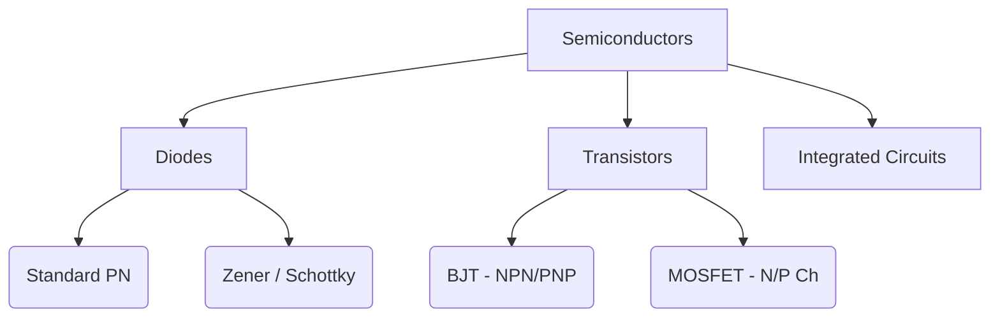

इलेक्ट्रॉनिक प्रतीक हार्डवेयर इंजीनियरिंग की सार्वभौमिक भाषा हैं। जिस तरह संगीत के नोट्स पिच और लय को निर्देशित करते हैं, उसी तरह सर्किट प्रतीक कागज के एक टुकड़े पर विद्युत कार्य, संपत्ति और कनेक्टिविटी को व्यक्त करते हैं।

इस व्यापक मार्गदर्शिका में, हम किसी भी योजना में आपके सामने आने वाले सबसे महत्वपूर्ण तत्वों की दृश्य आकृति विज्ञान का विश्लेषण करते हैं।

## वैश्विक मानक अंतर: आईईईई बनाम आईईसी

विशिष्ट प्रतीकों में गोता लगाने से पहले, यह पहचानना महत्वपूर्ण है कि योजनाबद्ध रूप से तैयार किए गए स्थान के आधार पर प्रतीक अलग दिख सकते हैं। दो प्रमुख मानक हैं **IEEE/ANSI** (ज्यादातर अमेरिका) और **IEC** (यूरोप और अंतर्राष्ट्रीय)।

```mermaid
flowchart LR
    subgraph Regional Standards
    A((Schematic Origin))
    A -- US / Americas --> B[IEEE / ANSI]
    A -- Europe / Int'l --> C[IEC]
    end
    
    B -.-> D(Zigzag Resistors)
    C -.-> E(Rectangle Resistors)
    
    style B fill:#1e293b,stroke:#f59e0b
    style C fill:#1e293b,stroke:#3b82f6
```

सर्किट डायग्राम मेकर में, हम मुख्य रूप से आईईईई/एएनएसआई मानक का उपयोग करते हैं, क्योंकि यह डिजिटल और शौकिया पारिस्थितिकी तंत्र में अत्यधिक लोकप्रिय है, हालांकि दोनों तकनीकी रूप से सही हैं।

## निष्क्रिय घटक

निष्क्रिय घटकों को संचालित करने के लिए किसी बाहरी शक्ति स्रोत की आवश्यकता नहीं होती है और वे सिग्नल को प्रवर्धित नहीं कर सकते हैं।

| घटक | मानक प्रतीक उपस्थिति | कार्यात्मक विवरण |
| :--- | :--- | :--- |
| **प्रतिरोधक** | एक तेज़, दांतेदार ज़िगज़ैग रेखा द्वारा परिभाषित। परिवर्तनीय वेरिएंट में रेखा को छेदने वाला एक तीर होता है। | विद्युत धारा के प्रवाह को प्रतिबंधित करने के लिए ऊर्जा को ऊष्मा के रूप में नष्ट करता है। |
| **संधारित्र** | दो समानांतर रेखाएं एक अंतराल से अलग हो गईं। ध्रुवीकृत वेरिएंट नकारात्मक टर्मिनल को इंगित करने के लिए रेखाओं में से एक को मोड़ते हैं। | विद्युत ऊर्जा को विद्युत क्षेत्र में अस्थायी रूप से संग्रहीत करता है। |
| **प्रेरक** | गोल लूपों या अर्ध-वृत्तों की एक श्रृंखला जो तार की कुंडलियों का प्रतिनिधित्व करती है। | चुंबकीय क्षेत्र में ऊर्जा संग्रहीत करके धारा प्रवाह में परिवर्तन का विरोध करता है। |

## सक्रिय घटक (अर्धचालक)

सक्रिय घटकों को एक शक्ति स्रोत की आवश्यकता होती है और वे बिजली के प्रवाह को नियंत्रित कर सकते हैं, अक्सर संकेतों को बढ़ा सकते हैं।

| घटक | दृश्य संकेतक | मुख्य उपयोग |
| :--- | :--- | :--- |
| **डायोड** | एक समतल रेखा की ओर इंगित करने वाला त्रिभुज. रेखा कैथोड (नकारात्मक) को इंगित करती है। | बिजली के लिए एक तरफ़ा वाल्व. |
| **एलईडी** | बाहर की ओर इशारा करते हुए दो छोटे तीरों वाला एक मानक डायोड प्रतीक, जो प्रकाश उत्सर्जन को दर्शाता है। | दृश्य संकेतक और ऑप्टोइलेक्ट्रॉनिक्स। |
| **बीजेटी ट्रांजिस्टर** | तीन कनेक्शनों से घिरी एक ऊर्ध्वाधर रेखा: आधार, संग्राहक, और एक उत्सर्जक जिसमें एक तीर एनपीएन या पीएनपी को निर्देशित करता है। | करंट-नियंत्रित स्विच और एम्पलीफायर। |
| **मोस्फेट** | पृथक गेट और आंतरिक सब्सट्रेट डायोड को उजागर करने वाली अलग-अलग सीमा रेखाएँ। | उच्च शक्ति के लिए वोल्टेज-नियंत्रित स्विचिंग। |

## मैकेनिकल और आउटपुट डिवाइस

ये हिस्से भौतिक दुनिया के साथ बातचीत करते हैं, या तो मानव इनपुट लेते हैं या भौतिक आउटपुट उत्पन्न करते हैं।

| घटक | योजनाबद्ध आशुलिपि | आवेदन |
| :--- | :--- | :--- |
| **स्विच (एसपीएसटी)** | एक टूटी हुई लाइन जो सर्किट को पूरा करने के लिए नीचे की ओर घूम सकती है। | बुनियादी चालू/बंद बिजली नियंत्रण। |
| **रिले** | आमतौर पर इसे पृथक स्विच संपर्कों के साथ युग्मित एक प्रारंभकर्ता (आंतरिक कुंडल) के रूप में दर्शाया जाता है। | लो-वोल्टेज माइक्रोकंट्रोलर के माध्यम से हाई-वोल्टेज लोड को स्विच करना। |
| **मोटर** | एक वृत्त जिसमें 'एम' होता है, अक्सर निर्दिष्ट सकारात्मक और नकारात्मक टर्मिनलों के साथ। | विद्युत धारा को घूर्णी गतिकी में परिवर्तित करना। |

> **डिज़ाइन टिप:** जब भी यांत्रिक स्विच या रिले का उपयोग करें, तो अपने अर्धचालक घटकों को वोल्टेज स्पाइक्स से बचाने के लिए आगमनात्मक भार में हमेशा एक *फ्लाईबैक डायोड* शामिल करें!

इन प्रतीकों को समझना सर्किट प्रवाह की ओर पहला कदम है। इन आकृतियों को तुरंत खींचने, छोड़ने और प्रयोग करने के लिए हमारे [ऑनलाइन संपादक](/संपादक/) को देखें।